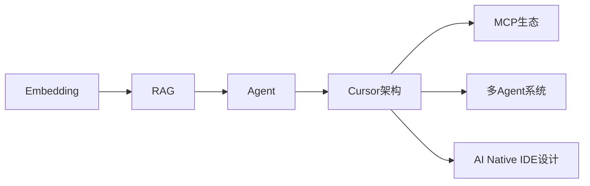
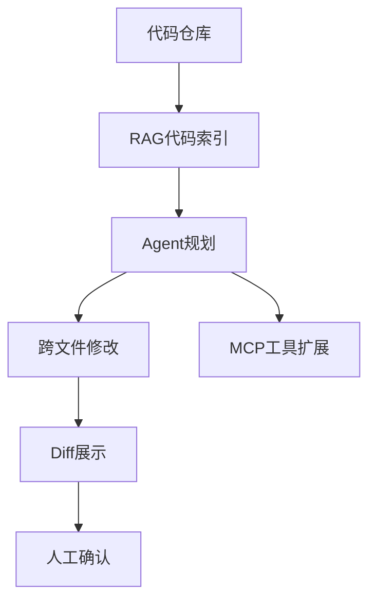
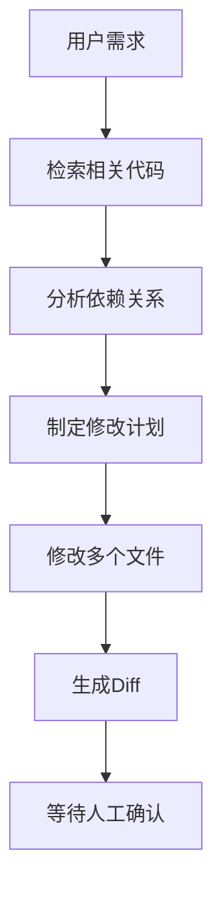
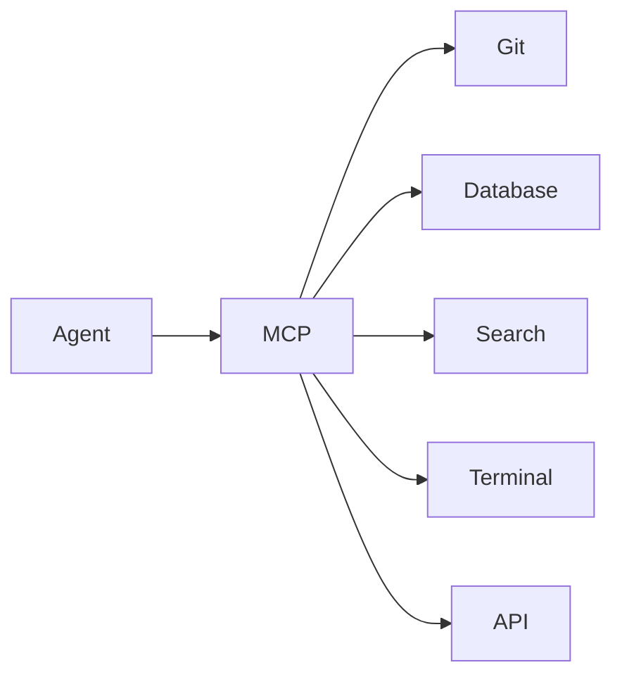
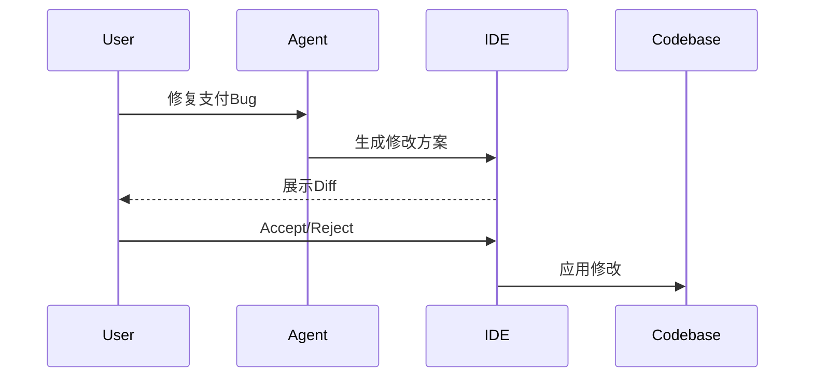
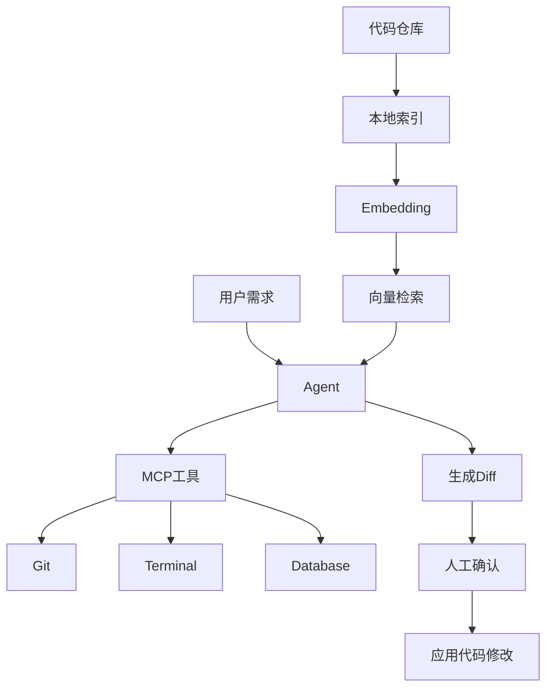
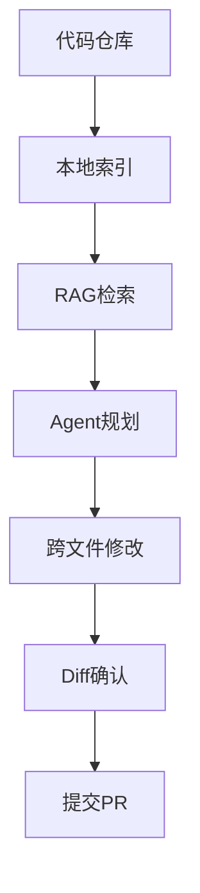
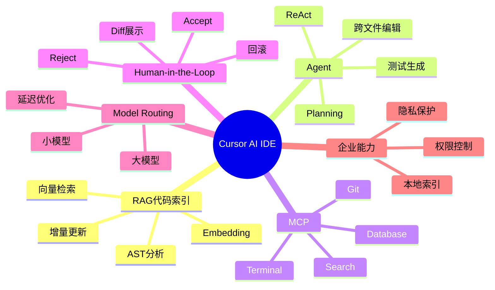

<!--
Chapter: 86
Node: KN-S-000001
Score: 91
Status: ✅ APPROVED
Attempt: 1
Round: 2
Generated: 2026-06-21 15:42:15
-->

# 第86章 Cursor AI — AI Native IDE 架构剖析 [L2-L3]

## Part 1：为什么要学这个？

### 你以为 AI IDE 是“把代码喂给 ChatGPT”

某后端工程师第一次用 Cursor 类 AI IDE 时，非常自信。

他心想：

> 不就是 ChatGPT 加个代码编辑器吗？大不了把整个项目上传给模型，然后问一句：“帮我改一下支付模块的 bug。”

结果下一秒，他愣住了。

AI 没有让他复制代码。

也没有要求上传整个仓库。

它直接定位到了：

* `PaymentService.java`
* `PaymentRepository.java`
* `PaymentConfig.java`
* `RefundProcessor.java`
* `PaymentTest.java`

并生成了一组跨 5 个文件的修改 Diff。

每个修改都能精确定位到函数级别。

甚至连测试代码都一起补上了。

这时候，很多工程师会产生一个疑问：

> 它到底是怎么知道整个项目结构的？

---

### 大部分人对 AI IDE 的理解，错在三个地方

错误理解一：

> AI IDE = ChatGPT + 代码编辑器。

错误理解二：

> 每次提问，都会把整个代码库发送给模型。

错误理解三：

> Agent 修改代码，就是模型自己“猜”。

事实上，这三件事都不成立。

真正的 Cursor 类 AI IDE，底层是一套非常复杂的 AI Native 架构：

```text
代码索引（RAG）
      ↓
代码理解（Agent）
      ↓
工具扩展（MCP）
      ↓
人工确认（Human-in-the-Loop）
```

它并不是：

> 把整个代码库塞给模型。

而是：

> 先把代码变成可检索的知识库，再让 Agent 规划修改方案，最后由人类决定是否接受变更。

---

### 为什么传统 IDE 已经不够用了

过去的软件开发有一个隐形成本：

> 找代码。

一个百万行项目中，修一个 Bug，真正写代码可能只需要 20 分钟。

剩下的时间都花在：

* 找调用链；
* 找配置；
* 找依赖；
* 找历史实现；
* 理解上下文。

很多团队统计发现：

> 超过一半的开发时间，不是在写代码，而是在理解代码。

AI Native IDE 的价值，不是替代程序员写代码。

而是：

> 帮程序员理解代码。

它把原来需要几十分钟的代码定位，压缩到了几百毫秒。

---

### 本章要解决的核心问题

学完这一章，你应该能够回答四个问题：

1. Cursor 为什么不需要上传整个代码库？
2. RAG 为什么能在百万行代码里快速找到相关代码？
3. Agent 为什么敢一次修改多个文件？
4. 为什么 Human-in-the-Loop 的 Diff 确认机制，是 AI IDE 建立信任的核心？

请记住这一句贯穿整章的话：

> **代码不进模型，索引进大脑；AI 提方案，人类点确认。**

---

## Part 2：学习路径定位

### 这一章在 AI Native 技术栈中的位置

Cursor 已经不是 Prompt Engineering 层面的技巧。

它属于：

> AI Native 应用架构设计。

它把多个核心技术融合在一起：

* RAG
* Agent
* Tool Calling
* MCP
* Human-in-the-Loop
* Model Routing

因此它位于：

```text
L2：能够理解 AI 系统架构
↓
L3：能够设计 AI Native 产品
```

---

### 前置知识

学习本章之前，需要掌握：

* Embedding
* 向量数据库
* RAG
* Agent
* Tool Calling

---

### 后续知识

掌握本章之后，可以继续学习：

* 多 Agent 系统
* 企业级代码 Agent
* 自主编程系统
* AI 操作系统（AI OS）

---



---

### 本章知识地图



---

### 学习目标

读完本章，你应该能够：

* 理解代码 RAG 和文档 RAG 的差异；
* 理解 Agent 如何进行跨文件编辑；
* 理解 MCP 在 IDE 中的作用；
* 能够设计一个简化版 Cursor 架构。

---

## Part 3：用生活理解它

### 图书馆管理员模型

假设你要找一本书里的一个知识点。

一种办法是：

把整个图书馆搬回家。

另一种办法是：

找一个非常熟悉图书馆的管理员。

你只问一句：

> “帮我找有关支付系统幂等性的内容。”

管理员会立即告诉你：

* 第三排书架；
* 第二本书；
* 第 87 页；
* 第 3 段。

Cursor 做的事情，就是第二种。

代码仓库就是图书馆。

Embedding 索引就是目录系统。

RAG 检索就是图书管理员。

Agent 则是帮你把找到的内容整理成解决方案的人。

---

### 类比的边界

这个类比并不完全成立。

图书管理员：

* 只负责找资料。

Cursor Agent：

* 不仅找资料；
* 还会分析代码；
* 修改代码；
* 调用工具；
* 生成 Diff；
* 规划执行步骤。

因此：

> RAG 负责“找到”，Agent 负责“行动”。

两者不能混为一谈。

---

## Part 4：AI 如何映射到传统概念

很多工程师第一次接触 Cursor，会觉得它很神秘。

其实它的很多能力，在传统软件领域都有对应物。

### 概念映射表

| 传统软件概念       | AI Native IDE 概念  |
| ------------ | ----------------- |
| 全文索引（Lucene） | 代码 Embedding 索引   |
| 搜索引擎         | RAG 检索            |
| 编译器 AST      | 代码语义理解            |
| 脚本自动化        | Agent 自动执行        |
| 插件机制         | MCP 工具协议          |
| 代码 Review    | Diff Human Review |
| 缓存系统         | Embedding Cache   |
| 路由策略         | Model Routing     |

---

### 从 IDE 到 AI IDE 的变化

| 传统 IDE    | AI Native IDE |
| --------- | ------------- |
| 用户找代码     | AI 找代码        |
| 用户决定修改位置  | AI 提出修改位置     |
| 用户写所有代码   | AI 生成部分代码     |
| 插件调用由用户触发 | Agent 自主调用工具  |
| 修改立即生效    | Diff 确认后生效    |

---

### 最大的变化是什么？

过去：

```text
Human -> IDE -> Code
```

现在：

```text
Human -> Agent -> IDE -> Code
```

人类不再直接操作代码。

而是在监督一个会写代码的 Agent。

这就是 AI Native IDE 的本质变化。

---

## Part 5：技术本质深讲

### Cursor 的三层架构

几乎所有 AI IDE，本质上都可以抽象成：

```text
RAG
+
Agent
+
MCP
```

---

### 第一层：代码库 RAG

普通文档 RAG：

```text
问题
↓
检索文档
↓
生成答案
```

代码 RAG：

```text
问题
↓
检索代码
↓
理解调用关系
↓
生成修改方案
```

最大的挑战在于：

代码不是普通文本。

代码存在：

* 调用关系；
* 类型依赖；
* 模块边界；
* 配置文件；
* 测试代码。

因此代码 RAG 往往需要：

* AST 分析；
* Symbol 索引；
* 增量 Embedding；
* 文件依赖图。

---

### 第二层：Agent

当用户说：

> 修复支付模块的超时问题。

这不是一个简单问答。

Agent 必须：

1. 找代码；
2. 找调用链；
3. 理解业务；
4. 制定修改计划；
5. 修改多个文件；
6. 生成测试代码；
7. 输出 Diff。

这是典型的 ReAct Agent。



---

### 第三层：MCP 工具生态

代码修改往往需要外部能力：

* 查询数据库；
* 搜索文档；
* 执行命令；
* 查看日志；
* 调用 Git。

如果每个 IDE 都自己实现：

工作量巨大。

于是出现了 MCP。



MCP 的价值是：

> 写一次工具，所有兼容客户端都能用。

它像 AI 世界里的 USB 接口。

---

### Human-in-the-Loop：信任的来源

为什么 Cursor 不直接改代码？

因为：

> AI 会犯错。

真正的企业开发中：

一次错误修改，可能导致：

* 数据损坏；
* 服务故障；
* 安全漏洞。

因此必须让人类拥有最终决定权。

流程如下：



这里的核心思想叫：

> Human-in-the-Loop。

AI 负责：

* 提建议。

人类负责：

* 做决定。

---

### Model Routing：速度与质量的平衡

所有请求都用最大模型，会非常慢。

Cursor 类产品一般采用：

| 任务      | 模型  |
| ------- | --- |
| 代码补全    | 小模型 |
| Tab预测   | 小模型 |
| Agent规划 | 大模型 |
| 复杂重构    | 大模型 |
| 聊天问答    | 中模型 |

这样才能做到：

```text
简单任务：毫秒级响应
复杂任务：高质量推理
```

---

### 整体架构图



这张图可以浓缩成一句话：

> **代码不进模型，索引进大脑；AI 提方案，人类点确认。**

## Part 6：动手 Demo（可运行代码）

### 用 40 行代码模拟 Cursor 的代码检索

真正的 Cursor 底层会使用 Embedding 模型和向量数据库。

为了理解原理，我们可以先实现一个极简版本：

* 建立代码索引；
* 根据用户问题检索相关代码；
* 返回最相关的文件。

```python
from sklearn.feature_extraction.text import TfidfVectorizer
from sklearn.metrics.pairwise import cosine_similarity

# 模拟代码库
files = {
    "payment_service.py": """
def create_payment(order_id):
    pass

def refund_payment(order_id):
    pass
""",
    "user_service.py": """
def create_user(name):
    pass

def login(username):
    pass
""",
    "payment_config.py": """
PAYMENT_TIMEOUT = 30
PAYMENT_RETRY = 3
"""
}

# 文件内容列表
documents = list(files.values())
file_names = list(files.keys())

# 建立向量索引
vectorizer = TfidfVectorizer()
matrix = vectorizer.fit_transform(documents)

# 用户问题
query = "modify payment timeout"

# 问题向量化
query_vec = vectorizer.transform([query])

# 相似度计算
scores = cosine_similarity(query_vec, matrix)[0]

# 找到最相关文件
ranked = sorted(
    zip(file_names, scores),
    key=lambda x: x[1],
    reverse=True
)

print("Top Relevant Files:")
for name, score in ranked:
    print(f"{name}: {score:.3f}")
```

---

### 运行后你会看到什么

输出类似：

```text
Top Relevant Files:
payment_config.py: 0.761
payment_service.py: 0.422
user_service.py: 0.000
```

这就是最简版的：

```text
代码 RAG
```

真实的 Cursor 会比这个复杂得多：

```text
TF-IDF
↓
Embedding
↓
向量数据库
↓
AST分析
↓
依赖图
↓
增量索引
```

但核心思想完全一致：

> 不扫描整个代码库，只找到最相关的代码。

---

### 如果再进一步

下一步就可以让 Agent：

1. 修改 `payment_config.py`
2. 更新 `payment_service.py`
3. 生成测试代码
4. 输出 Diff

这已经非常接近真实的 AI IDE 工作方式了。

---

## Part 7：真实项目场景

### 背景

某金融科技团队：

* 开发人数：30 人；
* 微服务数量：20+；
* 代码量：约 120 万行；
* 日均 PR：40 个。

团队最大的痛苦不是写代码。

而是：

```text
找代码。
```

修复一个支付 Bug 的流程通常是：

```text
收到告警
↓
搜索代码
↓
找调用链
↓
理解上下文
↓
修改代码
↓
补测试
```

平均耗时：

```text
2～3天
```

其中超过一半时间花在：

```text
理解代码
```

---

### 技术方案

团队引入 Cursor 类 AI IDE。

架构如下：



---

### 实现要点

#### 本地代码索引

代码不上传云端。

仅上传：

* Query
* 检索片段
* Prompt

这是企业采购的关键因素。

---

#### Agent Mode

Agent 自动：

* 找调用链；
* 找配置；
* 找测试；
* 补全修改。

一次修改可能跨：

* Controller
* Service
* Repository
* Config
* Test

---

#### Human-in-the-Loop

所有代码变更必须：

```text
Review
↓
Accept
↓
Apply
```

而不是：

```text
Auto Apply
```

---

### 最终效果

引入 AI IDE 后：

| 指标     | 优化前  | 优化后       |
| ------ | ---- | --------- |
| PR周期   | 36小时 | 10小时      |
| 代码定位   | 数秒搜索 | 200ms语义检索 |
| 回归Bug率 | 基准值  | 下降约30%    |

真正被提升的不是：

> 写代码速度。

而是：

> 理解代码速度。

---

## Part 8：这里容易踩坑

### 坑一：相信 Agent 一定正确

错误做法：

```python
agent.run(task)
agent.apply_all_changes()
```

正确做法：

```python
changes = agent.run(task)

for diff in changes:
    review(diff)

apply_selected_changes(changes)
```

---

### 为什么容易犯这个错误

因为 AI 输出得太像人写的代码。

但它仍然可能：

* 漏掉边界条件；
* 修改错误文件；
* 忽略兼容性问题。

AI 的代码质量高。

并不等于：

```text
100%正确
```

---

### 坑二：代码索引过期

错误做法：

```python
build_index_once()
```

正确做法：

```python
on_file_change():
    refresh_embedding()
```

或者：

```python
on_commit():
    update_index()
```

---

### 为什么会出问题

假设：

```text
PaymentAPI
```

已经被删除。

Embedding 没更新。

Agent 检索到了旧代码。

结果生成：

```python
PaymentAPI.call()
```

整个项目直接无法编译。

---

### 坑三：把代码 RAG 当文档 RAG

错误做法：

```text
Chunk：
1000 Token
Overlap：
200 Token
```

正确做法：

按照：

* 函数；
* 类；
* 模块；
* AST；

进行切分。

---

### 为什么？

代码天然具有结构。

随意切 Chunk：

```python
def create_payment(
```

和：

```python
):
```

可能被切到两个片段。

语义彻底丢失。

---

## Part 9：面试怎么答

### L1：Cursor 和 ChatGPT + 复制代码有什么区别？

#### 回答框架

第一层：

```text
自动上下文获取
```

第二层：

```text
代码RAG索引
```

第三层：

```text
跨文件理解
```

第四层：

```text
直接生成Diff
```

核心一句：

> Cursor 是代码理解系统，不是聊天机器人。

---

### L2：为什么 Human-in-the-Loop 是信任的关键？

#### 回答框架

第一层：

AI 只给建议。

第二层：

最终执行权在人类。

第三层：

Diff 提供可解释性。

第四层：

可以回滚。

第五层：

满足企业安全要求。

核心一句：

> 没有人工确认的 Agent，很难进入生产开发流程。

---

### L3：如果让你设计 Cursor，你怎么设计？

#### 回答框架

架构：

```text
RAG
+
Agent
+
MCP
```

代码索引：

```text
本地Embedding
增量更新
依赖图
```

Agent：

```text
ReAct
Planning
Tool Calling
```

MCP：

```text
标准协议
插件生态
```

隐私：

```text
代码本地
模型云端
上下文最小上传
```

这是一个非常经典的系统设计题。

---

## Part 10：考点速查

### **代码 RAG 不等于文档 RAG**

代码需要理解：

* AST
* 调用链
* 依赖关系

---

### **Human-in-the-Loop 是企业落地关键**

AI 提建议。

人类做决策。

---

### **代码不进模型**

上传的是：

* 检索片段；
* Prompt；

而不是整个仓库。

---

### **Model Routing 提升体验**

小模型负责速度。

大模型负责质量。

---

### **MCP 决定扩展能力**

工具标准化。

避免重复开发。

---

## Part 11：必背金句

**[局部检索原则]：不要把整个代码库喂给模型，只提供最相关的上下文。**

**[信任原则]：AI 可以修改代码，但必须由人类确认。**

**[索引原则]：代码库是知识库，Embedding 是目录。**

**[扩展原则]：工具能力应该协议化，而不是硬编码。**

**[路由原则]：不同任务使用不同模型。**

---

## Part 12：快速参考表

| 概念                | 作用     | 示例值           |
| ----------------- | ------ | ------------- |
| Embedding         | 代码向量化  | 1536维         |
| Chunk             | 代码切片   | 函数级           |
| Top-K             | 检索数量   | 5             |
| Agent             | 任务规划   | ReAct         |
| Diff Review       | 人工确认   | Accept/Reject |
| MCP               | 工具扩展协议 | Git、DB        |
| Model Routing     | 模型选择   | Small/Large   |
| Incremental Index | 增量更新   | File Watcher  |

---

## Part 13：思维导图



---

## Part 14：本章小结

第一句话：

> Cursor 不是 ChatGPT 加编辑器，而是代码 RAG、Agent 和 MCP 的组合系统。

第二句话：

> AI IDE 的核心价值不是替你写代码，而是帮你理解代码。

第三句话：

> 真正让企业敢使用 Agent 的，不是模型能力，而是 Human-in-the-Loop 的可控性。

---

### 成长路径

```text
L0：
会使用AI补全代码

L1：
理解代码RAG和Agent

L2：
能够设计AI IDE架构

L3：
能够设计企业级代码Agent系统
```

---

## Part 15：下一章预告

这一章，我们解决了：

* AI IDE 如何理解代码；
* 如何跨文件修改；
* 为什么需要人工确认；
* 为什么 MCP 能形成生态。

但还有一个更大的问题：

> 如果一个 Agent 已经可以修改代码，那么多个 Agent 能不能协作开发一个完整系统？

例如：

* 一个 Agent 写代码；
* 一个 Agent 做测试；
* 一个 Agent 做 Review；
* 一个 Agent 做部署。

它们之间如何通信？

如何共享记忆？

如何避免互相冲突？

下一章，我们进入：

> **Multi-Agent Software Engineering（多 Agent 软件工程）——让一群 AI 像工程团队一样协作开发软件。**