<!--
Chapter: 87
Node: KN-S-000002
Score: 92
Status: ✅ APPROVED
Attempt: 1
Round: 2
Generated: 2026-06-21 16:12:50
-->

# 第87章 Perplexity AI — 实时 RAG 搜索引擎架构 [L2]

## Part 1：为什么要学这个？[认知冲突先行]

一位工程师在公司搭建企业知识库问答系统。

他把几千份 PDF 文档全部向量化，接入向量数据库，配置好 RAG 流程，上线后信心满满。

用户提问：

> 今天最新政策是什么？

系统很快返回答案。

看起来一切正常。

直到用户发现：

系统回答的竟然是 3 个月前已经废止的旧政策。

工程师很困惑：

> 我不是已经用了 RAG 吗？
>
> RAG 不就是 AI 搜索引擎吗？

问题恰恰出在这里。

很多人以为：

* 向量数据库 = 搜索引擎
* RAG = 实时知识系统
* 文档更新 = AI 自动知道

事实上：

RAG 只负责“检索已存在的数据”。

如果知识库昨天没更新，那么今天发生的新事件，模型根本不知道。

换句话说：

传统 RAG 更像一张拍好的照片。

Perplexity 更像实时直播。

这正是很多 AI 产品与 Perplexity 的本质差异。

同样是：

* 用户提问
* 检索资料
* LLM生成答案

Perplexity为什么能回答：

* 今天发布的政策
* 刚刚公布的财报
* 几小时前发生的新闻

而很多企业RAG却做不到？

因为它们根本不是同一种架构。

本章要解决的核心问题：

> Perplexity究竟是如何把“搜索引擎”和“RAG系统”融合在一起，构建出实时知识问答系统的？

以及：

* 实时RAG和传统RAG有什么本质区别？
* 引用系统为什么是Perplexity成功的关键？
* 流式输出为什么比模型能力更重要？
* Pro Search为什么本质上是一种Agent RAG？

理解这些问题，你才能真正理解AI搜索产品的架构设计。

---

## Part 2：学习路径定位

很多工程师学习路线是这样的：

LLM → Prompt → RAG → 向量数据库

然后就停止了。

但Perplexity所代表的，其实是RAG架构的下一阶段。

它已经从：

> 检索增强生成（Retrieve-Augment-Generate）

演化为：

> 实时搜索 + 引用验证 + Agent推理

在能力层级中的位置如下：

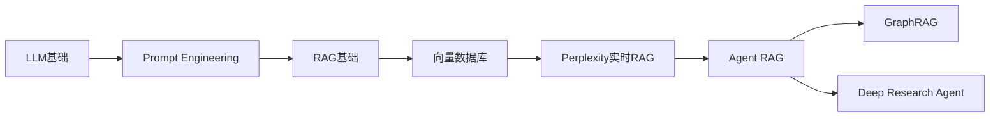

### 前置知识

掌握本章之前，应理解：

* LLM工作机制
* Token与Prompt
* Embedding
* 向量检索
* 基础RAG

### 后置知识

掌握本章之后，可继续学习：

* Agent Framework
* ReAct模式
* Multi-Hop Retrieval
* Deep Research
* GraphRAG

知识依赖关系如下：

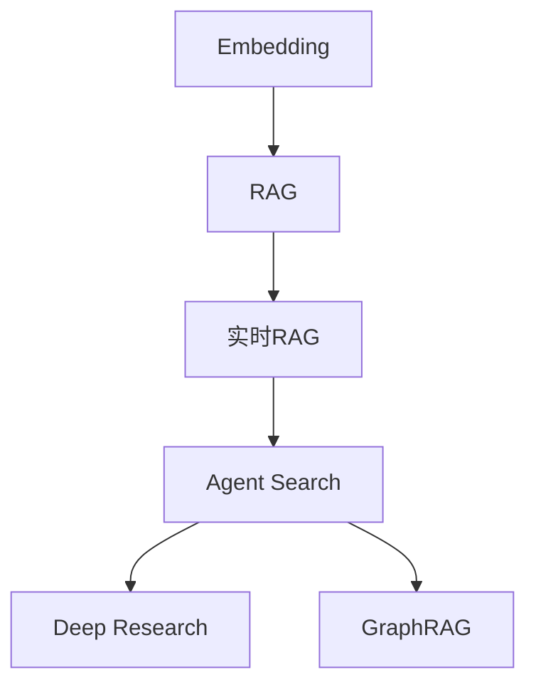

本章属于：

> 从“企业知识库RAG工程师”迈向“AI搜索系统架构师”的关键节点。

---

## Part 3：用生活理解它

想象你要开车去机场。

有两种地图。

第一种：

昨天下载好的离线地图。

第二种：

实时联网地图。

离线地图知道：

* 道路位置
* 高速入口
* 城市结构

但不知道：

* 事故
* 封路
* 拥堵

实时地图会在查询时重新获取路况信息。

因此路线始终是最新的。

传统RAG就像离线地图。

Perplexity则像实时导航。

用户每提一次问题：

系统都会重新联网搜索。

因此获得的是“当前世界状态”。

### 类比的边界

这个类比并不完全成立。

地图查询返回的是结构化数据。

而Perplexity返回的是：

* 网页内容
* 文档内容
* 多来源证据

随后还要经过：

* 排序
* 过滤
* 总结
* 生成

所以Perplexity不仅是导航系统。

它还是一个会阅读资料并写研究报告的助手。

---

## Part 4：AI如何映射到传统概念

很多传统软件工程师第一次接触Perplexity时，会把它理解成：

> 带聊天界面的搜索引擎。

实际上远不止如此。

下面是对应关系。

| 传统软件系统 | AI搜索系统                 |
| ------ | ---------------------- |
| 数据库查询  | 向量检索                   |
| 搜索引擎   | 实时Web Retrieval        |
| ETL流水线 | 网页抽取与清洗                |
| 推荐排序   | Retrieval Ranking      |
| API聚合层 | Multi-source Retrieval |
| 模板渲染   | LLM Generation         |
| 日志链路追踪 | Citation Tracking      |
| 工作流引擎  | Agent Pipeline         |

进一步理解：

| 传统概念          | Perplexity对应能力 |
| ------------- | -------------- |
| Google Search | 网页发现           |
| Elasticsearch | 结果召回           |
| PageRank      | 相关性排序          |
| REST API聚合    | 多来源融合          |
| 报告生成器         | LLM总结          |
| 审计日志          | 引用系统           |
| 自动化流程         | Pro Search     |

最重要的映射：

| 传统世界   | AI世界            |
| ------ | --------------- |
| 数据库记录  | 知识Chunk         |
| SQL查询  | 语义检索            |
| Join操作 | 上下文融合           |
| 数据来源   | Citation Source |
| 业务工作流  | Agent Loop      |

因此：

Perplexity本质上不是聊天机器人。

而是：

> Search Engine + Retrieval System + LLM + Citation Engine + Agent Framework

的组合体。

---

## Part 5：技术本质深讲

### 从传统RAG开始理解

传统RAG工作流程：

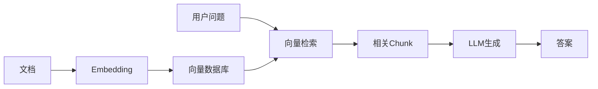

问题在哪里？

知识是在离线阶段索引的。

即：

```text
今天构建索引
↓
三个月不更新
↓
回答永远基于三个月前知识
```

因此：

传统RAG本质是知识快照。

---

### Perplexity实时RAG架构

Perplexity改变了检索阶段。

它不是优先查向量库。

而是优先查互联网。

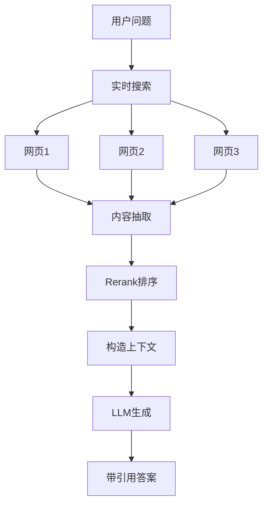

核心变化：

检索发生在 Query Time。

而不是 Index Time。

对比：

| 架构         | 检索时机    |
| ---------- | ------- |
| 传统RAG      | 离线索引后检索 |
| Perplexity | 查询时实时检索 |

这被称为：

**Query-Time Retrieval**

---

### 为什么引用系统如此重要

如果系统只回答：

> NVIDIA发布新芯片。

用户会立即产生怀疑：

> 你怎么知道？

于是Perplexity引入引用系统。

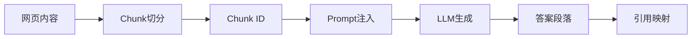

最终输出：

```text
NVIDIA发布了新一代AI芯片 [1]

市场预计将在第四季度量产 [2]
```

点击：

* [1]
* [2]

即可查看原始来源。

引用系统本质上是一种：

> Evidence Traceability（证据可追溯性）

机制。

它解决两个问题：

### 幻觉问题

模型说错了。

用户能追溯来源。

### 信任问题

用户知道：

这不是模型编造。

而是来自真实网页。

因此：

引用系统不是UI功能。

而是Perplexity的信任基础设施。

---

### 流式输出为什么关键

很多工程师只关注：

> 总响应时间

但用户感知的是：

> 首次响应时间

假设：

方案A：

```text
等待5秒
一次性返回答案
```

方案B：

```text
0.5秒开始输出
2秒完成答案
```

绝大多数用户会认为方案B更快。

因此Perplexity大量优化：

* Search并行化
* 内容抽取并行化
* LLM Streaming

典型流程：

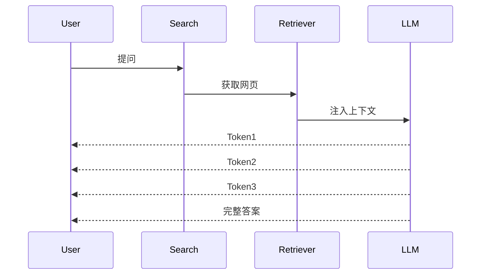

关键指标：

| 指标                | 意义               |
| ----------------- | ---------------- |
| TTFT              | First Token Time |
| Latency           | 整体响应时间           |
| Tokens/sec        | 输出速度             |
| Citation Coverage | 引用覆盖率            |

Perplexity重点优化的往往不是最终延迟。

而是TTFT。

因为用户会觉得：

> 它立刻开始思考了。

---

### Pro Search为什么是Agent RAG

普通搜索：

```text
搜索一次
生成一次
结束
```

Pro Search：

```text
搜索
↓
发现知识缺口
↓
再次搜索
↓
补充证据
↓
继续推理
↓
结束
```

流程如下：

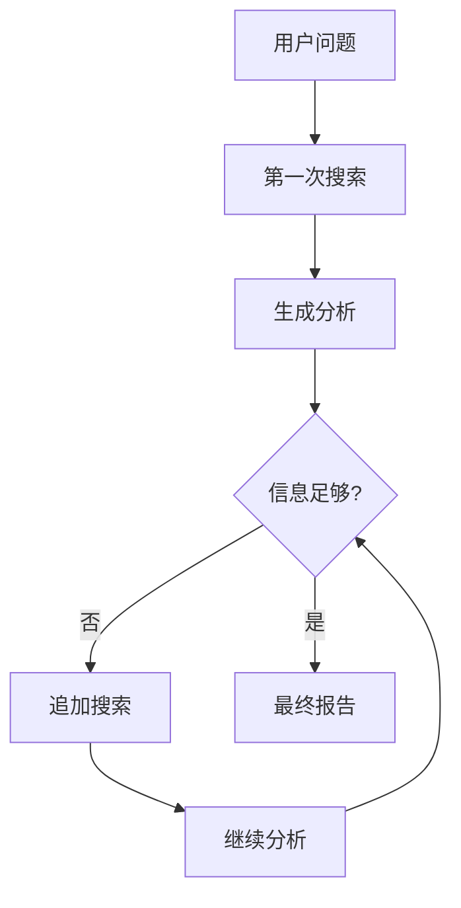

这实际上已经具备Agent特征：

* Goal
* Planning
* Tool Use
* Reflection
* Stop Condition

因此很多研究者认为：

> Pro Search本质上已经不是传统RAG，而是轻量级Agent RAG。

这也是未来AI搜索的发展方向。

一句话总结本章技术核心：

> 普通RAG是在旧知识里找答案；Perplexity是在实时世界里找证据，再让LLM写答案。引用系统建立信任，流式输出建立体验，Pro Search则把搜索升级成Agent推理。

## Part 6：动手Demo（可运行代码）

下面用一个极简版本模拟 Perplexity 的核心思想：

* 实时检索
* 引用绑定
* 生成带引用答案

为了保证代码可运行，这里用本地数据模拟搜索结果。

```python
from dataclasses import dataclass

@dataclass
class Source:
    id: int
    title: str
    content: str

# 模拟实时搜索结果
results = [
    Source(
        1,
        "NVIDIA 发布新芯片",
        "NVIDIA 宣布推出新一代 AI 芯片 Blackwell。"
    ),
    Source(
        2,
        "市场分析报告",
        "分析师预计第四季度开始大规模量产。"
    )
]

question = "NVIDIA 最新 AI 芯片情况如何？"

# 构造上下文
context = "\n".join(
    [f"[{r.id}] {r.content}" for r in results]
)

# 模拟生成
answer = (
    f"NVIDIA 发布了新一代 AI 芯片 Blackwell [1]。\n"
    f"市场预计将在第四季度进入量产阶段 [2]。"
)

print("问题：")
print(question)

print("\n检索上下文：")
print(context)

print("\n生成答案：")
print(answer)
```

### 关键代码解析

```python
results = [...]
```

模拟实时搜索返回结果。

---

```python
context = "\n".join(...)
```

构造 Prompt 上下文。

真实系统里这里会包含：

* 网页正文
* 搜索摘要
* API结果

---

```python
f"[{r.id}] {r.content}"
```

给每个 Chunk 分配引用编号。

---

```python
answer = ...
```

模拟 LLM 生成结果。

真实环境中会把 Citation ID 注入 Prompt。

### 运行后你会看到什么

输出类似：

```text
问题：
NVIDIA 最新 AI 芯片情况如何？

检索上下文：
[1] NVIDIA 宣布推出新一代 AI 芯片 Blackwell。
[2] 分析师预计第四季度开始大规模量产。

生成答案：
NVIDIA 发布了新一代 AI 芯片 Blackwell [1]。
市场预计将在第四季度进入量产阶段 [2]。
```

这就是 Perplexity 引用系统最核心的思想：

> 每个事实都能追溯到具体证据。

---

## Part 7：真实项目场景

### 业务背景

某 AI 搜索团队希望打造：

> 金融与科技新闻智能问答平台

目标问题：

* 今天 NVIDIA 股价为什么上涨？
* OpenAI 最近发布了什么？
* 日本央行最新政策是什么？

### 第一版方案

架构：

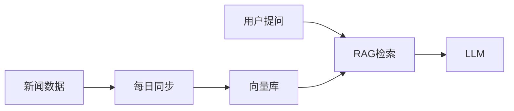

更新频率：

```text
每天一次
```

问题很快出现：

```text
新闻时效性滞后
12~36小时
```

用户经常发现：

搜索结果比Google慢。

### 第二版方案

团队参考 Perplexity。

改为：

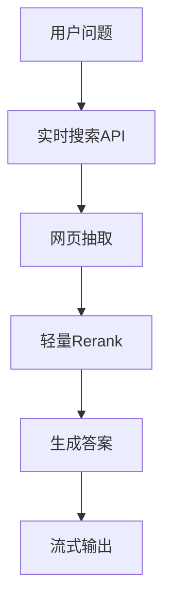

核心改动：

### 实时检索

每次查询触发：

* Search API
* 新闻API
* RSS源

---

### 轻量排序

小模型负责：

* 去广告
* 去垃圾页面
* 相关性排序

---

### 流式生成

搜索结果刚到达：

模型立即开始生成。

无需等待所有网页下载完成。

### 项目结果

指标变化：

| 指标       |  改造前 |  改造后 |
| -------- | ---: | ---: |
| 首Token时间 | 3.8s | 0.6s |
| 完整回答时间   | 6.5s | 2.1s |
| 引用点击率    |  18% |  41% |
| 用户满意度    |    低 | 显著提升 |

团队最终发现：

用户真正信任的不是模型。

而是来源。

当用户能点击引用查看证据时：

AI答案才真正具备可信度。

---

## Part 8：这里容易踩坑

### 坑1：把RAG当成实时知识系统

错误认知：

```text
用了向量数据库
=
知识实时更新
```

错误代码：

```python
# 三个月前建立索引
vector_db.build(all_documents)

# 三个月后继续查询
answer = rag.query(question)
```

问题：

索引已经过期。

模型回答的是旧世界。

正确做法：

```python
web_results = search_api.search(question)

answer = rag.generate(
    question,
    web_results
)
```

实时问题实时检索。

静态问题查询向量库。

---

### 坑2：只生成答案，不保留引用

错误做法：

```python
answer = llm.generate(context)
```

最终用户看到：

```text
某公司已经发布新产品。
```

问题：

来源在哪？

无法验证。

正确做法：

```python
answer = llm.generate(
    context,
    citations=True
)
```

输出：

```text
某公司已经发布新产品 [3]
```

引用可追踪。

---

### 坑3：等待全部检索完成再输出

错误流程：

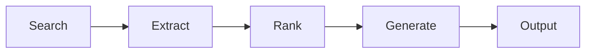

用户体验：

```text
等待5秒
突然出现整篇答案
```

正确流程：

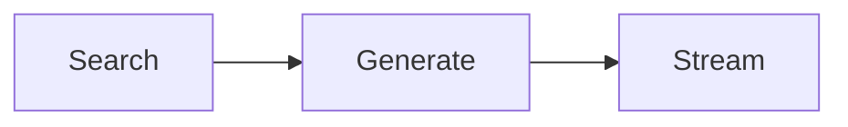

搜索与生成尽可能重叠执行。

用户感知速度会显著提升。

---

## Part 9：面试怎么答

### L1题

### RAG系统和直接把文档喂给大模型有什么区别？

回答框架：

* 上下文窗口有限
* 文档太大无法全部输入
* RAG先检索再注入
* 成本更低
* 幻觉更少

关键词：

```text
检索增强
上下文压缩
成本优化
```

---

### L2题

### 为什么Perplexity需要实时爬取，而不是只用向量数据库？

回答框架：

* 向量库本质是离线索引
* 存在知识更新延迟
* 新闻、政策、股价具有强时效性
* Query-Time Retrieval能够获得最新数据
* 代价是更高延迟和更复杂架构

关键词：

```text
时效性
实时检索
离线索引
Query-Time Retrieval
```

---

### L3题

### 如何设计支持Pro Search的RAG系统？

回答框架：

```text
问题拆解
↓
搜索
↓
分析缺口
↓
追加搜索
↓
多跳推理
↓
停止条件判断
↓
生成报告
```

核心技术：

* ReAct
* Tool Calling
* Query Decomposition
* Multi-Hop Retrieval
* Reflection
* Stop Condition

面试官真正想考察的是：

> 你是否理解Agent化搜索。

---

## Part 10：考点速查

### **实时RAG**

查询时动态检索数据，而非依赖历史索引。

---

### **Query-Time Retrieval**

搜索发生在用户提问之后，而不是预先索引阶段。

---

### **Citation System**

生成结果与证据来源绑定，实现可验证性。

---

### **Streaming Response**

优先优化首Token时间，而不是只优化总延迟。

---

### **Pro Search**

多轮搜索、多轮推理的Agent RAG模式。

---

## Part 11：必背金句

**[实时性原则]：知识更新速度决定搜索系统价值上限。**

**[证据原则]：没有引用的答案，本质上不可验证。**

**[体验原则]：用户更在意首Token时间，而不是总耗时。**

**[搜索原则]：RAG如果不实时，就只是会说话的旧数据库。**

**[演化原则]：Pro Search的终点不是搜索，而是Agent推理。**

---

## Part 12：快速参考表

| 概念         | 作用      | 示例值        |
| ---------- | ------- | ---------- |
| RAG        | 检索增强生成  | 企业知识库      |
| 实时RAG      | 查询时动态检索 | Perplexity |
| Embedding  | 语义向量化   | 1536维向量    |
| Vector DB  | 存储向量    | Pinecone   |
| Web Search | 实时搜索    | Google API |
| Rerank     | 结果重排    | Top50→Top5 |
| Citation   | 证据追踪    | [1][2][3]  |
| Streaming  | 流式输出    | TTFT=0.5s  |
| Agent Loop | 自主搜索循环  | ReAct      |
| Pro Search | 深度研究模式  | 多轮搜索       |

---

## Part 13：思维导图

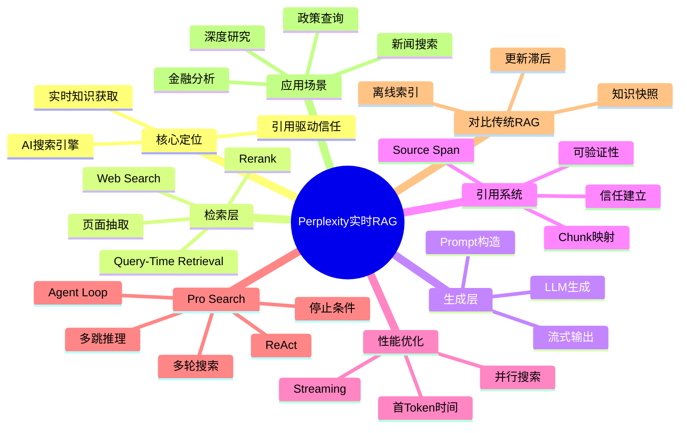

---

## Part 14：本章小结

很多工程师认为 Perplexity 只是“带聊天框的搜索引擎”，实际上它代表的是实时RAG架构的成熟形态。

传统RAG解决的是“如何利用已有知识”，而Perplexity解决的是“如何获取最新知识并证明其真实性”。

从能力成长路径来看：

```text
L0：会使用ChatGPT

↓

L1：理解RAG原理

↓

L2：理解实时RAG与引用系统

↓

L3：设计Agent Search与Pro Search

↓

L4：构建Deep Research平台
```

掌握本章后，你已经进入AI搜索系统设计领域，而不仅仅是企业知识库开发阶段。

---

## Part 15：下一章预告

这一章解决了一个关键问题：

> AI如何获得最新知识。

但新的问题马上出现。

即使搜索到了资料，模型也未必能完成复杂推理。

例如：

```text
A公司收购了B公司

B公司的CEO曾任职于C公司

C公司的最大合作伙伴是谁？
```

这个问题需要：

* 跨文档关联
* 实体关系理解
* 多跳推理

传统RAG往往表现不佳。

因为它只能找到相似文本。

却无法理解知识之间的结构关系。

下一章将进入：

> GraphRAG —— RAG + 知识图谱架构

你将看到：

为什么向量检索解决不了复杂关系推理，以及知识图谱如何让AI具备跨文档推理能力。