<!--
Chapter: 88
Node: KN-S-000003
Score: 92
Status: ✅ APPROVED
Attempt: 1
Round: 2
Generated: 2026-06-21 16:34:54
-->

# 第88章 企业客服 Agent 系统设计 [L2-L3]

## Part 1：为什么要学这个？[认知冲突先行]

某电商平台上线 AI 客服后，团队原本非常兴奋。

他们做了很多正确的事情：

* 接入了先进的大模型
* 构建了 RAG 知识库
* 导入了退款规则文档
* 建立了订单查询接口

上线后，一位用户发来消息：

> 我要退款，已经等了7天还没人处理。

系统经过检索后，准确找到了《退款政策说明》文档。

然后回复：

> 根据平台退款规则，退款将在7个工作日内处理完成……

从技术角度看，系统没有出错。

从业务角度看，灾难发生了。

用户变得更愤怒：

> 你根本没解决问题！

随后连续投诉、升级工单、给出差评。

工程师很困惑：

> 大模型不是已经理解语义了吗？
>
> RAG不是已经找到正确知识了吗？
>
> 为什么用户还是不满意？

问题出在一个很多 AI 工程师容易忽略的地方：

系统回答得对，不代表系统处理得对。

用户真正的问题并不是：

> “退款规则是什么？”

而是：

> “我已经等了7天，你们到底有没有人在处理我的退款？”

这里隐藏着两个高风险信号：

* 退款请求
* 强烈负面情绪

这类请求本不应该继续走 FAQ 流程。

应该直接升级人工。

这就是企业客服 Agent 与普通 ChatBot 的本质区别。

普通 ChatBot 的目标是：

> 回答问题。

企业客服 Agent 的目标是：

> 正确处理问题。

本章要解决的核心问题是：

* 为什么客服系统必须先分诊（Triage）？
* 为什么不能把所有请求都交给 LLM？
* Human-in-the-Loop 应该放在哪些关键节点？
* 如何设计真正能落地生产环境的 AI 客服架构？

一句话记忆：

> 客服先分诊，再回答；高风险先人工，低风险才自动化。

---

## Part 2：学习路径定位

企业客服 Agent 已经属于生产级 Agent 系统设计。

它不是 Prompt Engineering 的延伸，而是 Agent Architecture（Agent 架构设计）的典型案例。

所处位置：

* L0：LLM 基础
* L1：Prompt 工程
* L2：单 Agent 系统
* L3：多 Agent + HITL
* L4：企业级 Agent 平台

知识路径如下：

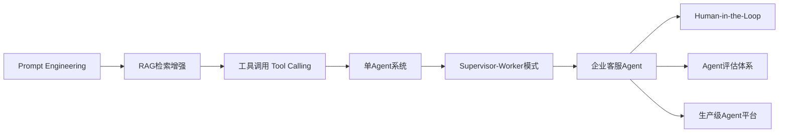

本章前置知识：

* Prompt Engineering
* RAG
* Tool Calling
* Supervisor-Worker Pattern

本章后续知识：

* Agent Evaluation
* Agent Governance
* Multi-Agent Orchestration
* Agent Observability

本章是很多企业级 Agent 项目的分水岭。

能够写 Prompt，不代表能够设计客服系统。

能够做 Demo，也不代表能够上线生产。

客服 Agent 正是从“能跑”走向“可运营”的关键一步。

---

## Part 3：用生活理解它

想象一家大型医院急诊中心。

每天有几千名病人进入大厅。

如果所有病人都统一排队挂号，会发生什么？

* 感冒患者排队
* 胃痛患者排队
* 心脏病患者也排队

结果可能是：

心脏病患者还没轮到挂号就出事了。

因此医院一定有一个步骤：

分诊（Triage）。

护士会快速判断：

* 普通患者 → 普通门诊
* 骨科问题 → 骨科医生
* 心脏病发作 → 抢救室

企业客服 Agent 完全一样。

* FAQ 问题 → FAQ Agent
* 订单查询 → Order Agent
* 退款纠纷 → Refund Agent
* 高情绪用户 → 人工客服

类比的边界：

医院分诊依赖医生经验和生命风险判断。

客服系统中的 Triage Agent 依赖：

* 意图识别
* 风险识别
* 情绪分析
* 置信度评估

本质相似，但实现机制完全不同。

---

## Part 4：AI如何映射到传统概念

很多传统软件工程师看到 Agent 架构时会觉得陌生。

实际上，大部分概念都有对应关系。

| 传统软件架构            | AI Agent 架构             |
| ----------------- | ----------------------- |
| API Gateway       | Triage Agent            |
| Router            | Intent Router           |
| Service Layer     | Worker Agent            |
| Workflow Engine   | Supervisor              |
| Rule Engine       | HITL Trigger            |
| Knowledge Base    | RAG Knowledge Base      |
| Human Operator    | Human-in-the-Loop       |
| Exception Queue   | Escalation Queue        |
| Monitoring System | Agent Evaluation System |

进一步映射：

| 企业客服需求 | 传统方案  | Agent方案          |
| ------ | ----- | ---------------- |
| FAQ回答  | 搜索系统  | FAQ Agent + RAG  |
| 查询订单   | API服务 | Order Worker     |
| 退款处理   | 工单系统  | Refund Worker    |
| 投诉升级   | 客服转接  | Escalation Agent |
| 风险控制   | 审批流   | HITL             |
| 流程编排   | BPM   | Supervisor       |

最大的变化在于：

传统系统：

> 路由规则由程序员写死。

Agent 系统：

> 路由决策由 Triage Agent 动态完成。

这也是为什么 Triage Agent 的准确率极其重要。

因为它决定后面所有流程是否正确。

---

## Part 5：技术本质深讲

### 企业客服 Agent 的核心架构

生产环境中最常见的架构：

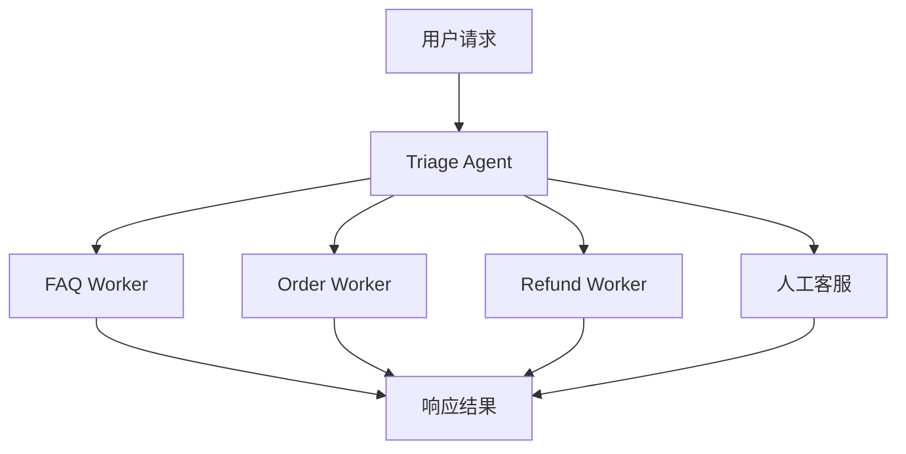

这里采用的是经典的：

Supervisor-Worker Pattern

其中：

* Triage = Supervisor
* FAQ/Order/Refund = Worker

---

### 为什么 Triage 必须使用大模型

很多团队会犯一个错误：

> 所有 Agent 都用同一个模型。

实际上不同 Agent 的目标完全不同。

Triage Agent 需要完成：

* 意图识别
* 风险判断
* 情绪分析
* 流程决策

例如：

> 我要退款，已经等了7天。

Triage 不仅要识别：

* Intent = Refund

还要识别：

* Emotion = Angry
* Risk = High

并决定：

* Escalate to Human

这是复杂推理任务。

准确率优先。

因此通常使用能力更强的大模型。

---

### 为什么 FAQ Agent 可以使用小模型

FAQ Agent 的工作相对简单：

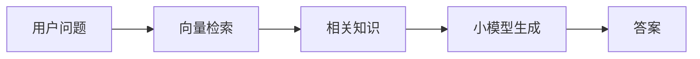

这里主要依赖：

* 向量检索
* 文档召回

模型只负责组织答案。

因此：

* 不需要复杂推理
* 不需要多步决策
* 不需要风险判断

使用小模型即可。

收益非常明显：

| 方案               | 成本 | 延迟 |
| ---------------- | -- | -- |
| 全部大模型            | 高  | 高  |
| Triage大模型+FAQ小模型 | 低  | 低  |

许多企业实践中：

FAQ 成本可以下降 70% 以上。

---

### Human-in-the-Loop 的三个关键节点

生产环境里最重要的设计不是 Agent。

而是：

Human-in-the-Loop。

核心思想：

> AI负责大多数情况，人负责高风险情况。

典型架构：

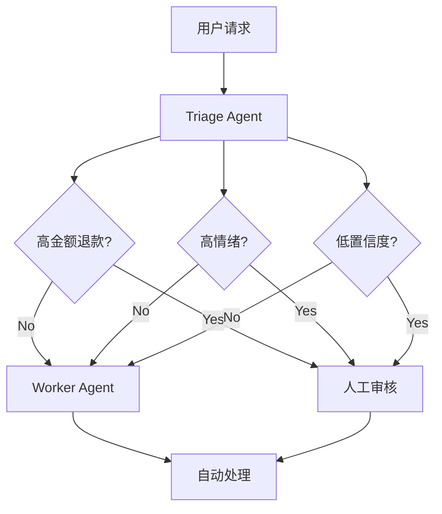

三个关键触发点：

### 第一类：高金额退款

例如：

* 金额 > 500 元
* 金额 > 1000 元

不同企业阈值不同。

原因：

退款意味着资金流出。

错误成本极高。

因此必须人工确认。

---

### 第二类：高情绪用户

例如检测到：

* 愤怒
* 投诉
* 威胁曝光
* 差评威胁

典型语句：

> 我要投诉你们。

> 我要发微博曝光。

> 你们这是欺诈。

此时继续让 AI 回答往往会激化矛盾。

正确做法：

直接转人工。

情绪优先级高于意图优先级。

即使用户问题本质是 FAQ。

只要情绪高风险。

仍然优先人工处理。

---

### 第三类：低置信度

例如：

```text
Intent Confidence = 0.42
```

系统无法确定：

* 查询订单？
* 退款申请？
* 投诉升级？

此时继续自动执行风险很大。

应该进入人工审核队列。

典型阈值：

```text
confidence < 0.65
```

触发 HITL。

---

### 企业级客服 Agent 完整执行流程

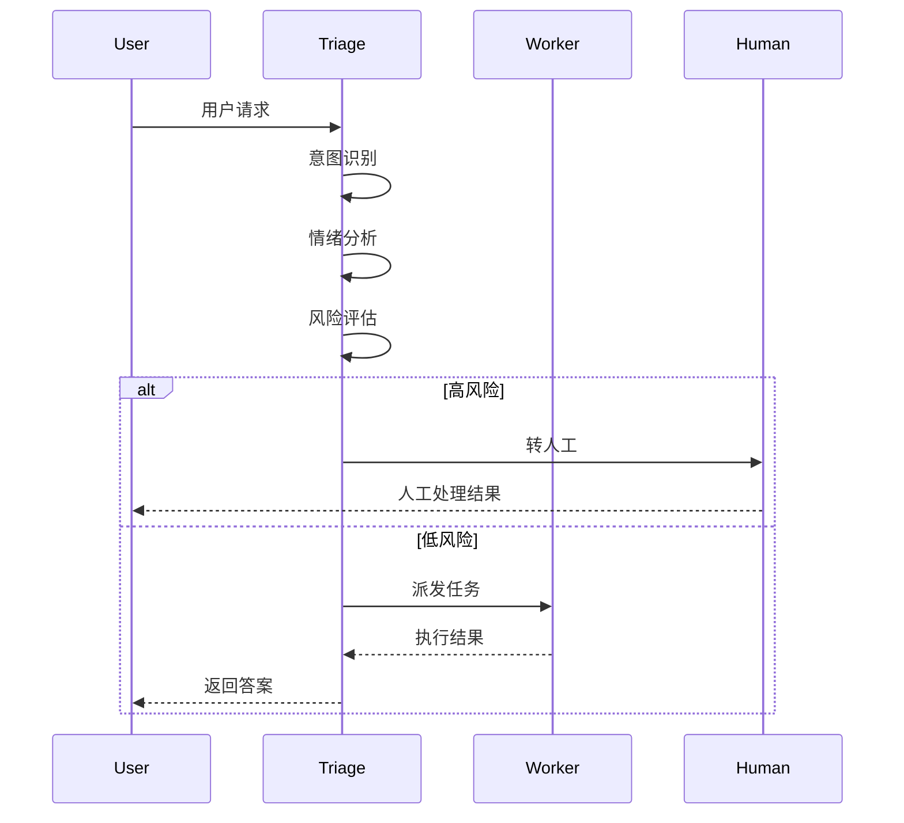

企业客服 Agent 的本质可以浓缩成一句话：

> Triage 决定谁来处理问题，Worker 负责解决问题，Human 负责承担高风险决策。

这正是现代企业客服系统能够实现约 70% 自动化率，同时保持业务安全性的核心原因。

## Part 6：动手Demo（可运行代码）

下面实现一个更接近真实生产环境的轻量版 Triage。

与纯关键词匹配不同，这个版本使用简单向量相似度思想完成意图识别。

核心能力：

* Intent Routing
* Emotion Detection
* Confidence Calculation
* HITL Trigger
* Trace Log

```python
from dataclasses import dataclass
from math import sqrt


@dataclass
class Ticket:
    text: str
    amount: float = 0


INTENT_VECTORS = {
    "faq": [1, 0, 0],
    "order": [0, 1, 0],
    "refund": [0, 0, 1]
}


KEYWORDS = {
    "faq": ["规则", "怎么", "帮助"],
    "order": ["订单", "物流", "快递"],
    "refund": ["退款", "退货", "赔偿"]
}


def cosine_similarity(v1, v2):
    dot = sum(a * b for a, b in zip(v1, v2))
    norm1 = sqrt(sum(x * x for x in v1))
    norm2 = sqrt(sum(x * x for x in v2))
    return dot / (norm1 * norm2)


def embed_text(text):
    vector = [0, 0, 0]

    for idx, intent in enumerate(["faq", "order", "refund"]):
        for word in KEYWORDS[intent]:
            if word in text:
                vector[idx] += 1

    return vector


def detect_emotion(text):
    angry_words = ["投诉", "曝光", "欺诈", "差评", "愤怒"]

    for word in angry_words:
        if word in text:
            return "angry"

    return "normal"


def triage(ticket):
    emotion = detect_emotion(ticket.text)

    if emotion == "angry":
        return "human", 1.0

    user_vector = embed_text(ticket.text)

    scores = {}

    for intent, intent_vector in INTENT_VECTORS.items():
        scores[intent] = cosine_similarity(
            user_vector,
            intent_vector
        ) if sum(user_vector) > 0 else 0

    intent = max(scores, key=scores.get)
    confidence = scores[intent]

    if confidence < 0.65:
        return "human", confidence

    if intent == "refund" and ticket.amount > 500:
        return "human", confidence

    return intent, confidence


ticket = Ticket(
    text="我要退款，已经等了7天",
    amount=800
)

route, confidence = triage(ticket)

print("route =", route)
print("confidence =", round(confidence, 2))
```

### 关键代码解释

文本向量化：

```python
user_vector = embed_text(ticket.text)
```

实际生产环境中通常会替换为：

* OpenAI Embedding
* BGE
* E5
* Voyage Embedding

置信度计算：

```python
confidence = scores[intent]
```

用于决定是否触发人工审核。

高风险退款：

```python
if intent == "refund" and ticket.amount > 500:
    return "human"
```

触发 HITL。

### 运行后你会看到什么

输出类似：

```text
route = human
confidence = 1.0
```

原因：

* 识别到退款意图
* 金额超过500元
* 进入人工审核

这就是企业客服系统中最重要的风险控制机制。

---

## Part 7：真实项目场景

### 项目背景

某大型跨境电商平台：

* 日均咨询量 120 万+
* 覆盖 30 多个国家
* SKU 数百万级
* 客服团队数千人

系统初期架构非常简单：

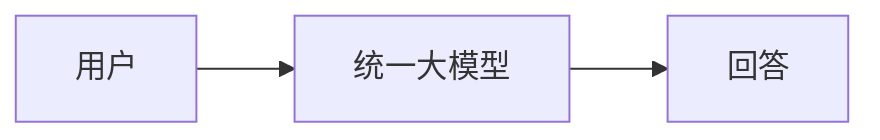

上线后问题不断出现：

* FAQ成本极高
* 高峰期延迟严重
* 高情绪用户识别失败
* 退款纠纷升级增加

客户满意度下降至：

```text
CSAT = 78%
```

---

### 重构后的架构

团队最终采用 Supervisor-Worker 模式：

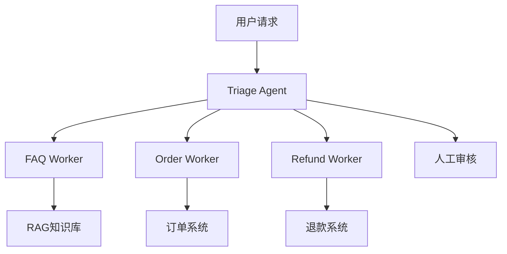

---

### 技术选型

| 模块         | 技术方案              |
| ---------- | ----------------- |
| Triage     | 大模型               |
| FAQ        | 小模型 + RAG         |
| Order      | Tool Calling      |
| Refund     | Tool Calling      |
| Emotion    | 分类模型              |
| Vector DB  | Milvus / pgvector |
| Monitoring | Langfuse          |
| Tracing    | OpenTelemetry     |

---

### 客服知识库设计

很多团队误以为知识库只有 FAQ。

实际上成熟系统通常包含：

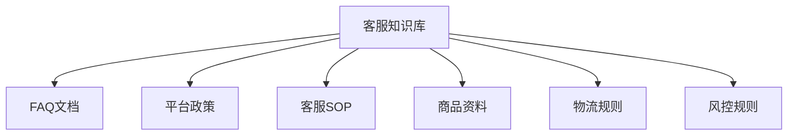

不同文档采用不同策略：

| 文档类型 | 更新频率 | Chunk策略  |
| ---- | ---- | -------- |
| FAQ  | 高频   | 小Chunk   |
| 商品资料 | 高频   | 中Chunk   |
| SOP  | 中频   | 大Chunk   |
| 政策规则 | 低频   | 结构化Chunk |

---

### 可观测性设计

很多团队上线后才发现：

系统为什么转人工？

为什么误判？

为什么路由错误？

完全查不到。

因此必须记录 Trace。

示例：

```text
trace_id=cs_001928
user_id=u_123
intent=refund
emotion=angry
confidence=0.91
refund_amount=800
hitl_trigger=emotion
final_route=human
latency=210ms
```

这是生产环境必不可少的数据。

---

### 项目结果

重构后指标变化：

| 指标     | 改造前    | 改造后   |
| ------ | ------ | ----- |
| 自动化率   | 48%    | 71%   |
| 平均响应时间 | 1800ms | 420ms |
| 人工介入率  | 基线     | -32%  |
| CSAT   | 78%    | 86%   |
| 退款升级率  | 基线     | -41%  |

核心经验：

> 自动化率提升来自正确分诊，而不是更大的模型。

---

## Part 8：这里容易踩坑

### 坑一：所有请求都交给大模型

错误代码：

```python
response = large_model.invoke(user_input)
```

问题：

* 成本高
* 延迟高
* 无法扩展

错误架构：

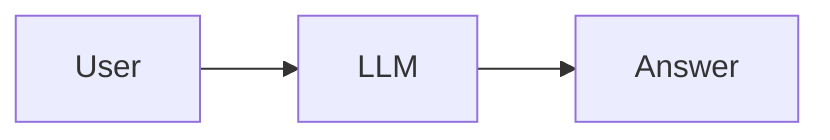

正确架构：

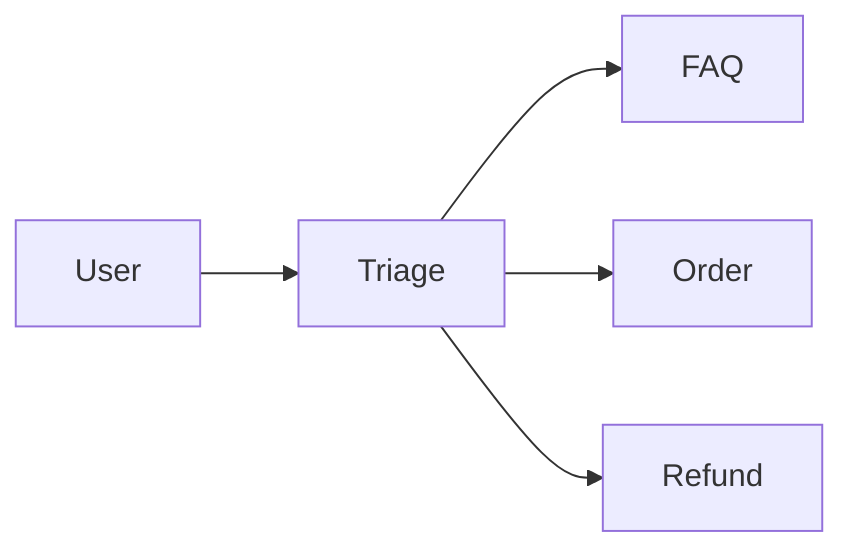

原因：

不同任务需要不同能力。

---

### 坑二：先识别意图，再识别情绪

错误代码：

```python
intent = classify_intent(text)

if intent == "faq":
    faq_worker()
```

用户输入：

```text
我要投诉你们物流太慢
```

系统可能直接进入 FAQ。

正确代码：

```python
emotion = detect_emotion(text)

if emotion == "angry":
    transfer_to_human()

intent = classify_intent(text)
```

原因：

情绪风险高于业务意图。

---

### 坑三：忽略低置信度

错误代码：

```python
intent = model.predict(text)

execute(intent)
```

即使模型只有 40% 把握也执行。

正确代码：

```python
intent, confidence = predict(text)

if confidence < 0.65:
    route_to_human()
```

原因：

生产系统最大的风险来自错误自动化。

不是来自人工处理。

---

## Part 9：面试怎么答

### L1：企业客服 Agent 中 HITL 的三个介入点是什么？

回答框架：

* 高金额退款
* 高情绪用户
* 低置信度判断

进一步说明：

* 资金风险
* 舆情风险
* 决策风险

对应三种不同风险源。

---

### L2：为什么 Triage 用大模型而 FAQ 用小模型？

回答框架：

Triage 负责：

* 意图理解
* 情绪分析
* 风险评估
* 路由决策

属于高价值决策。

FAQ 负责：

* 检索知识
* 组织答案

属于低风险执行。

总结：

```text
Triage = Accuracy First
FAQ = Cost First
```

---

### L3：如何评估客服 Agent 是否达到生产级？

从四个维度回答。

业务指标：

* CSAT
* 投诉率
* 升级率

效率指标：

* 自动化率
* 平均处理时间
* 人工接管率

模型指标：

* Intent Accuracy
* Routing Accuracy
* Emotion Recall

风险指标：

* 错误退款率
* 错误拒答率
* 高风险漏检率

最终目标：

```text
效率
+
质量
+
安全
+
成本
```

同时达标。

---

## Part 10：考点速查

### **Supervisor-Worker 架构**

Triage 负责决策，Worker 负责执行。

### **Human-in-the-Loop**

高风险节点必须引入人工审核。

### **情绪优先原则**

情绪风险优先级高于业务意图。

### **Triage 使用大模型**

准确率优先于成本。

### **FAQ 使用小模型 + RAG**

检索驱动场景优先优化成本。

---

## Part 11：必背金句

**[分诊原则]：客服系统先决定谁处理问题，再决定如何处理问题。**

**[风险原则]：涉及资金、情绪和不确定性的请求必须触发 HITL。**

**[架构原则]：Supervisor 决策，Worker 执行。**

**[成本原则]：大模型负责判断，小模型负责重复劳动。**

**[生产原则]：自动化率不是目标，正确自动化率才是目标。**

---

## Part 12：快速参考表

| 概念               | 作用    | 示例值          |
| ---------------- | ----- | ------------ |
| Triage Agent     | 分诊路由  | GPT级模型       |
| FAQ Worker       | FAQ回答 | 小模型+RAG      |
| Order Worker     | 查询订单  | Tool Calling |
| Refund Worker    | 退款处理  | Tool Calling |
| HITL             | 人工审核  | 审批流          |
| Emotion Score    | 情绪识别  | angry        |
| Confidence       | 置信度   | 0.65         |
| Refund Threshold | 退款阈值  | 500元         |
| CSAT             | 客户满意度 | 86%          |
| Automation Rate  | 自动化率  | 71%          |
| Routing Accuracy | 路由准确率 | >95%         |
| Emotion Recall   | 情绪召回率 | >90%         |

---

## Part 13：思维导图

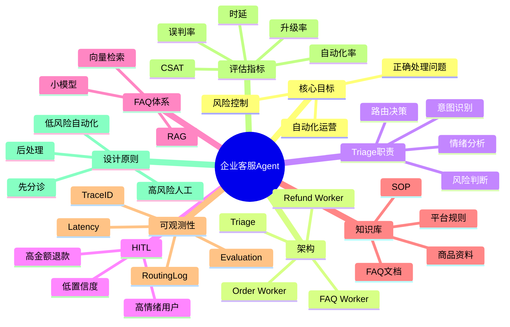

---

## Part 14：本章小结

企业客服 Agent 的核心不是回答问题，而是正确处理问题。

生产级客服系统本质上是一个 Triage + Worker + HITL 的风险控制系统，而不是单纯的大模型聊天系统。

从成长路径来看：

* L0：理解客服业务流程
* L1：实现 FAQ Bot
* L2：构建 RAG 客服系统
* L3：设计 Supervisor-Worker + HITL 架构
* L4：建设企业级 Agent 平台与治理体系

---

## Part 15：下一章预告

本章解决了一个关键问题：

> 如何让客服 Agent 安全地自动处理大部分用户请求？

但新的问题马上出现：

即使架构设计正确，我们如何证明它真的可靠？

例如：

* 自动化率为什么是 71% 而不是 50%？
* 情绪模型是否漏掉愤怒用户？
* Triage 是否把退款请求误路由到 FAQ？
* 新模型上线后效果到底提升还是下降？

这些问题已经超出了 Agent 设计本身。

开始进入 Agent Evaluation 领域。

下一章：

# 第89章 Agent 评估体系设计

你将学习：

* Offline Evaluation
* Online Evaluation
* Routing Accuracy
* Task Success Rate
* Human Preference
* LLM-as-a-Judge
* A/B Testing
* Agent Observability

届时你会发现：

> 能运行的 Agent 并不少见，能够持续评估、持续优化、持续迭代的 Agent，才是真正的生产级 Agent。