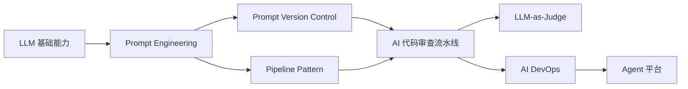
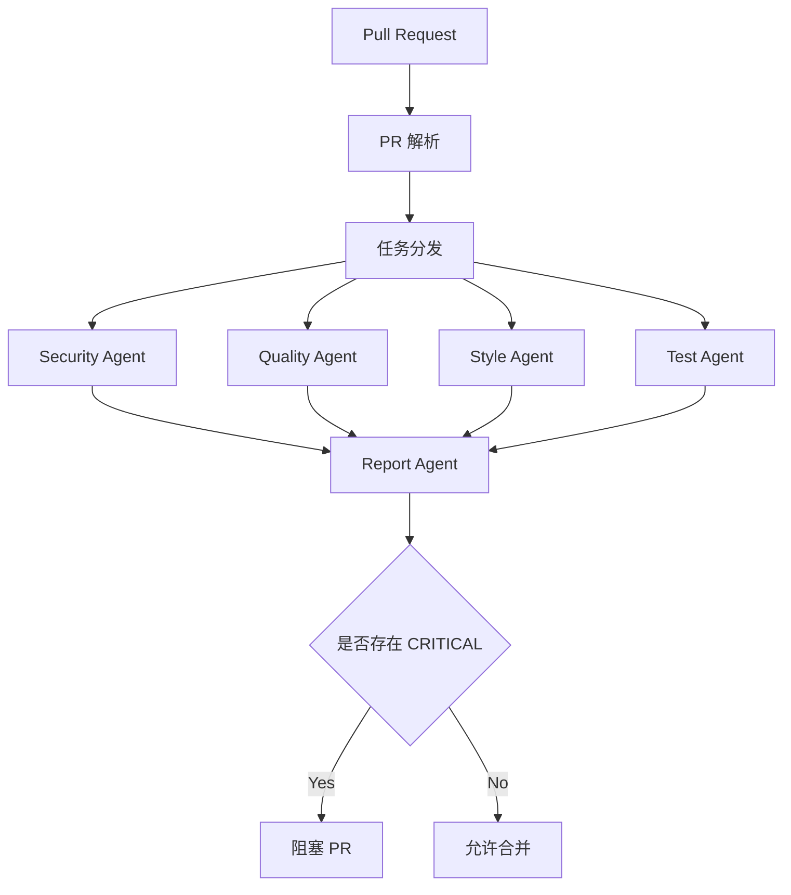
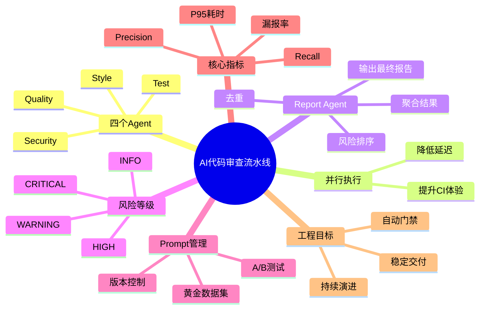

<!--
Chapter: 89
Node: KN-S-000004
Score: 92
Status: ✅ APPROVED
Attempt: 1
Round: 2
Generated: 2026-06-21 17:22:00
-->

# 第89章 AI 代码审查流水线 [L2-L3]

## Part 1：为什么要学这个？——AI Review 越细，为什么团队反而开始绕过它？

某团队决定升级自己的 AI Code Review。

他们觉得一个大模型检查得不够全面，于是拆成了四个专业 Agent：

* Security Agent（安全）
* Quality Agent（代码质量）
* Style Agent（编码规范）
* Test Agent（测试覆盖）

团队很满意。

"专业的人做专业的事。"

于是他们采用了这样的执行流程：

> 安全检查 → 代码质量 → 规范检查 → 测试分析 → 汇总报告

上线第一周，大家觉得效果不错。

上线第二周，开发开始抱怨：

> "为什么提交一个 PR 要等两分钟？"

上线第三周，越来越多人开始：

* 手工跳过 Review
* 直接强推（Force Push）
* 关闭 AI Review
* 等快下班再提交 PR

团队开始困惑：

> 我们不是让 AI 更专业了吗？

为什么大家反而不用了？

问题不是 Review 能力，而是**工程体验**。

如果每个 Agent 都需要 25~30 秒，那么：

* 一个 Agent：≈30 秒
* 四个串行 Agent：≈120 秒

AI Review 已经成为 CI/CD 中最慢的一环。

开发者不会因为 AI 更聪明而更愿意等待。

他们只会寻找绕过它的方法。

真正的问题不是：

> Agent 越多是不是越好？

真正的问题应该变成：

* 多个 Agent 怎样协作？
* 怎样保证 Review 不增加等待时间？
* 怎样让 AI 真正成为代码门禁（Gatekeeper）？
* Prompt 更新以后，如何保证系统不会退化？

这一章讨论的不是一个 Prompt，而是一整套**AI Code Review 工程流水线**。

学习完成后，你将理解：

* 为什么四个 Agent 必须并行，而不是串行
* 为什么 Report Agent 不负责审查，只负责裁决
* 为什么 CRITICAL 必须能够自动阻塞 PR
* 为什么 Prompt 更新必须经过黄金数据集验证，而不是直接上线

---

## Part 2：学习路径定位

AI Code Review 并不是 Prompt Engineering，而是 AI Native 工程体系中的一个综合案例。

它把多个知识点真正组合成了一个可以落地到生产环境的系统。

学习路径如下：



### 本章前置知识

学习本章之前，建议已经掌握：

* Prompt 设计
* GitHub Pull Request 流程
* 多 Agent 协作模式
* CI/CD 基础流程
* Prompt Version Control

否则容易把整个系统理解成：

> "就是调用四次 LLM。"

实际上，它更接近一个 AI 原生的软件流水线。

### 本章在整个 AI Native 架构中的位置

L0 阶段关注模型能不能回答问题。

L1 阶段关注 Prompt 如何写。

L2 阶段开始关注多个 Agent 如何协作。

到了本章（L2-L3），重点已经变成：

> 如何让 AI 真正进入软件工程流程，并成为 CI/CD 的自动门禁。

继续学习后，你会进一步进入：

* AI DevOps
* Agent 平台
* 自动评估系统
* LLM-as-Judge
* 企业级 AI Governance

因此，本章是 AI 工程化的重要分水岭。

---

## Part 3：用生活理解它

想象一家高峰期的外卖厨房。

如果只有一个厨师，他需要依次完成：

* 做菜
* 装盒
* 检查质量
* 打包
* 出餐

每一步都必须等前一步结束。

订单越多，排队越严重。

真正高效的厨房不会这样工作。

而是：

* 厨师负责炒菜
* 配菜员负责装盒
* 质检负责检查
* 打包员负责封装

这些工作尽可能同时进行。

最后由出餐人员统一确认后交给骑手。

AI Code Review 也是一样。

安全检查、代码质量检查、规范检查、测试分析之间并不存在强依赖。

它们天然适合并行执行。

### 类比的边界

这个类比只能帮助理解"并行协作"。

真实系统中：

* Agent 会共享同一个 PR 上下文
* Report Agent 会做冲突消解
* 不同 Agent 使用的模型可能不同
* 安全检查往往需要更强模型，而不是和其他 Agent 完全一致

因此，它远比厨房分工复杂。

---

## Part 4：AI 如何映射到传统概念

很多传统软件工程师第一次看到 AI Code Review，会觉得：

> "这不就是 SonarQube + 静态扫描吗？"

其实只有一部分相似。

最大的变化是：

传统规则依赖固定规则引擎。

AI Review 更依赖推理能力。

对应关系如下。

| 传统软件工程      | AI Code Review             |
| ----------- | -------------------------- |
| Lint 工具     | Style Agent                |
| 静态分析器       | Quality Agent              |
| 安全扫描器（SAST） | Security Agent             |
| 测试覆盖率分析     | Test Agent                 |
| 规则引擎        | Prompt + LLM 推理            |
| CI Gate     | Report Agent + CRITICAL 阻塞 |
| 规则配置文件      | Prompt Version             |
| 规则升级        | Prompt 更新 + 黄金数据集验证        |

### 最大变化在哪里？

传统工具通常只能回答：

> 有没有违反规则？

AI Agent 更进一步回答：

* 为什么这是 Bug？
* 是否存在隐藏风险？
* 有没有更好的实现？
* 是否可能影响未来维护？
* 是否存在业务逻辑漏洞？

因此：

传统 Review 更偏向**规则匹配（Rule-based）**。

AI Review 更偏向**语义理解（Semantic Reasoning）**。

但 AI 不能完全替代规则。

最佳实践通常是：

* 规则负责确定性检查
* AI 负责复杂推理
* 两者共同进入 Report Agent

这种组合比任何单独方案都更稳定。

---

## Part 5：技术本质深讲

很多人理解 AI Code Review 时，脑海中的流程仍然是：

> 一个 Prompt → 一个模型 → 一个结果

真正的工程实现完全不是这样。

它实际上是一套**多 Agent 并行流水线**。

整体执行过程如下。



### 核心组件一：PR Context Builder

所有 Agent 都不能直接读取 Git Diff。

系统需要先把 PR 转换成统一上下文，包括：

* Git Diff
* 修改文件
* 提交说明
* 所属模块
* 历史修改记录
* 团队规范
* 测试信息

这样所有 Agent 才拥有一致的输入。

否则不同 Agent 看到的信息不同，会导致结论相互矛盾。

---

### 核心组件二：四个专业 Agent

每个 Agent 只负责一种能力。

#### Security Agent

关注：

* SQL 注入
* XSS
* SSRF
* 权限绕过
* 密钥泄露
* 敏感数据

这里通常会选择能力更强的大模型。

原因很简单：

漏掉一个安全漏洞的代价，远远高于多花几分钱的模型调用费用。

工程上更关注**Recall（召回率）**，宁可适当增加人工复核，也要尽量减少漏报。

---

#### Quality Agent

关注：

* 可维护性
* 重复代码
* 潜在 Bug
* 空指针风险
* 异常处理
* API 使用方式

它更像高级代码评审工程师。

---

#### Style Agent

关注：

* 命名规范
* 团队编码规范
* Commit 规范
* 注释要求
* 架构约束

这一类检查通常依赖团队规范知识库，因此会结合 RAG，将最新规范作为上下文提供给模型，避免 Prompt 固化导致规范更新不同步。

---

#### Test Agent

关注：

* 是否缺失测试
* 边界条件是否覆盖
* 是否需要新增 Case
* 是否影响已有测试

它不是运行测试，而是分析代码变更对测试策略的影响。

---

### 核心组件三：Report Agent

Report Agent 不负责重新分析代码。

它负责：

* 聚合四个 Agent 输出
* 去除重复问题
* 冲突消解
* 风险等级统一
* 输出最终 Review

这也是为什么它可以保持轻量。

真正耗时的是四个专业 Agent，而不是 Report Agent。

---

### 核心组件四：CRITICAL 自动阻塞

这是 AI Review 能否成为真正门禁的关键。

很多团队只是把 AI 评论写进 PR。

开发者完全可以忽略。

真正的生产环境通常会定义风险等级，例如：

| 等级       | 处理方式    |
| -------- | ------- |
| INFO     | 仅提示     |
| WARNING  | 建议修复    |
| HIGH     | 要求人工确认  |
| CRITICAL | 自动阻塞 PR |

只有 CRITICAL 能直接阻止代码进入主分支，AI 才真正参与了软件交付流程，而不仅仅是一个"评论机器人"。

---

### 核心组件五：Prompt 回归验证

Prompt 并不是越改越好。

每一次修改，都可能改变 Agent 的行为。

因此成熟团队会维护一套黄金数据集，例如：

* 100 个历史 PR
* 已知漏洞
* 已知误报
* 已知最佳答案

新的 Prompt 必须先跑完整个数据集。

重点观察：

* Precision 是否下降
* Security Recall 是否下降
* CRITICAL 误杀率是否增加
* 平均 Review 时间是否变长

只有全部指标满足要求，新的 Prompt 才允许发布。

这也是 AI Code Review 能持续稳定演进，而不会因一次 Prompt 修改导致整个系统性能退化的关键所在。

## Part 6：动手 Demo（可运行代码）

下面用一个最小示例模拟 AI Code Review 的核心思想。

为了方便运行，这里不用真实 LLM，而是用 `asyncio` 模拟四个 Agent 并行执行。

```python
import asyncio
import random
import time


async def security_agent():
    await asyncio.sleep(random.uniform(1.0, 2.0))
    return {"agent": "Security", "level": "CRITICAL", "issue": "Possible SQL Injection"}


async def quality_agent():
    await asyncio.sleep(random.uniform(1.0, 2.0))
    return {"agent": "Quality", "level": "WARNING", "issue": "Function too long"}


async def style_agent():
    await asyncio.sleep(random.uniform(1.0, 2.0))
    return {"agent": "Style", "level": "INFO", "issue": "Variable naming"}


async def test_agent():
    await asyncio.sleep(random.uniform(1.0, 2.0))
    return {"agent": "Test", "level": "HIGH", "issue": "Missing edge-case tests"}


async def main():
    start = time.perf_counter()

    reports = await asyncio.gather(
        security_agent(),
        quality_agent(),
        style_agent(),
        test_agent(),
    )

    elapsed = time.perf_counter() - start

    print(f"Review finished in {elapsed:.2f}s\n")

    for report in reports:
        print(report)

    blocked = any(r["level"] == "CRITICAL" for r in reports)

    print("\nResult:")
    print("BLOCK PR" if blocked else "PASS")


if __name__ == "__main__":
    asyncio.run(main())
```

### 关键代码解析

```python
reports = await asyncio.gather(...)
```

这是整个示例最重要的一行。

`asyncio.gather()` 会同时启动四个 Agent。

整个耗时接近：

> 最慢 Agent 的时间

而不是：

> 四个 Agent 时间相加。

---

```python
blocked = any(r["level"] == "CRITICAL" for r in reports)
```

模拟 Report Agent。

它不会重新分析代码。

它只负责：

* 汇总所有结果
* 判断是否存在 CRITICAL
* 决定是否允许 Merge

这就是生产环境最常见的 Gatekeeper 模式。

### 运行后你会看到什么

可能得到类似输出：

```text
Review finished in 1.92s

{'agent': 'Security', 'level': 'CRITICAL', 'issue': 'Possible SQL Injection'}
{'agent': 'Quality', 'level': 'WARNING', 'issue': 'Function too long'}
{'agent': 'Style', 'level': 'INFO', 'issue': 'Variable naming'}
{'agent': 'Test', 'level': 'HIGH', 'issue': 'Missing edge-case tests'}

Result:
BLOCK PR
```

如果把 `asyncio.gather()` 改成依次 `await` 四个 Agent，整体耗时会接近四个任务时间之和，这正是串行 Pipeline 的性能瓶颈。

---

## Part 7：真实项目场景

### 业务背景

某 AI 独角兽拥有：

* 200+ 软件工程师
* 每天约 800 个 Pull Request
* GitHub + GitHub Actions + Kubernetes CI

最初，他们把 AI Code Review 放进 CI 流程中。

整体流程如下：

```text
提交 PR
      │
      ▼
Security
      │
      ▼
Quality
      │
      ▼
Style
      │
      ▼
Test
      │
      ▼
Review Report
```

结果很快出现问题。

### 遇到的问题

系统统计数据显示：

| 指标           |  上线初期 |
| ------------ | ----: |
| 平均 Review 时间 |  92 秒 |
| P95 延迟       | 140 秒 |
| 开发者跳过 Review |  大量出现 |
| CI 被绕过比例     |  持续升高 |

工程师反馈非常一致：

> "AI 很聪明，但太慢。"

团队发现：

AI Review 不仅没有提升质量，反而降低了开发效率。

### 技术改造方案

他们进行了三项关键改造。

#### 一、四个 Agent 全部并行

所有 Agent 同时读取：

* Diff
* PR 描述
* 项目上下文
* 团队规范

互不等待。

#### 二、增加 Report Agent

Report Agent 负责：

* 去重
* 风险排序
* 合并相同问题
* 输出统一评论

开发者只看到一份最终报告，而不是四份互相独立的评论。

#### 三、CRITICAL 自动阻塞

系统规则变成：

* INFO：直接放行
* WARNING：提示修改
* HIGH：建议人工确认
* CRITICAL：CI 失败，禁止 Merge

AI 不再只是建议工具，而是真正成为交付流程的一部分。

### Prompt 如何上线？

团队规定：

任何 Prompt 修改都必须经过：

1. 黄金数据集（100 个历史 PR）
2. A/B 对比测试
3. 指标评估
4. 人工抽样 Review

只有全部通过才能发布。

### 最终效果

改造完成后：

| 指标       |     优化前 |     优化后 |
| -------- | ------: | ------: |
| 平均耗时     |    92 秒 |    28 秒 |
| 耗时下降     |       - |     69% |
| 安全漏洞漏检率  |    4.3% |    0.7% |
| CI 被绕过比例 | 100% 基线 | 下降约 90% |

这个案例说明：

真正影响 AI Review 落地的，不只是模型能力，更是流水线架构设计。

---

## Part 8：这里容易踩坑

### 坑一：把四个 Agent 做成串行 Pipeline

错误示例：

```python
security = await security_agent()
quality = await quality_agent()
style = await style_agent()
test = await test_agent()
```

正确示例：

```python
security, quality, style, test = await asyncio.gather(
    security_agent(),
    quality_agent(),
    style_agent(),
    test_agent(),
)
```

为什么容易犯？

很多工程师习惯 Pipeline 思维。

但四个 Review Agent 之间没有数据依赖。

串行只会增加等待时间。

---

### 坑二：安全 Agent 使用小模型节省成本

错误思路：

> 安全检查也只是文本分析，用便宜模型即可。

结果：

* SQL 注入漏检增加
* 权限漏洞漏检增加
* 敏感信息泄露未发现

错误示例（伪代码）：

```python
security_model = "small-model"
```

正确示例：

```python
security_model = "large-model"
quality_model = "medium-model"
style_model = "small-model"
```

原因：

安全领域最重要的是 Recall。

一次漏报进入生产环境的代价，远高于几十次模型调用费用。

---

### 坑三：Prompt 修改后直接上线

错误流程：

```text
修改 Prompt
      │
      ▼
上线
```

正确流程：

```text
修改 Prompt
      │
      ▼
黄金数据集
      │
      ▼
指标比较
      │
      ▼
A/B 测试
      │
      ▼
发布
```

为什么？

Prompt 本质上也是代码。

没有回归测试，就无法知道：

* 漏报是不是增加了
* 误报是不是增加了
* Review 是否变慢了

---

## Part 9：面试怎么答

### L1：AI 代码审查流水线中，四个 Agent 分别负责什么？

回答框架：

* Security：安全漏洞
* Quality：代码质量
* Style：团队规范
* Test：测试覆盖分析
* 每个 Agent 遵循单一职责原则
* 最终交由 Report Agent 聚合

---

### L2：为什么必须并行，而不是 Pipeline 串行？

回答框架：

* 四个 Agent 无数据依赖
* 串行耗时约为 O(n)
* 并行耗时约为 O(max(n))
* PR 延迟直接影响开发体验
* 开发者会绕过过慢的 CI
* Report Agent 才负责统一裁决

这是工程效率问题，不只是算法问题。

---

### L3：如何评估 AI Code Review 是否可靠？

回答框架：

不要只回答 Accuracy。

建议从多个维度说明：

**质量指标**

* Precision
* Recall（尤其 Security Recall）
* 漏报率
* 误报率

**工程指标**

* PR 平均耗时
* P95 延迟
* CI 成功率
* 被绕过比例

**持续演进指标**

* 黄金数据集回归
* Prompt A/B Test
* CRITICAL 误杀率
* 人工抽样审核

面试官通常希望看到的是完整的工程质量体系，而不仅是模型评分。

---

## Part 10：考点速查

* **四 Agent 并行执行**：总耗时接近最慢 Agent，而不是四者之和。
* **Report Agent 聚合**：负责统一裁决，不重新审查代码。
* **CRITICAL 自动阻塞 PR**：AI 必须具备门禁能力，而不仅是评论能力。
* **安全 Agent 优先 Recall**：漏报安全漏洞的代价远高于模型调用成本。
* **黄金数据集回归测试**：每次 Prompt 修改都必须验证是否发生性能退化。

---

## Part 11：必背金句

* **单一职责**：一个 Agent 只解决一种类型的问题。
* **并行优于串行**：独立任务并行执行，延迟取决于最长路径而不是路径总和。
* **门禁优于建议**：没有自动阻塞能力，AI Review 很容易被忽略。
* **安全优先 Recall**：宁可适当增加误报，也不要放过高危漏洞。
* **Prompt 即代码**：任何 Prompt 修改都必须经过版本管理和回归验证。

---

## Part 12：快速参考表

| 概念             | 作用          | 示例值                   |
| -------------- | ----------- | --------------------- |
| Security Agent | 发现安全漏洞      | SQL 注入、XSS、权限绕过       |
| Quality Agent  | 分析代码质量      | 重复代码、异常处理             |
| Style Agent    | 检查团队规范      | 命名、注释、提交规范            |
| Test Agent     | 分析测试覆盖      | 缺少边界测试                |
| Report Agent   | 聚合所有结果      | 统一 Review 报告          |
| CRITICAL       | 阻塞合并        | 禁止 Merge              |
| Golden Dataset | Prompt 回归验证 | 100 个历史 PR            |
| Recall         | 减少漏报        | Security Recall ≥ 99% |
| Precision      | 减少误报        | 避免大量无效告警              |
| Prompt Version | 版本管理        | v1.3 → v1.4           |

---

## Part 13：思维导图



---

## Part 14：本章小结

AI Code Review 的核心不是把一个大 Prompt 拆成多个 Prompt，而是通过多个专业 Agent 并行协作，在保证审查质量的同时维持优秀的 CI/CD 体验。

真正成熟的系统不仅包含四个专业 Agent，还包括 Report Agent、CRITICAL 自动阻塞机制以及基于黄金数据集的 Prompt 回归验证体系。

学习路径上，你已经从理解单个 Agent，迈向了设计企业级 AI 工程流水线：L0 学会使用模型，L1 学会设计 Prompt，L2 学会组织多 Agent，L3 则开始建立可持续演进、可评估、可治理的 AI 软件工程体系。

---

## Part 15：下一章预告

本章介绍了 AI 如何参与代码审查，并通过多 Agent 协作、自动门禁和质量评估实现工程化落地。

不过，一个新的问题随之出现：

如果同一个 AI 系统包含几十个 Prompt、多个 Agent、不同版本模型和不断演进的知识库，如何保证每次变更都可追踪、可回滚、可审计，而不会因为一次 Prompt 更新导致整个系统行为发生不可控变化？

下一章将进入 **Prompt Version Control（提示词版本控制）**，学习如何像管理源代码一样管理 Prompt，包括版本号、变更记录、回归测试、灰度发布与快速回滚，为 AI 系统建立真正可维护的工程基础。