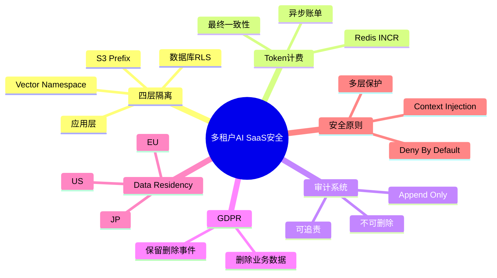
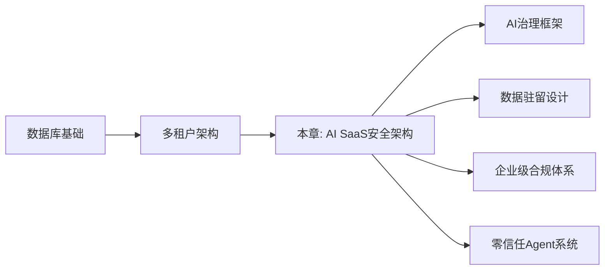
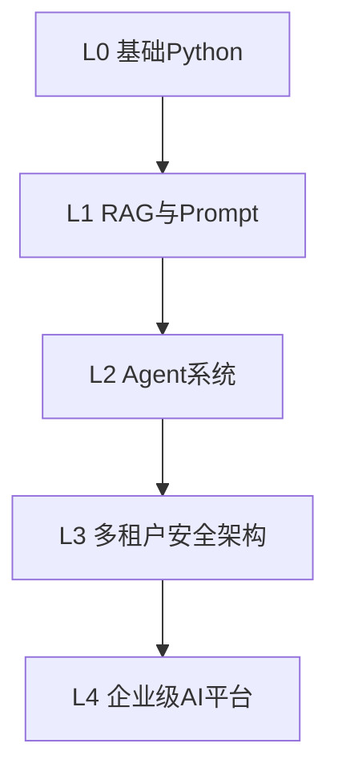
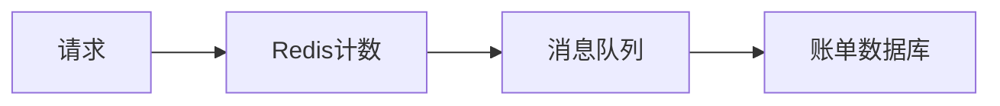
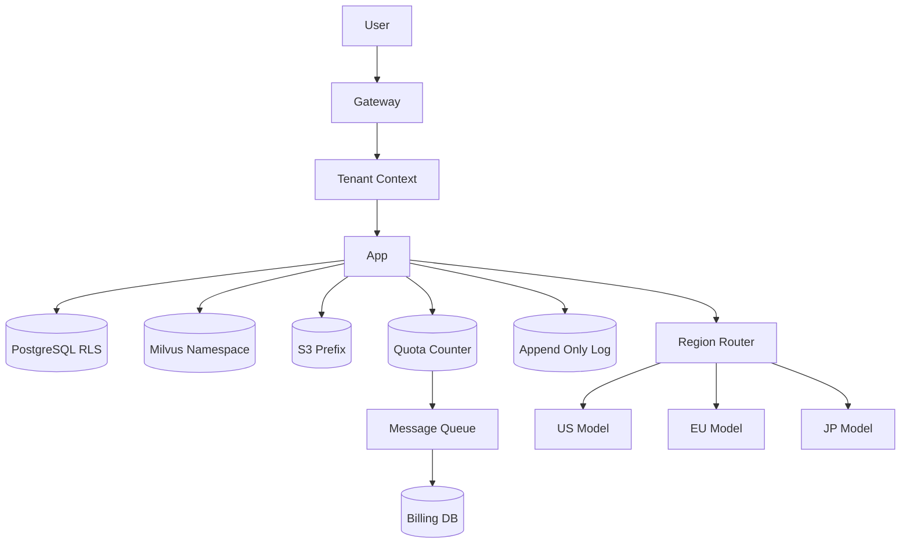
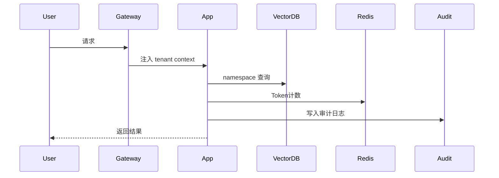

<!--
Chapter: 90
Node: KN-S-000005
Score: 92
Status: ✅ APPROVED
Attempt: 1
Round: 2
Generated: 2026-06-21 17:36:53
-->

## Part 6：动手 Demo（可运行代码）

### 一个最小的多租户安全模拟

下面的示例模拟：

* API Gateway 注入 tenant context；
* Redis 配额计数；
* Vector Namespace 隔离；
* Append-Only 审计日志。

```python
from collections import defaultdict
from datetime import datetime

# 模拟 Redis
quota_counter = defaultdict(int)

# 模拟向量库 namespace
vector_store = {
    "tenant_a": ["退款流程文档", "VIP客户规则"],
    "tenant_b": ["物流异常处理", "订单延迟说明"]
}

# Append-Only 审计日志
audit_logs = []


def search_docs(tenant_id: str, token_cost: int):
    # Redis INCR
    quota_counter[tenant_id] += token_cost

    # namespace 隔离查询
    result = vector_store.get(tenant_id, [])

    # 写入审计日志
    audit_logs.append({
        "tenant": tenant_id,
        "event": "SEARCH",
        "time": datetime.now().isoformat()
    })

    return result


docs = search_docs("tenant_a", 120)

print("检索结果:", docs)
print("Token使用量:", quota_counter["tenant_a"])
print("审计记录数量:", len(audit_logs))
```

### 关键代码说明

#### quota_counter

模拟 Redis：

```python
quota_counter[tenant_id] += token_cost
```

实际生产环境：

```python
redis.incrby(key, token_count)
```

#### namespace 查询

```python
vector_store.get(tenant_id)
```

真实系统：

```python
vector_db.search(
    embedding,
    namespace=tenant_id
)
```

#### 审计日志

日志只新增：

```python
audit_logs.append(...)
```

没有：

* update；
* delete；

满足 Append-Only 原则。

### 运行后你会看到什么

输出类似：

```text
检索结果: ['退款流程文档', 'VIP客户规则']
Token使用量: 120
审计记录数量: 1
```

说明：

* tenant_a 无法看到 tenant_b 数据；
* Token 被正确统计；
* 操作被记录。

---

## Part 7：真实项目场景

### 某大型 AI 客服平台

业务规模：

* 1200+ 企业客户；
* 每天约 8 亿 Token；
* 数百万知识库文档；
* 多区域部署。

### 早期架构

系统只有：

```text
API
 ↓
MySQL
```

所有 SQL：

```sql
WHERE tenant_id = ?
```

团队认为已经足够安全。

### 实际事故

Milvus 没有 namespace。

结果：

约 0.03% 检索结果出现跨租户返回。

虽然比例很低：

但依然产生：

* 3 起客户投诉；
* 数据泄露事件；
* 合规风险。

### 重构后的架构

#### 第一层

PostgreSQL RLS。

#### 第二层

Milvus：

```python
namespace = tenant_id
```

#### 第三层

S3：

```text
tenant_001/docs/
tenant_002/docs/
```

#### 第四层

Gateway 自动注入：

```python
tenant_context
```

业务代码无法伪造。

### 配额系统

高频统计：

```python
Redis INCR
```

异步：

```text
Kafka → Billing DB
```

### 重构结果

| 指标     |   优化前 |   优化后 |
| ------ | ----: | ----: |
| 数据泄露事件 |   3 次 |   0 次 |
| 检索错误率  | 0.03% |     0 |
| 审计通过时间 |  14 天 |   3 天 |
| 检索延迟   | 320ms | 210ms |

### 为什么延迟反而下降？

因为：

namespace 隔离以后：

索引范围更小。

搜索速度反而更快。

安全设计不一定牺牲性能。

---

## Part 8：这里容易踩坑

### 坑一：只隔离 SQL

错误代码：

```python
docs = vector_db.search(query_embedding)
```

正确：

```python
docs = vector_db.search(
    query_embedding,
    namespace=tenant_id
)
```

### 为什么会犯？

开发者容易认为：

> 数据都在数据库里。

但 AI 系统的数据可能存在：

* Vector DB；
* Redis；
* S3；
* Cache。

数据库正确，不代表系统正确。

---

### 坑二：同步写账单

错误：

```python
redis.incrby(key, tokens)
db.update_usage(tokens)
```

每次请求都更新数据库。

高并发下：

数据库成为瓶颈。

正确：

```python
redis.incrby(key, tokens)
send_to_queue(tokens)
```

消费者异步：

```python
billing_worker()
```

### 为什么会犯？

传统 CRUD 思维：

希望所有数据立即一致。

实际上：

计费系统更适合最终一致性。

---

### 坑三：允许删除审计日志

错误：

```python
DELETE FROM audit_logs
WHERE id = ?
```

正确：

新增：

```python
{
    "event": "DELETE_DOC"
}
```

但不删除历史。

### 为什么会犯？

很多人把日志当普通业务表。

实际上：

审计日志属于合规资产。

---

## Part 9：面试怎么答

### L1 问题

#### 多租户系统为什么不能只加 tenant_id？

回答思路：

1. AI 系统不只有 SQL；

2. 还包含：

   * Vector DB；
   * S3；
   * Redis；

3. 单层过滤无法保证全链路安全；

4. 必须多层隔离。

---

### L2 问题

#### 应用层漏掉 tenant_id 怎么办？

回答框架：

* RLS 强制约束；
* Gateway 注入 context；
* Deny By Default；
* Namespace 隔离；
* S3 Prefix 隔离。

核心思想：

> 不相信业务代码。

---

### L3 问题

#### 如何实现 GDPR 删除权？

回答结构：

业务数据：

* DB 删除；
* Vector 删除；
* S3 删除；

审计系统：

* 保留删除事件；
* 不保留原内容；

实现：

```text
可删业务数据
不可删审计链
```

这样同时满足：

* GDPR；
* 可追责；
* 合规审计。

---

## Part 10：考点速查

### **四层隔离**

应用层 + RLS + Namespace + S3 Prefix。

---

### **Redis INCR**

高频计数的最佳方案。

---

### **最终一致性**

Redis 实时统计，账单异步落库。

---

### **Append-Only**

审计日志只能追加。

---

### **Data Residency**

根据地区路由不同模型。

---

## Part 11：必背金句

### [隔离原则]

不要相信单层安全。

---

### [默认拒绝]

没有租户上下文，直接拒绝。

---

### [系统保护代码]

RLS 的职责是保护开发者犯错。

---

### [日志不可逆]

审计链只能追加。

---

### [最终一致性优先]

计费系统追求正确，不追求实时事务。

---

## Part 12：快速参考表

| 概念             | 作用       | 示例值               |
| -------------- | -------- | ----------------- |
| tenant_id      | 租户身份     | tenant_001        |
| RLS            | 数据库保护    | PostgreSQL Policy |
| Namespace      | 向量隔离     | tenant_001        |
| S3 Prefix      | 对象隔离     | tenant_001/docs   |
| Redis INCR     | Token 统计 | +500              |
| MQ             | 异步账单     | Kafka             |
| Audit Log      | 审计追踪     | Append Only       |
| Data Residency | 区域路由     | EU / JP / US      |

---

## Part 13：思维导图



---

## Part 14：本章小结

真正的多租户安全，不是 SQL 加一个 tenant_id，而是全链路一致性隔离。

Redis 负责高频计数，审计链负责合规追责，两者承担完全不同的职责。

从成长路径来看：

* L0：理解数据库；
* L1：理解 RAG；
* L2：理解 Agent；
* L3：设计企业级 AI SaaS 安全平台。

---

## Part 15：下一章预告

这一章解决了：

* 多租户隔离；
* Token 配额；
* GDPR 删除；
* 审计系统。

但新的问题出现了：

即使数据隔离正确，

Agent 会不会自己获得过高权限？

例如：

* 自动删除文件；
* 自动调用危险工具；
* 越权访问内部资源；

下一章将进入：

> Agent 权限提升（Privilege Escalation）与最小权限设计。

重点讨论：

* Excessive Agency；
* Tool Sandbox；
* 最小权限原则；
* Prompt Injection 导致的越权问题；
* OWASP LLM Top 10 中的 LLM08。

# 第90章 多租户 AI SaaS 平台安全架构 [L3]

## Part 1：为什么要学这个？[认知冲突先行]

### 你以为加了 tenant_id，结果还是泄露了

某 AI 客服 SaaS 平台上线了一个新功能：支持“跨知识库智能搜索”。

开发团队非常自信，因为他们在所有 SQL 查询中都加上了：

```sql
WHERE tenant_id = ?
```

测试环境全部通过，代码审查也没有问题。

上线几天后，事故发生了。

一家企业客户搜索内部故障记录时，居然看到了另一家公司的工单内容，里面甚至包含手机号和订单号。

团队开始排查数据库。

结果发现：

* SQL 没问题；
* MySQL 没问题；
* API 没问题；

真正的问题出现在：

> 向量数据库检索时，没有指定 namespace。

数据库层隔离了。

Embedding 层没有隔离。

最终造成跨租户数据泄露。

### 大多数人的错误理解

很多工程师会认为：

> 多租户安全 = SQL 加 tenant_id。

这是传统 Web 系统时代形成的习惯。

但 AI 系统已经不只有数据库。

现在一个请求可能同时访问：

* PostgreSQL
* Redis
* Milvus
* S3
* LLM 服务
* 审计系统

任何一层漏掉租户上下文，都可能导致越权。

### 本章解决的问题

本章要回答几个真正的生产级问题：

* 为什么 tenant_id 不够？
* 四层隔离到底是什么？
* 应用层漏掉过滤条件怎么办？
* Redis 为什么比数据库更适合 Token 配额？
* GDPR 删除权如何实现？
* 为什么审计日志不能删除？
* 数据驻留要求如何影响 AI 架构？

记住这一句：

> 多租户安全不是“加个 tenant_id”，而是“四层锁 + 一条不可删审计链”。

---

## Part 2：学习路径定位

### 所处位置

本章属于 L3。

说明你已经具备：

* 数据库基础；
* RAG 架构；
* Agent 系统；
* 权限模型；

现在开始进入：

> 企业级 AI 平台安全设计。

### 前置知识 → 当前知识 → 后续知识



### 知识层级关系



### 学完以后你会获得什么

你将具备：

* 企业 SaaS 安全设计能力；
* 多租户隔离能力；
* GDPR 合规设计能力；
* Token 计费能力；
* 审计系统设计能力。

这已经接近 AI 平台架构师的职责范围。

---

## Part 3：用生活理解它

### 共享办公楼的类比

可以把多租户 AI SaaS 想成一栋共享办公楼。

每家公司都在同一栋楼办公。

安全并不是只有大门刷卡。

还包括：

* 门禁卡（应用层）
* 电梯权限（数据库 RLS）
* 档案柜分区（Vector Namespace）
* 仓库楼层（S3 路径）

只有四层全部生效，才真正安全。

如果电梯没有限制：

即使别人进不了你的办公室，也可能直接去仓库拿走文件。

### 类比的边界

现实中的办公楼：

* 人可以通过肉眼识别错误；

软件系统不会。

一旦漏掉某个过滤条件：

系统不会提醒你。

它只会：

> 正常返回错误的数据。

所以 AI 系统必须依靠自动约束，而不是人工自觉。

---

## Part 4：AI 如何映射到传统概念

### AI 系统比传统 Web 多了一层“知识数据”

传统系统主要关注：

* 用户
* 数据库
* 文件系统

AI 系统新增：

* Embedding
* Vector DB
* Prompt Context
* Token 消耗

因此隔离复杂度大幅提升。

### 对应关系

| 传统系统   | AI 系统             |
| ------ | ----------------- |
| 数据库表   | 关系数据库 + Vector DB |
| 文件存储   | S3 + 知识库文档        |
| 用户权限   | Tenant Context    |
| 请求次数限制 | Token 配额          |
| 操作日志   | Append-Only 审计链   |
| 分库分表   | Namespace 隔离      |
| 地域部署   | Data Residency    |

### 安全机制映射

| 传统概念          | AI 对应实现          |
| ------------- | ---------------- |
| WHERE user_id | WHERE tenant_id  |
| 数据库权限         | RLS Policy       |
| 目录隔离          | S3 Prefix        |
| 缓存隔离          | Redis Key Prefix |
| 日志系统          | 不可删除审计链          |
| 限流器           | Redis INCR       |
| 机房部署          | 区域化 LLM Router   |

### 为什么 AI 更难

传统系统：

```python
用户 → DB
```

AI 系统：

```python
用户 → API → DB → Vector DB → Redis → S3 → LLM
```

链路越长：

越容易漏掉某一层。

---

## Part 5：技术本质深讲

### 多租户 AI 平台的核心目标

目标只有一句：

> 同一套基础设施服务多个客户，但任何客户都无法感知其他客户的存在。

实现方式：

### 第一层：应用层隔离

所有查询必须带：

```python
tenant_id
```

例如：

```sql
SELECT *
FROM conversations
WHERE tenant_id = ?
```

这一层最容易实现。

也是最容易遗漏的。

### 第二层：数据库 RLS

假设开发者忘记：

```sql
WHERE tenant_id = ?
```

数据库自己拒绝访问。

例如 PostgreSQL：

```sql
CREATE POLICY tenant_policy
ON conversations
USING (tenant_id = current_setting('app.tenant_id'));
```

这样即使代码写错：

数据库仍然保护数据。

### 第三层：向量 Namespace

错误示例：

```python
vector_db.search(query_embedding)
```

正确：

```python
vector_db.search(
    query_embedding,
    namespace=tenant_id
)
```

因为：

Embedding 本身不包含租户信息。

如果不限制 namespace：

检索会跨租户返回结果。

### 第四层：S3 路径隔离

错误：

```python
documents/report.pdf
```

正确：

```python
tenant_123/documents/report.pdf
```

路径结构：

```text
tenant_id/
    docs/
    images/
    embeddings/
```

这样即使拿到对象名：

也无法访问其他租户文件。

---

### Redis 配额管理

Token 消耗非常高频。

如果每次都更新数据库：

```python
UPDATE usage SET tokens = tokens + 100;
```

数据库会成为瓶颈。

更合理：

```python
redis.incrby(
    f"quota:{tenant_id}",
    token_count
)
```

特点：

* 原子操作；
* O(1)；
* 支持百万级 QPS；

账单数据库异步更新：



实现最终一致性。

---

### GDPR 删除权

用户要求删除数据时：

需要删除：

* DB 数据；
* Embedding；
* S3 文件；

但是：

审计记录不能删除。

原因是：

合规要求可追溯。

正确做法：

记录：

```json
{
  "event": "DELETE",
  "tenant_id": "t001",
  "record_id": "doc_99",
  "operator": "admin",
  "timestamp": "2026-06-21"
}
```

不记录：

* 原始内容；
* 文档正文；

这样同时满足：

* 用户删除权；
* 审计可追责。

### Append-Only 审计链

日志只允许：

* append；

禁止：

* update；
* delete；

这样任何人都无法篡改历史。

### 数据驻留（Data Residency）

不同国家要求：

数据不能离境。

例如：

```python
if tenant.region == "eu":
    use_eu_model()

elif tenant.region == "jp":
    use_japan_model()
```

因此：

LLM 选择不再是技术问题。

而是法律问题。

---

### 整体架构图



### 请求生命周期



### 核心记忆锚点

> 多租户 AI SaaS = 四层数据隔离 + Redis 配额 + 不可删除审计链。