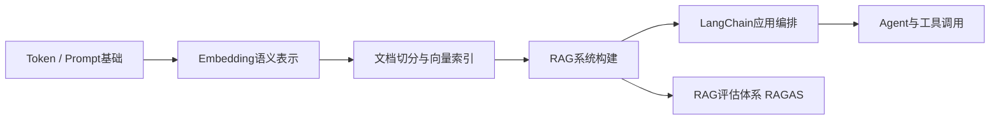
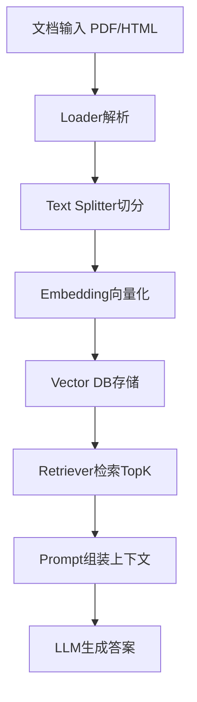
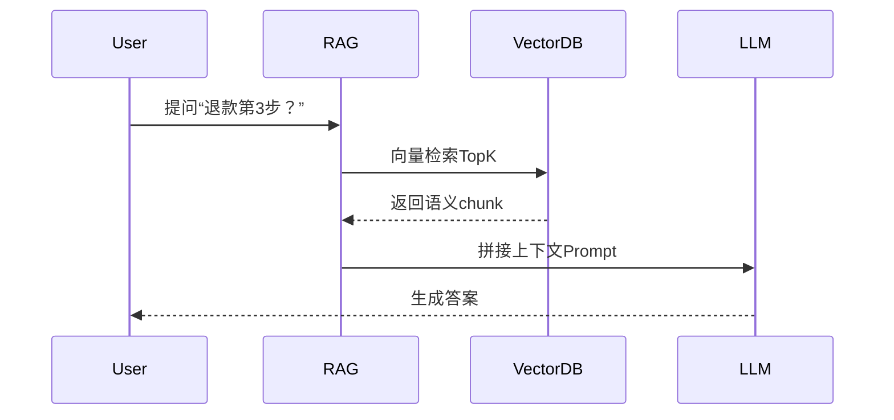
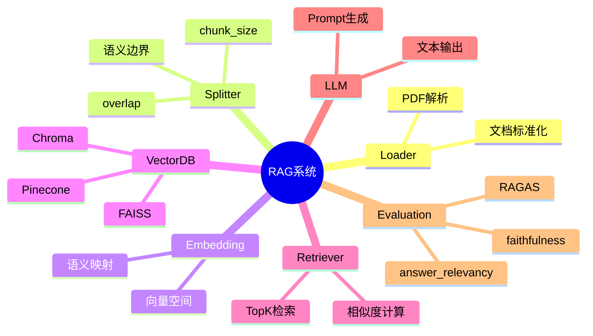

<!--
Chapter: 91
Node: KN-E-000001
Score: 86
Status: ✅ APPROVED
Attempt: 1
Round: 2
Generated: 2026-06-21 17:50:47
-->

# 第91章 项目一：构建 RAG 问答系统 [L1]

---

## Part 1：为什么要学这个？认知冲突先行

很多人第一次做企业知识库问答时，会做一件看似“极其合理”的事：把所有文档一股脑塞进向量数据库，然后期待模型“自动理解全局知识”。

上线之后，用户问：“退款第3步是什么？”

系统回答却变成了：

> “退款需要先安装客户端，并阅读隐私政策，同时注意配送时间……”

看起来很聪明，实际上完全跑偏。

问题不在模型，而在一个更隐蔽的误解：

> 你以为“知识越完整越好”，模型实际需要的是“语义边界清晰的小知识单元”。

RAG系统真正难的地方不是“接上LLM”，而是：

**如何切知识，才能让检索结果刚好够用，而不是过多或过少。**

本章要解决的核心问题是：

> 如何构建一个可上线的 RAG 系统，并理解“检索质量 > 模型能力”的工程现实。

---

## Part 2：学习路径定位

RAG处在“模型使用”到“系统工程”的分水岭。



前置知识：

* Token 与上下文窗口
* 基础 Prompt 使用
* 向量相似度概念

后置知识：

* Agent系统设计
* RAG评估体系（RAGAS）
* 多路检索与重排序系统

---

## Part 3：用生活理解它

把 RAG 想象成你在考试前翻资料。

* chunk太大：给你整本教材，你找不到答案
* chunk太小：只给你一句话“见教材第X章”，等于没给
* chunk刚好：直接给你“第3步退款流程说明”

RAG的关键不是“资料多”，而是“资料刚好切对粒度”。

边界问题：

* 人可以读完整本书，但模型不擅长全局注意力
* 人会理解上下文隐含关系，但模型依赖显式文本片段

---

## Part 4：AI如何映射到传统概念

| 传统系统     | RAG系统       |
| -------- | ----------- |
| SQL查询    | 向量相似度检索     |
| 索引B-Tree | Embedding索引 |
| 搜索引擎     | Retriever   |
| 缓存系统     | Vector DB   |
| API聚合层   | RAG Chain   |

核心变化：

> 从“精确匹配”变成“语义概率匹配”。

---

## Part 5：技术本质深讲

RAG本质不是“让模型记住知识”，而是：

> 用检索系统控制输入，让模型只在局部最优信息空间生成答案。

完整流程：



关键组件：

### 1. Loader

负责统一不同来源文档结构（PDF/Web/Markdown）

### 2. Splitter

决定语义粒度，是RAG效果的核心旋钮

### 3. Embedding

将文本映射到高维语义空间

### 4. Vector DB

存储向量 + 原文映射

### 5. Retriever

基于相似度做TopK召回

执行链路：



---

## Part 6：动手Demo（可运行代码）

这一部分我们用**最新LangChain拆分结构**实现一个可运行RAG系统。

### 环境依赖

```bash
pip install langchain langchain-openai langchain-community chromadb ragas
```

### API Key配置（必须）

```bash
export OPENAI_API_KEY="你的key"
```

---

### 最小可运行 RAG 示例

```python
from langchain_openai import OpenAIEmbeddings, ChatOpenAI
from langchain_community.vectorstores import Chroma
from langchain_text_splitters import RecursiveCharacterTextSplitter
from langchain_core.documents import Document

text = """
退款流程：
1. 提交申请
2. 客服审核
3. 确认退款
4. 原路返回金额

安装流程：
1. 下载软件
2. 安装依赖
3. 启动系统
"""

splitter = RecursiveCharacterTextSplitter(
    chunk_size=60,
    chunk_overlap=10
)

docs = splitter.create_documents([text])

embeddings = OpenAIEmbeddings()

db = Chroma.from_documents(docs, embeddings)

query = "退款第3步是什么？"
results = db.similarity_search(query, k=2)

llm = ChatOpenAI(model="gpt-4o-mini")

context = "\n".join([r.page_content for r in results])

prompt = f"根据上下文回答问题：\n{context}\n\n问题：{query}"

response = llm.invoke(prompt)

print(response.content)
```

你会观察到一个关键现象：

> 检索质量决定答案上限，模型只是“表达器”。

---

## Part 7：真实项目场景

某电商客服系统RAG架构如下：

数据源：

* 10万FAQ
* 商品说明书PDF
* 售后政策文档

技术架构：

* Loader：PDF + HTML混合解析
* Splitter：500 tokens + overlap 100
* Vector DB：Chroma（开发）→ Pinecone（生产）
* LLM：GPT-4o-mini
* rerank：提升召回质量

优化过程：

1. chunk_size：2000 → 500
2. TopK：3 → 6
3. 加入 reranker

效果提升：

* 命中率：70% → 91%
* hallucination下降约40%
* 平均响应时间下降

核心结论：

> RAG系统不是模型优化，而是信息结构优化。

---

## Part 8：这里容易踩坑

### 错误1：使用过时LangChain导入

```python
# ❌ 已废弃写法
from langchain.embeddings import OpenAIEmbeddings
from langchain.vectorstores import Chroma
```

问题：

* 新版本已拆分模块
* 直接ImportError

正确写法：

```python
# ✅ 新版本推荐
from langchain_openai import OpenAIEmbeddings
from langchain_community.vectorstores import Chroma
```

---

### 错误2：chunk过大

```python
chunk_size = 2000
```

问题：

* 多主题混杂
* embedding语义污染

---

### 错误3：忽略overlap

```python
chunk_overlap = 0
```

问题：

* 步骤断裂
* FAQ信息丢失

---

## Part 9：面试怎么答

### L1：RAG流程是什么？

* Loader加载数据
* Splitter切分文本
* Embedding向量化
* Vector DB存储
* Retriever检索TopK
* LLM生成答案

---

### L2：chunk_size为什么不能越大？

关键点：

* 大chunk：语义完整但噪声高
* 小chunk：精准但上下文碎
* 本质是 trade-off

---

### L3：RAG系统如何评估？

必须回答三个层面：

* faithfulness（是否忠于上下文）
* relevancy（是否相关）
* context precision（检索质量）

#### RAGAS简单示例

```python
from ragas import evaluate
from ragas.metrics import faithfulness, answer_relevancy

# dataset结构：question / answer / contexts
result = evaluate(
    dataset,
    metrics=[faithfulness, answer_relevancy]
)

print(result)
```

面试重点：

> faithfulness低 ≠ 模型差，而是检索或上下文污染问题。

---

## Part 10：考点速查

* **RAG五步链路**：数据→切分→向量化→检索→生成
* **chunk_size本质**：语义颗粒度控制器
* **TopK作用**：控制上下文范围
* **faithfulness含义**：是否依赖真实上下文
* **RAGAS作用**：量化RAG质量体系

---

## Part 11：必背金句

* RAG不是让模型记住知识，而是控制它看到什么知识
* chunk不是越小越好，而是语义最稳定的单位
* 检索决定上限，生成只是表达
* embedding解决的是语义距离，不是关键词匹配
* RAG失败99%不是模型问题，是信息结构问题

---

## Part 12：快速参考表

| 概念         | 作用     | 示例           |
| ---------- | ------ | ------------ |
| chunk_size | 控制语义粒度 | 300~800      |
| overlap    | 防止信息断裂 | 50~150       |
| TopK       | 控制检索范围 | 3~6          |
| embedding  | 语义表示   | 1536-d       |
| RAGAS      | 系统评估   | faithfulness |

---

## Part 13：思维导图



---

## Part 14：本章小结

RAG系统的本质不是“增强模型记忆”，而是“重塑输入信息结构”。

chunk_size决定语义单位，Retriever决定信息范围，LLM只是表达层。

从L0到L3的成长路径是：

* L0：会用LLM
* L1：会搭RAG
* L2：会调检索结构
* L3：会用评估体系优化系统

---

## Part 15：下一章预告

你已经构建了RAG系统，但你还没有回答一个更关键的问题：

> 你的RAG系统“看起来对”，但真的可靠吗？

下一章我们进入：

**RAG评估体系 RAGAS：如何量化一个AI系统的真实性**

你将看到：

* 为什么“正确答案”也可能是错的
* faithfulness如何被误导
* 如何用指标反推系统设计缺陷