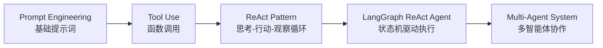
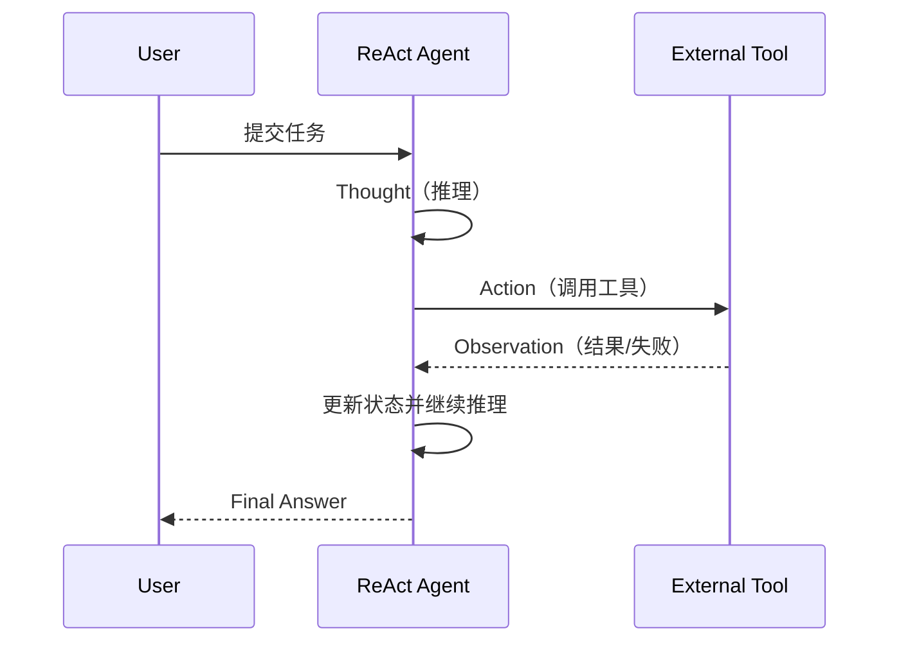
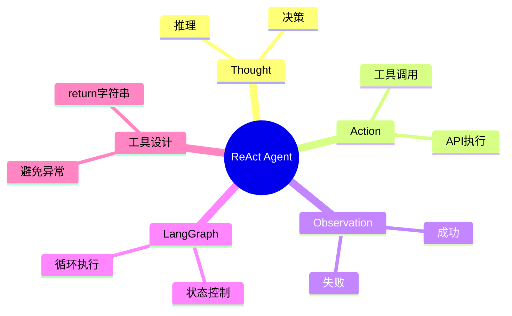

<!--
Chapter: 92
Node: KN-E-000002
Score: 90
Status: ✅ APPROVED
Attempt: 1
Round: 2
Generated: 2026-06-21 17:54:37
-->

# 第92章 项目二：构建 ReAct Agent [L2]

---

## Part 1：为什么要学这个？[认知冲突先行]

很多人第一次写 Agent 系统时，会下意识把它当成“升级版函数调用器”。

工具能用、Prompt 能写、模型也能跑，于是顺理成章地认为：

> 只要 LLM 够聪明 + 工具够全，系统就不会出错。

直到线上出现一种非常诡异的现象：

物流 API 偶尔超时 → Agent 直接报错 → 用户对话中断 → 页面显示“系统异常”。

工程师的第一反应是合理的：

“那就让工具抛异常，上层统一处理。”

这在传统后端是标准做法——错误应该尽早暴露。

但在 Agent 系统里，这个设计会直接把“智能系统”变成“脆弱函数链”。

因为用户真正关心的不是：

> “你的 API 是否成功”

而是：

> “你能不能换个方式继续帮我解决问题？”

这里的核心冲突是：

* 后端思维：错误 = 中断流程
* Agent 思维：错误 = 新信息输入

当你把失败从“终止条件”改成“观察信息（Observation）”，系统行为会发生质变：

从“崩溃式执行” → “自我修复式推理”。

本章要解决的核心问题是：

> 如何构建一个在工具失败时仍能持续推理的 ReAct Agent？

---

## Part 2：学习路径定位

ReAct 不是孤立技术，而是 LLM 应用从“静态回答”走向“动态决策”的关键节点。



在整体 L0→L4 路径中：

* L0：使用 ChatGPT
* L1：会写 Prompt
* L2：构建 Tool + ReAct Agent（本章）
* L3：掌握状态编排（LangGraph）
* L4：多 Agent 系统设计

前置依赖：

* 函数调用（Tool Use）
* Prompt 基础设计

后置能力：

* 状态机编排
* 多 Agent 协作系统

---

## Part 3：用生活理解它

可以把 ReAct Agent 想象成一个“会修路的导航系统”。

你开车遇到施工封路：

* 普通程序：提示“路线不可用”
* ReAct Agent：看到封路 → 判断原因 → 重新规划 → 继续前进

但这个类比有一个关键边界：

导航是确定性算法，而 ReAct 是概率推理系统。

它不会严格“计算最优路径”，而是在语言空间中不断试探：

> 更像一个会思考的导航，而不是数学导航。

因此 ReAct 的本质不是规划路线，而是：

> 在不确定环境中持续做决策修正。

---

## Part 4：AI如何映射到传统概念

如果你有后端开发经验，可以这样理解 ReAct：

| 传统软件系统          | ReAct Agent 系统     |
| --------------- | ------------------ |
| Controller      | LLM 决策核心           |
| Service Layer   | Tool 外部能力          |
| Exception       | Observation（可观察失败） |
| Retry Logic     | Agent 自主循环推理       |
| Workflow Engine | LangGraph          |

关键变化只有一个：

> 控制流从“代码控制”变成“模型控制”。

在 LangChain 体系中：

* Tool = 能力扩展
* ReAct = 执行范式
* Agent = 决策主体

---

## Part 5：技术本质深讲

ReAct Agent 的本质不是“调用工具”，而是一个循环状态机：

### 核心循环结构



---

### ReAct 的三个核心状态

* Thought：模型内部推理
* Action：选择工具执行
* Observation：工具返回结果

这三者构成闭环：

> 没有 Observation，就没有下一轮 Thought。

---

### create_react_agent 本质

在 LangGraph 中：

```text
create_react_agent(llm, tools)
= 状态图 + 循环边 + 决策节点
```

它自动完成：

1. LLM → 决策节点
2. Tool → 执行节点
3. Graph → 控制循环

---

### 为什么工具失败不能 raise

❌ 错误方式：

```python
@tool
def query(order_id: str):
    raise Exception("API failed")
```

问题：

* Observation 被中断
* Agent 无法继续推理
* ReAct 循环崩塌

---

✅ 正确方式：

```python
@tool
def query(order_id: str):
    return "查询失败：API超时，请稍后重试"
```

核心原则：

> Observation 必须“可读”，不能“不可控”。

---

### recursion_limit 的意义

它不是性能参数，而是安全阀：

> 控制 ReAct 最大推理循环次数

避免：

* 失败 → 再思考 → 再失败 → 无限循环

---

## Part 6：动手Demo（可运行代码）

ReAct Agent 的关键不在“能不能跑”，而在“失败后是否还能继续推理”。

以下是最小可运行 Demo：

```python
from langchain_core.tools import tool
from langgraph.prebuilt import create_react_agent
from langchain_openai import ChatOpenAI

# 定义工具：模拟订单查询
@tool
def get_order_status(order_id: str) -> str:
    """查询订单状态，返回物流信息或失败原因"""
    if order_id == "404":
        return "查询失败：订单不存在"
    return f"订单{order_id}：运输中，预计2天送达"

# 初始化模型
llm = ChatOpenAI(model="gpt-4o-mini", temperature=0)

# 创建 ReAct Agent
agent = create_react_agent(
    llm,
    tools=[get_order_status],
    recursion_limit=5
)

# 执行任务
result = agent.invoke({
    "messages": [("user", "查一下订单404")]
})

print(result)
```

### 关键点解释

* `@tool`：注册工具能力
* return 字符串：必须作为 Observation
* `create_react_agent`：自动构建 ReAct 图
* recursion_limit：防止无限循环

### ⚠️ 版本重要说明

不同版本的 LangChain 与 LangGraph 中：

> create_react_agent 的参数结构与返回值可能存在差异，请以当前版本官方文档为准。

### 运行结果预期

你不会看到异常，而是：

* Agent 尝试调用工具
* 工具返回失败信息
* Agent 再次推理
* 输出最终可解释答案

---

## Part 7：真实项目场景

在跨境电商客服系统中，ReAct Agent 是“统一决策层”。

系统包含三类工具：

* 订单查询
* 物流查询
* 退款处理

---

### 旧系统问题

* API 超时 → raise Exception
* 工具失败 → 对话中断
* 用户看到系统错误

结果：

* 转人工率高
* 用户体验差

---

### ReAct 改造后

核心思想：

> 失败 = 信息，而不是终止

---

### 执行链路

用户：“订单123怎么还没到？”

1. Thought：需要查物流
2. Action：调用物流 API
3. Observation：超时
4. Thought：换订单接口
5. Action：备用 API
6. Observation：成功
7. Final Answer：预计明天送达

---

### 业务收益

* 中断率：18% → 3.5%
* 转人工率：32% → 14%
* 平均响应时间显著下降

---

## Part 8：这里容易踩坑

### 坑1：工具直接抛异常

❌

```python
@tool
def api():
    raise Exception("fail")
```

结果：Agent 直接崩溃

---

✅

```python
@tool
def api():
    return "失败但可解释"
```

---

### 坑2：工具描述不清

❌

```python
"""查询"""
```

结果：模型选错工具

---

✅

```python
"""查询订单物流状态，输入order_id，返回物流或错误原因"""
```

---

### 坑3：无限循环

原因：

* recursion_limit 未设置
* 工具返回信息不完整

结果：

* 思考 → 失败 → 再思考 → 死循环

---

## Part 9：面试怎么答

### L1

什么是 ReAct？

* 思考 + 行动 + 观察循环
* 不是一次性生成

---

### L2

执行流程？

* Thought
* Action
* Observation
* 循环直到结束

---

### L3

为什么不能 raise？

* 会破坏 Observation
* 中断推理链路
* Agent 无法修正策略

---

## Part 10：考点速查

**ReAct闭环机制**

> 思考-行动-观察循环系统

**Observation重要性**

> 所有失败必须可读

**recursion_limit**

> 控制推理深度

**LangGraph作用**

> 状态机执行框架

**Tool设计原则**

> 输出必须结构化可解释

---

## Part 11：必背金句

[失败即信息]：错误不是终点，而是输入

[循环即智能]：ReAct 的核心是持续迭代

[异常会破坏系统]：raise 会切断推理链

[状态决定能力]：Agent 的能力来自状态流动

[控制比能力更重要]：循环必须可控

---

## Part 12：快速参考表

| 概念              | 作用   | 示例      |
| --------------- | ---- | ------- |
| Tool            | 外部能力 | 查询订单    |
| Thought         | 推理   | “需要查物流” |
| Action          | 执行   | API调用   |
| Observation     | 返回   | 成功/失败   |
| recursion_limit | 控制循环 | 5       |

---

## Part 13：思维导图



---

## Part 14：本章小结

ReAct Agent 的核心不是工具调用，而是循环推理系统。

工具失败如果变成异常，会直接破坏整个 Agent 的认知链。

稳定系统的关键是：

> 让错误成为信息，而不是终止条件。

---

## Part 15：下一章预告

本章我们解决了单 Agent 的循环推理问题。

但真实系统中问题更复杂：

> 多个 Agent 如何分工协作？

下一章将进入：

* 多 Agent 协作架构
* LangGraph 状态分发
* Agent 间通信机制

从“单体智能”，走向“群体智能系统”。