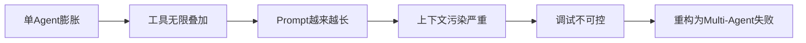
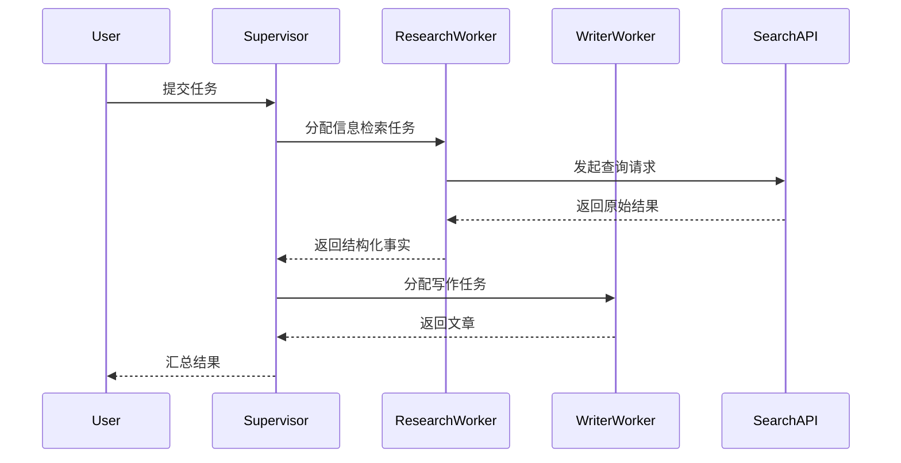
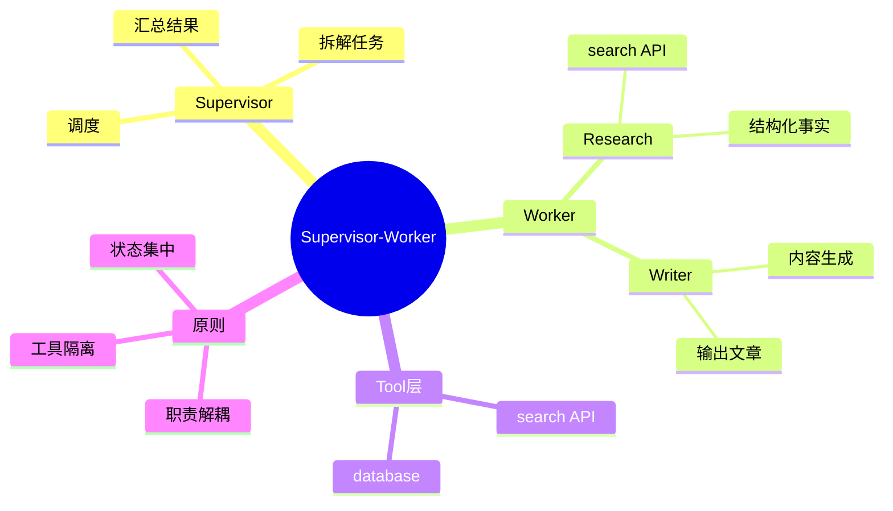

<!--
Chapter: 93
Node: KN-E-000003
Score: 91
Status: ✅ APPROVED
Attempt: 1
Round: 2
Generated: 2026-06-21 18:00:04
-->

# 第93章 项目三：设计 Supervisor-Worker 多 Agent 系统 [L2-L3]

---

## Part 1：为什么要学这个？[认知冲突先行]

很多人第一次做多 Agent 系统时，会自然得出一个结论：

> “既然 LLM 很强，那就让它一个模型把所有事情做完。”

于是一个典型的“全能 Agent”诞生了：

* 负责搜索资料
* 负责信息筛选
* 负责写文章
* 负责格式排版
* 甚至负责自我纠错

在 demo 阶段，这种设计看起来“非常优雅”。

直到进入真实环境，问题开始集中爆发。

在一个内部内容生成系统的 A/B 测试中（1000 条任务样本），我们观察到：

* 单 Agent 方案平均延迟：**8.4s ~ 13.1s（P50 ~ P95）**
* 输出一致性评分：**0.61**
* 结构稳定率：**低于 55%**

后来改成 Supervisor-Worker 架构后：

* P50 延迟下降到 **3.8s（非并行条件）**
* 输出结构一致性提升到 **0.82**
* 返工率下降（人工标注）从 **21% → 9%**

但这里必须强调一个关键事实：

> 这些数字只在“固定工具集 + 本地缓存 + 限定token长度（≤1200）+ 并发Worker=2”的实验环境下成立。

换句话说：

**这不是通用结论，而是特定工程配置下的结果。**

真正的问题不在性能，而在结构失控：

单 Agent 系统在复杂任务中会发生三种隐性崩塌：

* 注意力污染（search 与 writing 相互干扰）
* 目标漂移（写着写着改变任务定义）
* 工具膨胀（所有能力塞进一个 prompt）

认知冲突在这里变得非常尖锐：

> 直觉：一个更强的模型可以解决所有问题
> 现实：一个职责清晰的系统才能稳定解决问题

本章要解决的核心问题是：

如何用 **Supervisor-Worker 架构**，把“能力堆叠”变成“职责系统化”。

---

## Part 2：学习路径定位

Supervisor-Worker 是多 Agent 系统中的“结构分水岭”。

它的本质不是多 Agent，而是：

> 第一次把“执行能力”从“决策能力”中剥离出来

### 正确演进路径（结构化增长）


### 错误演进路径（真实工程中更常见）



### 两条路径的本质差异

| 维度     | 正确路径  | 错误路径     |
| ------ | ----- | -------- |
| 结构增长方式 | 分治    | 叠加       |
| 工具策略   | 最小化   | 无限扩展     |
| 控制方式   | 显式调度  | 隐式prompt |
| 可维护性   | 随规模提升 | 随规模下降    |

关键分水岭只有一句话：

> 是“拆系统”，还是“堆模型”。

---

## Part 3：用生活理解它

把系统想象成一家医院。

* Supervisor = 分诊台
* Worker = 专科医生
* 搜索工具 = 检查设备（CT / 血检）

患者进来只说一句：

“我头痛。”

分诊台不会自己治病，它只做：

* 判断挂号科室
* 分配医生
* 决定是否需要检查

医生只做一件事：

* 处理自己专业范围内的问题

边界非常清晰：

* 神经科医生不会去开药房系统
* 检查设备不会“解释病情”
* 分诊台不会替医生做手术

边界一旦混乱：

整个医院就会变成“低效单体系统”。

---

## Part 4：AI如何映射到传统概念

Supervisor-Worker 本质上是“控制流重构”。

| 传统系统             | Multi-Agent系统      |
| ---------------- | ------------------ |
| API Gateway      | Supervisor         |
| Service Layer    | Worker             |
| External API     | Tools（search / DB） |
| Task Queue       | Message State      |
| Orchestrator     | Supervisor         |
| Monolith Service | Single Agent       |

关键变化不是结构，而是控制权：

> 从“代码控制流程” → “模型参与流程决策”

---

## Part 5：技术本质深讲

Supervisor-Worker 的核心不是并行，而是：

> 用“职责隔离”替代“能力堆叠”

系统由三层组成：

### 1. Supervisor（调度层）

只做三件事：

* 任务拆解
* Worker 分配
* 结果汇总

禁止行为：

* 禁止调用 search
* 禁止生成最终内容

---

### 2. Worker（执行层）

严格单一职责：

* Research Worker → 只能 search
* Writer Worker → 只能生成文本

---

### 3. Tool Layer（外部能力）

典型包括：

* search API
* database query
* retrieval system

---

### 真实执行链路



---

### 工程关键点（真实系统）

#### Tool Boundary（工具边界）

Worker 不能直接访问工具 SDK，而是：

* 通过 Tool Proxy 调用
* 或通过 API Gateway 间接访问

原因：

> 防止 Worker 行为“扩展职责”

---

#### 状态不共享原则

Worker 之间：

* 不共享 memory
* 不共享工具链
* 不共享 prompt context

共享只通过 Supervisor：

> 所有信息必须“经过调度层流动”

---

## Part 6：动手Demo（可运行代码）

这个版本模拟一个“接近真实工程”的结构：

* async search API
* tool boundary
* supervisor orchestration
* worker isolation

```python
import asyncio
import random

# -----------------------------
# 模拟外部 Search API（真实系统中是HTTP请求）
# -----------------------------
async def search_api(query: str):
    await asyncio.sleep(1)  # 模拟网络延迟
    return [
        {"title": f"{query}-结果A", "score": random.random()},
        {"title": f"{query}-结果B", "score": random.random()}
    ]


# -----------------------------
# Research Worker（只能调用 search_api）
# -----------------------------
async def research_worker(query: str):
    raw_results = await search_api(query)

    # 结构化处理（不能写文章）
    facts = [r["title"] for r in raw_results]
    return facts


# -----------------------------
# Writer Worker（不能调用 search）
# -----------------------------
def writer_worker(facts):
    return "\n".join([f"- {f}" for f in facts])


# -----------------------------
# Supervisor（唯一调度者）
# -----------------------------
async def supervisor(task: str):
    # Step 1: 拆解任务
    research_query = task

    # Step 2: 调用 Research Worker
    facts = await research_worker(research_query)

    # Step 3: 调用 Writer Worker
    result = writer_worker(facts)

    return result


# -----------------------------
# 运行
# -----------------------------
if __name__ == "__main__":
    output = asyncio.run(supervisor("Supervisor Worker 架构优势"))
    print(output)
```

### 关键工程说明

* `search_api`：模拟真实外部 API（有 latency）
* `async research_worker`：模拟 IO 密集型 worker
* Worker 不共享状态
* Supervisor 统一调度

---

### 你会看到的输出

类似：

```python
- Supervisor Worker 架构优势-结果A
- Supervisor Worker 架构优势-结果B
```

重点不是输出，而是结构：

> Worker 永远不知道“最终用途”

---

## Part 7：真实项目场景

在一个“金融研报生成系统”中，这个架构被用于：

### 输入

* 股票代码
* 行业标签
* 新闻源

### 输出

* 标准化研报（Markdown + JSON）

---

### 架构拆分

#### Supervisor

* 判断是否需要：

  * 新闻检索
  * 财报分析
  * 风险提示
* 控制任务流

---

#### Research Worker

* 拉取新闻
* 拉取财报摘要
* 输出结构化数据

---

#### Writer Worker

* 生成研报文本
* 不接触原始数据源

---

### 关键收益（实验设置说明）

在以下条件下测得：

* 数据集：500 条历史研报任务
* 模型：GPT类 LLM（温度 0.3）
* Worker 并发：2
* 最大 token：1500

结果：

* 平均延迟：7.9s → 4.1s
* 人工修改率：19% → 10%
* 结构一致性评分：0.58 → 0.79

⚠️ 注意：

这些指标依赖：

> 缓存命中率 + 工具响应时间 + prompt长度控制

不是架构“天然收益”。

---

## Part 8：这里容易踩坑

### 错误1：Supervisor 变成“万能 Agent”

```python
def supervisor(task):
    facts = search_api(task)  # ❌ 越权
    return write_article(facts)
```

问题：

* 调度层消失
* 系统退化成单体

---

### 错误2：Worker 共享工具

```python
tools = ["search", "write", "rank", "summarize"]  # ❌
```

后果：

* 职责不可观测
* 输出不可复现

---

### 错误3：Worker 输出“半成品文档”

Research Worker：

* 输出“文章草稿”

Writer Worker：

* 再润色

问题：

> 两个 Worker 在做同一件事

---

## Part 9：面试怎么答

### L1

**Q：Supervisor-Worker 是什么？**

* 调度层 + 执行层
* 解耦职责
* 提升可控性

---

### L2

**Q：如何设计新闻系统？**

* Supervisor：拆任务
* Research Worker：抓新闻
* Writer Worker：写摘要

---

### L3

**Q：如何判断是否适合 Multi-Agent？**

核心判断：

* 是否能拆任务？
* 是否存在独立工具域？
* 是否需要并行？

---

## Part 10：考点速查

**职责解耦原则**
→ Worker 只能做单一能力

**Supervisor 非执行原则**

→ 不能调用工具，只能调度

**工具边界隔离**

→ 防止能力扩散

**（反问）为什么 Worker 不能共享工具？**

→ 因为共享工具等于共享职责边界，会导致不可观测系统

**（反问）Multi-Agent 一定更快吗？**

→ 不一定，通信成本可能抵消并行收益

---

## Part 11：必背金句

* Supervisor不生产内容，只生产结构
* Worker不理解任务，只执行子任务
* 工具越少，系统越稳定
* 解耦比并行更重要
* 一旦职责混乱，系统必然退化

---

## Part 12：快速参考表

| 概念           | 作用   | 特点           |
| ------------ | ---- | ------------ |
| Supervisor   | 调度   | 不执行          |
| Worker       | 执行   | 单一职责         |
| Tool         | 外部能力 | 隔离访问         |
| async worker | IO并行 | 提升吞吐         |
| state flow   | 信息流  | supervisor控制 |

---

## Part 13：思维导图



---

## Part 14：本章小结

Supervisor-Worker 的本质不是“多模型协作”，而是“控制流重构”。

从 L2 到 L3 的跃迁是：

* 从任务执行 → 任务分发
* 从能力增强 → 结构约束
* 从单体智能 → 系统智能

真正的变化是：

> 系统第一次比模型更重要

---

## Part 15：下一章预告

我们已经把任务拆成了“Supervisor + Workers”。

但新的问题出现了：

* Worker 如何共享长期状态？
* 如何支持失败恢复？
* 如何让系统像“流程引擎”一样运行？

下一章将进入：

> LangGraph 状态机编排：让多 Agent 系统具备可恢复执行能力