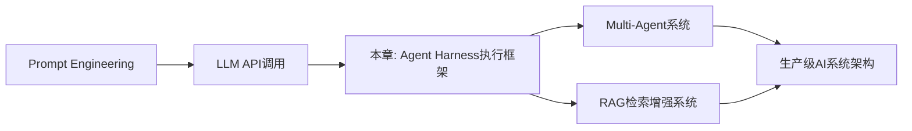
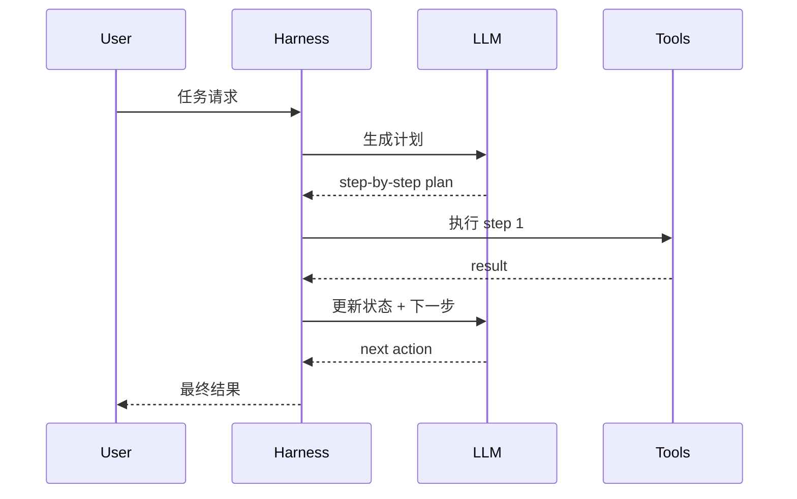
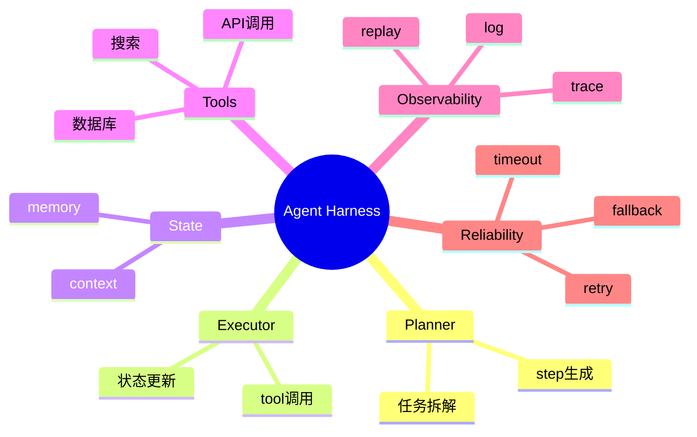

<!--
Chapter: 95
Node: KN-E-000005
Score: 92
Status: ✅ APPROVED
Attempt: 2
Round: 2
Generated: 2026-06-21 18:20:33
-->

# 第95章 项目五：生产级 Agent Harness [L3]

## Part 1：为什么要学这个？[认知冲突先行] [L3]

很多人第一次做 Agent 系统时，会有一种“我已经会调用 LLM API 了”的错觉。

代码大概长这样：

```python
response = llm.chat("帮我写个SQL优化方案")
print(response)
```

能跑、能用、还能上线 demo，于是一个“Agent 系统”就诞生了。

但问题在生产环境里会突然变得尖锐：
同一个请求，有时成功、有时超时、有时工具乱调用、有时直接胡编结果。

你会发现一个残酷事实：

> 你以为你在做 Agent，其实你只是“在调用一个会说话的 API”。

真正的问题不是“LLM 会不会回答”，而是：

* 谁来控制它什么时候调用工具？
* 工具失败怎么办？
* 多步推理中间状态怎么保存？
* 如何复现一次失败？
* 如何观测它到底“想了什么”？

这一章要解决的核心问题是：

> 如何构建一个**可控、可观测、可恢复、可评估**的生产级 Agent Harness（执行外壳系统）。

---

## Part 2：学习路径定位

Agent Harness 并不是孤立知识，它处在 AI 工程化的中间层。



### 前置知识

* LLM API 调用
* Prompt 基础
* JSON / function calling

### 后置知识

* 多 Agent 协作系统
* 自动化评估体系
* AI Workflows / DAG 编排

---

## Part 3：用生活理解它

把 Agent Harness 想象成一家餐厅的“后厨系统”。

* 顾客（用户）点单
* 厨师（LLM）负责做菜
* 但厨房必须有：

  * 菜单（tools schema）
  * 订单系统（task state）
  * 监控摄像头（logging）
  * 备菜流程（planning）
  * 出错补救机制（retry / fallback）

没有 Harness 的 Agent，就像：

> 厨师直接冲到前台随机做菜，还可能忘了订单。

类比边界：

* 厨师不像 LLM 一样“随机生成”
* 现实厨房是确定流程，但 LLM 是概率系统
* 所以 Harness 比厨房系统更复杂

---

## Part 4：AI如何映射到传统概念

| 传统软件系统             | Agent Harness   |
| ------------------ | --------------- |
| Web Server         | Agent Runtime   |
| Controller         | Orchestrator    |
| Function Call      | Tool Invocation |
| Log System         | Trace System    |
| Job Queue          | Task Queue      |
| Exception Handling | Retry Policy    |
| Unit Test          | Agent Eval Case |

本质上：

> Agent Harness = “不确定性函数 + 确定性控制系统”

---

## Part 5：技术本质深讲

Agent Harness 的核心不是“让模型聪明”，而是：

> 把 LLM 变成一个可控状态机节点。

它通常包含：

* Planner（规划器）
* Executor（执行器）
* Tool Router（工具路由）
* Memory（短期/长期记忆）
* State Store（状态持久化）
* Logger（可观测系统）



关键设计点：

* **状态显式化**：每一步都必须可序列化
* **执行解耦**：LLM 不直接操作工具
* **循环控制**：最大 step 限制避免死循环
* **失败恢复**：工具失败不能污染上下文

---

## Part 6：动手Demo（可运行代码）

下面是一个最小 Agent Harness（简化版）：

```python
import json
import random

# 模拟LLM
def fake_llm(prompt):
    if "plan" in prompt:
        return json.dumps({
            "steps": ["search_data", "analyze", "summarize"]
        })
    return "done"

# 工具系统
def search_data():
    return "raw data: AI market grows 30%"

def analyze(data):
    return f"analysis based on {data}"

def summarize(data):
    return f"summary: {data[:20]}"

TOOLS = {
    "search_data": search_data,
    "analyze": analyze,
    "summarize": summarize
}

# Agent Harness
class AgentHarness:
    def __init__(self):
        self.state = {}

    def run(self, task):
        plan = json.loads(fake_llm("create plan: " + task))
        steps = plan["steps"]

        data = None
        for step in steps:
            if step == "search_data":
                data = TOOLS[step]()
            else:
                data = TOOLS[step](data)

            print(f"[STEP] {step} -> {data}")

        return data

agent = AgentHarness()
result = agent.run("analyze AI market")
print("FINAL:", result)
```

关键点说明：

* `fake_llm()` 模拟规划能力
* `TOOLS` 是受控执行环境
* `AgentHarness.run()` 是核心控制流

运行结果类似：

```python
[STEP] search_data -> raw data: AI market grows 30%
[STEP] analyze -> analysis based on raw data...
[STEP] summarize -> summary: analysis based on ...
FINAL: summary: analysis...
```

---

## Part 7：真实项目场景

在生产环境中，Agent Harness 常见于：

### 1. 企业数据分析 Agent

* 输入：业务问题
* 输出：SQL + 图表 + 报告

### 2. 客服自动化系统

* 自动拆解用户问题
* 调用 CRM / 工单系统

### 3. DevOps Agent

* 自动诊断日志
* 调用 kubectl / CI pipeline

技术选型：

* FastAPI（API层）
* Redis（状态存储）
* Postgres（长期记忆）
* OpenTelemetry（trace）

关键点：

* 所有 tool call 必须可回放
* 所有 step 必须可 trace
* 每次执行必须可复现

---

## Part 8：这里容易踩坑

### 坑1：让 LLM 直接调用工具

❌ 错误：

```python
llm("帮我查数据库并执行SQL")
```

问题：不可控 + 无审计

✔ 正确：

```python
plan = llm("生成执行计划")
execute(plan)
```

---

### 坑2：没有状态管理

❌ 错误：

每一步都是独立 prompt

✔ 正确：

```python
state = {
    "history": [],
    "context": {}
}
```

---

### 坑3：没有失败恢复

工具失败直接 crash

✔ 正确策略：

* retry 3 次
* fallback tool
* 或降级 plan

---

## Part 9：面试怎么答

### L1：什么是 Agent Harness？

核心思路：

* 控制 LLM 执行流程的外部框架
* 不让模型直接控制系统

---

### L2：如何保证可控性？

要点：

* tool whitelist
* state machine
* step limit
* structured output

---

### L3：如何设计生产级系统？

思路：

* 解耦 planner / executor
* trace every step
* replay mechanism
* evaluation loop

---

## Part 10：考点速查

* **状态机设计**：Agent 本质是 state transition system
* **工具隔离**：LLM 不直接执行函数
* **可观测性**：必须支持 trace replay
* **失败恢复**：retry + fallback 是必备
* **循环控制**：避免无限 reasoning loop

---

## Part 11：必背金句

* Harness 不是让模型更聪明，而是让系统更可控
* Agent 的核心不是推理，而是执行控制
* 没有状态的 Agent 只是一次性函数
* 可观测性比能力更重要
* 生产系统永远在处理失败，而不是处理理想情况

---

## Part 12：快速参考表

| 概念       | 作用      | 示例值         |
| -------- | ------- | ----------- |
| State    | 记录执行上下文 | {"step": 2} |
| Tool     | 外部能力接口  | search_db() |
| Planner  | 生成步骤    | steps list  |
| Executor | 执行步骤    | tool runner |
| Trace    | 执行记录    | JSON log    |

---

## Part 13：思维导图



---

## Part 14：本章小结

Agent Harness 的本质，是给 LLM 加上一层“执行控制系统”，而不是提升模型能力本身。

它让不确定的模型输出，变成可管理的工程流程。

从 L0 到 L3 的成长路径是：

* L0：只会调用 LLM API
* L1：会做 prompt chaining
* L2：能做 tool calling
* L3：能构建完整执行系统（Harness）

---

## Part 15：下一章预告

本章解决了“如何控制 Agent 执行”。

但现实问题还没结束：

* 多个 Agent 如何协作？
* 如何避免互相冲突？
* 如何拆解复杂任务成团队系统？

下一章将进入：

> 多 Agent 协作系统（Multi-Agent Orchestration）