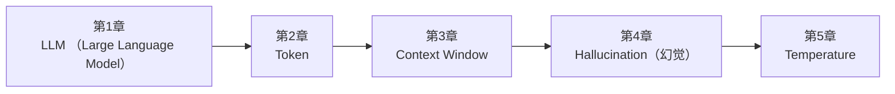

<!--
Chapter: 96
Node: SUMMARY-PART-01
Score: 100
Status: AUTO-GENERATED
Generated: summary
-->

# 第96章 【小结】第一部分：LLM 基础 (ch1-ch5)

> **速读指南**：本章是「第一部分：LLM 基础」的精华浓缩（共5个核心知识点）。
> 如果时间有限，只读本章即可掌握该部分所有核心概念。
> 重点看：**一、知识点精华一览**（速查表）和 **四、高频面试题精华**（备考必读）。

## 一、知识点精华一览

| 章节 | 概念 | 一句话掌握 |
|------|------|-----------|
| 第1章 | **LLM (Large Language Model)** | LLM = 读过所有书的接龙高手，概率预测下一个词，不是真的在思考。 |
| 第2章 | **Token** | Token是LLM的计量单位，≠字符≠单词，是成本和上下文窗口的计算基础。 |
| 第3章 | **Context Window** | Context Window 是 LLM 的桌面大小——桌面外的资料它看不见，设计系统时必须精打细算。 |
| 第4章 | **Hallucination（幻觉）** | 幻觉是 LLM 的结构性缺陷——它不会说'我不知道'，只会自信地编造听起来合理的内容。 |
| 第5章 | **Temperature** | Temperature=0是确定性模式（调试用），越高越随机，按任务类型调，不是越低越好。 |

## 二、核心原理速记

### 1. LLM (Large Language Model)  `[L0-L1]`

**心智模型**：LLM = 一个"接龙高手" 它本质上只做一件事：给定前面的文字，预测下一个最可能出现的词（Token）。 但因为训练数据极其丰富，它"见过"几乎所有人类知识， 所以它的"接龙"看起来像理解、推理、创作。 类比：一个读过所有书的人，被要求"接着说"—— 他不是真的在思考，而是在凭借极其丰富的阅读经验做出最合理的预测。

**考试要点**：
- LLM 生成文本的方式：逐 Token 预测，基于概率分布采样
- Context Window 的限制：超出窗口的内容被截断，LLM 无法访问
- Temperature=0：确定性输出（总选最高概率）；Temperature 越高：输出越随机
- LLM 不适合的场景：精确计算、实时数据、确定性规则

**核心原则**：
- LLM 是概率模型，不是确定性程序：同样的输入，每次输出可能不同
- LLM 没有理解，只有统计模式：它预测'什么词最可能出现'，而非'理解意思'

### 2. Token  `[L0-L1]`

**心智模型**：Token ≈ 乐高积木 文字是用乐高拼出来的模型，但乐高的形状不是一个字母，也不是一个完整单词， 而是常见的"词片段"： - "un" + "believ" + "able" = "unbelievable"（3个Token） - "中" + "文" = "中文"（可能是1-2个Token） - " hello" 和 "hello" 是不同的Token（前面有空格）

**考试要点**：
- 英文1词≈1.3Token，中文1字≈1-1.5Token
- 输出Token通常比输入Token贵（生成比理解计算量大）
- Context Window以Token计量，超出则截断
- BPE（Byte Pair Encoding）是常见的Tokenization算法

**核心原则**：
- Token ≠ 字符 ≠ 单词：中文1字约1.5Token，英文1词约1.3Token
- Context Window 以Token计量，不是字符或单词

### 3. Context Window  `[L0-L1]`

**心智模型**：Context Window = 考试时桌面的大小（开卷考试） - 桌面只有这么大，能摊开的参考资料就这么多 - 超出桌面的资料必须收起来，考试时看不到 - 桌面越大，能参考的资料越多，回答越准确 - 但桌面太大也有问题：找关键信息变慢（注意力分散）

**考试要点**：
- Context Window = 输入Token + 输出Token，共享上限
- LLM 没有持久记忆，每次请求独立，只能看到当前 Context 内容
- Lost in the Middle：关键信息在中间时 LLM 注意力下降
- 解决长对话的方法：历史摘要压缩、外部记忆存储（Long-term Memory）

**核心原则**：
- Context Window 是 LLM 唯一的'记忆'——不在窗口内就等于不存在
- 输入 + 输出共享同一个 Context Window，输出越长，留给输入的空间越少

### 4. Hallucination（幻觉）  `[L0-L1]`

**心智模型**：LLM 幻觉 ≈ 一个记性很好但喜欢"补全故事"的学生 - 他读过大量资料，能流畅地讲任何话题 - 但当他不确定细节时，他不会说"我不知道" - 而是凭直觉"补全"一个听起来合理的答案 - 你分辨不出他哪句话是真记得的，哪句是编的 更精确的类比： LLM = 预测接龙机器。它预测"下一个最可能出现的Token"， "最可能"不等于"最真实"——统计上合理的词语拼接，可能在事实上完全错误。

**考试要点**：
- 幻觉的本质：LLM 预测'统计上合理'的Token，不等于预测'事实上正确'的内容
- 三种幻觉类型：事实幻觉、指令幻觉、上下文幻觉
- RAG 只能减少知识性幻觉，无法消除推理性幻觉
- 管理幻觉的系统性手段：RAG + Evaluation + Human-in-the-Loop + Guardrails

**核心原则**：
- 幻觉是 LLM 的结构性特征，不是 bug，无法被根治，只能被管理
- LLM 的输出置信度不等于事实准确度——它越自信，越需要验证

### 5. Temperature  `[L0-L1]`

**心智模型**：Temperature = 调酒师调酒的"大胆程度" - Temperature=0：严格按经典配方，每次完全相同 - Temperature=0.7：稍微发挥，有点变化但不出格 - Temperature=1.5：大胆创新，可能出奇制胜，也可能难以下咽 或者： Temperature = 填空题的答题策略 - 低温：永远填最常见的词（保守） - 高温：随机从候选词中抽取（大胆，可能出现意外之喜，也可能错误）

**考试要点**：
- Temperature=0：贪婪解码，输出确定，可复现
- Temperature越高：输出越随机多样，低概率Token被选中机会越大
- 代码生成建议低Temperature（0-0.2），创意写作建议高Temperature（0.7-1.2）
- Evaluation时用Temperature=0保证结果可复现

**核心原则**：
- Temperature=0 是调试模式：输出确定，可复现，便于排查问题
- Temperature 不等于质量：高温不是'更好'，是'更多样'——适合创意任务

## 三、对比与选型速查

| 概念 | 解决的问题 | 最佳适用场景 | 不适合场景/反模式 |
|------|-----------|------------|-----------------|
| **LLM (Large Language Model)** | 1. 语言理解的通用性：一个模型解决所有语言任务，不再需要为每个任务单独训练 | 始终将 LLM 视为概率组件，而非确定性函数——设计 Evaluation 来持续监控输出质量 | 把 LLM 当数据库用（问它具体事实）（后果：高幻觉率，输出不可信。应使用 RAG 或结构化数据源） |
| **Token** | 为什么不按字符处理？字符粒度太细，序列太长，计算量爆炸 | 估算成本时：中文字数 × 1.5 ≈ Token数；英文词数 × 1.3 ≈ Token数 | 把整个文档塞入Prompt不做压缩（后果：Token浪费，Context溢出，成本飙升，且关键信息被噪音淹没） |
| **Context Window** | LLM 没有持久记忆 | 将最重要的信息放在 Context 的开头或结尾（LLM 对首尾内容注意力更强） | 不限制历史对话长度，让它无限增长（后果：Context Window 溢出，早期历史被截断，LLM '忘记'重要信息；成 |
| **Hallucination（幻觉）** | 理解幻觉是 AI Native Engineer 的必修课，因为： | 对所有 AI 输出建立 Evaluation 体系，持续监控幻觉率 | 对 LLM 输出不加验证直接展示给用户（后果：幻觉内容传播给用户，引发信任危机，在医疗/法律场景可能造成严重后果） |
| **Temperature** | LLM 生成每个 Token 时，会得到词表中所有 Token 的概率分布 | 调试和测试 Prompt 时，固定 Temperature=0，确保结果可复现 | 所有任务都用 Temperature=1（默认值）（后果：代码类任务随机性过高，稳定性差，难以调试） |

## 四、高频面试题精华

**Q: LLM 的本质是什么？它如何生成文本？（考察：能否解释 Token 预测机制）？**

> **答题要点**：LLM = 一个"接龙高手" 它本质上只做一件事：给定前面的文字，预测下一个最可能出现的词（Token）。 但因为训练数据极其丰富，它"见过"几乎所有人类知识， 所以它的"接龙"看起来像理解、推理、创作。  类比：一个读过所有书的人，被要求"接着说"—— 他不是真的在思考，而是在凭借极其丰富的阅读经验做出最合理的预测。
>
> **最佳实践**：始终将 LLM 视为概率组件，而非确定性函数——设计 Evaluation 来持续监控输出质量

**Q: LLM 为什么会产生幻觉？如何缓解？（考察：对 LLM 局限性的理解）？**

> **答题要点**：LLM = 一个"接龙高手" 它本质上只做一件事：给定前面的文字，预测下一个最可能出现的词（Token）。 但因为训练数据极其丰富，它"见过"几乎所有人类知识， 所以它的"接龙"看起来像理解、推理、创作。  类比：一个读过所有书的人，被要求"接着说"—— 他不是真的在思考，而是在凭借极其丰富的阅读经验做出最合理的预测。
>
> **最佳实践**：始终将 LLM 视为概率组件，而非确定性函数——设计 Evaluation 来持续监控输出质量

**Q: Token是什么？为什么LLM用Token而不是字符或单词？**

> **答题要点**：Token ≈ 乐高积木 文字是用乐高拼出来的模型，但乐高的形状不是一个字母，也不是一个完整单词， 而是常见的"词片段"： - "un" + "believ" + "able" = "unbelievable"（3个Token） - "中" + "文" = "中文"（可能是1-2个Token） - " hello" 和 "hello" 是不同的Token（前面有空格）
>
> **最佳实践**：估算成本时：中文字数 × 1.5 ≈ Token数；英文词数 × 1.3 ≈ Token数

**Q: 如何估算一段文本的Token数？中英文有什么差异？**

> **答题要点**：Token ≈ 乐高积木 文字是用乐高拼出来的模型，但乐高的形状不是一个字母，也不是一个完整单词， 而是常见的"词片段"： - "un" + "believ" + "able" = "unbelievable"（3个Token） - "中" + "文" = "中文"（可能是1-2个Token） - " hello" 和 "hello" 是不同的Token（前面有空格）
>
> **最佳实践**：估算成本时：中文字数 × 1.5 ≈ Token数；英文词数 × 1.3 ≈ Token数

**Q: Context Window 是什么？它对多轮对话系统设计有什么影响？**

> **答题要点**：Context Window = 考试时桌面的大小（开卷考试） - 桌面只有这么大，能摊开的参考资料就这么多 - 超出桌面的资料必须收起来，考试时看不到 - 桌面越大，能参考的资料越多，回答越准确 - 但桌面太大也有问题：找关键信息变慢（注意力分散）
>
> **最佳实践**：将最重要的信息放在 Context 的开头或结尾（LLM 对首尾内容注意力更强）

**Q: 什么是'Lost in the Middle'问题？如何缓解？**

> **答题要点**：Context Window = 考试时桌面的大小（开卷考试） - 桌面只有这么大，能摊开的参考资料就这么多 - 超出桌面的资料必须收起来，考试时看不到 - 桌面越大，能参考的资料越多，回答越准确 - 但桌面太大也有问题：找关键信息变慢（注意力分散）
>
> **最佳实践**：将最重要的信息放在 Context 的开头或结尾（LLM 对首尾内容注意力更强）

**Q: 什么是 LLM 幻觉？为什么会产生幻觉？（考察：对 LLM 本质的理解）？**

> **答题要点**：LLM 幻觉 ≈ 一个记性很好但喜欢"补全故事"的学生 - 他读过大量资料，能流畅地讲任何话题 - 但当他不确定细节时，他不会说"我不知道" - 而是凭直觉"补全"一个听起来合理的答案 - 你分辨不出他哪句话是真记得的，哪句是编的  更精确的类比： LLM = 预测接龙机器。它预测"下一个最可能出现的Token"， "最可能"不等于"最真实"——统计上合理的词语拼接，可能在事实上完全错误。
>
> **最佳实践**：对所有 AI 输出建立 Evaluation 体系，持续监控幻觉率

**Q: 幻觉有哪几种类型？各自的成因是什么？**

> **答题要点**：LLM 幻觉 ≈ 一个记性很好但喜欢"补全故事"的学生 - 他读过大量资料，能流畅地讲任何话题 - 但当他不确定细节时，他不会说"我不知道" - 而是凭直觉"补全"一个听起来合理的答案 - 你分辨不出他哪句话是真记得的，哪句是编的  更精确的类比： LLM = 预测接龙机器。它预测"下一个最可能出现的Token"， "最可能"不等于"最真实"——统计上合理的词语拼接，可能在事实上完全错误。
>
> **最佳实践**：对所有 AI 输出建立 Evaluation 体系，持续监控幻觉率

**Q: Temperature 参数的作用是什么？取值范围和效果？**

> **答题要点**：Temperature = 调酒师调酒的"大胆程度" - Temperature=0：严格按经典配方，每次完全相同 - Temperature=0.7：稍微发挥，有点变化但不出格 - Temperature=1.5：大胆创新，可能出奇制胜，也可能难以下咽  或者： Temperature = 填空题的答题策略 - 低温：永远填最常见的词（保守） - 高温：随机从候选词中抽取（大胆，可能出现意外之喜
>
> **最佳实践**：调试和测试 Prompt 时，固定 Temperature=0，确保结果可复现

**Q: 调试 Prompt 时为什么要设置 Temperature=0？**

> **答题要点**：Temperature = 调酒师调酒的"大胆程度" - Temperature=0：严格按经典配方，每次完全相同 - Temperature=0.7：稍微发挥，有点变化但不出格 - Temperature=1.5：大胆创新，可能出奇制胜，也可能难以下咽  或者： Temperature = 填空题的答题策略 - 低温：永远填最常见的词（保守） - 高温：随机从候选词中抽取（大胆，可能出现意外之喜
>
> **最佳实践**：调试和测试 Prompt 时，固定 Temperature=0，确保结果可复现

## 五、常见误区警示

**LLM (Large Language Model) 的常见误区**：

- ❌ 误解：LLM 是在'思考'或'理解'
  ✅ 正解：LLM 是在做统计预测——预测下一个最可能的 Token。它的输出看起来像理解，是因为训练数据极其丰富，而非真正具备推理能力。
- ❌ 误解：LLM 记得所有对话历史
  ✅ 正解：LLM 只能看到当前请求中 Context Window 内的内容。超出窗口的内容会被截断，LLM 完全'忘记'。

**Token 的常见误区**：

- ❌ 误解：1个Token = 1个字
  ✅ 正解：中文1字约1-1.5个Token，英文1个词约1-1.3个Token，标点、空格也占Token。
- ❌ 误解：Token越少越好
  ✅ 正解：Token数少意味着信息少。关键是信息密度：用最少的Token传递最关键的信息，而不是一味压缩。

**Context Window 的常见误区**：

- ❌ 误解：LLM 能记住所有历史对话
  ✅ 正解：LLM 没有持久记忆。每次请求独立，只能看到当前 Context Window 内的内容。超出的历史会被截断或遗忘。
- ❌ 误解：Context Window 越大，系统设计就越简单
  ✅ 正解：大 Context Window 带来'Lost in the Middle'问题：关键信息放在中间部分时，LLM 容易忽略。同时成本也更高。

**Hallucination（幻觉） 的常见误区**：

- ❌ 误解：幻觉只在模型不确定时才出现
  ✅ 正解：LLM 在高度自信时同样会幻觉。它无法准确评估自己的不确定性，越流畅的表达不代表越准确。
- ❌ 误解：RAG 能解决所有幻觉
  ✅ 正解：RAG 只能减少'知识型幻觉'（不知道某个事实）。'推理型幻觉'（推理过程出错）和'指令型幻觉'（忽略要求）RAG 无能为力。

**Temperature 的常见误区**：

- ❌ 误解：Temperature=0 输出最准确
  ✅ 正解：Temperature=0 输出最稳定（可复现），不代表最准确。LLM 最高概率的输出仍可能是错的。
- ❌ 误解：Temperature 越高，输出越聪明
  ✅ 正解：Temperature 越高，输出越多样，但也越容易偏离主题、产生幻觉。聪明与否和 Temperature 无关。

## 六、知识关联图

## 七、本章自测清单

完成本部分学习后，你应该能够：

- [ ] **LLM (Large Language Model)**：LLM = 读过所有书的接龙高手，概率预测下一个词，不是真的在思考。
- [ ] **Token**：Token是LLM的计量单位，≠字符≠单词，是成本和上下文窗口的计算基础。
- [ ] **Context Window**：Context Window 是 LLM 的桌面大小——桌面外的资料它看不见，设计系统时必须精打细算。
- [ ] **Hallucination（幻觉）**：幻觉是 LLM 的结构性缺陷——它不会说'我不知道'，只会自信地编造听起来合理的内容。
- [ ] **Temperature**：Temperature=0是确定性模式（调试用），越高越随机，按任务类型调，不是越低越好。

> 如果某项还不确定，回到对应章节复习后再打勾。
