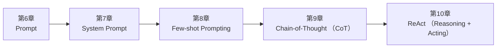

<!--
Chapter: 97
Node: SUMMARY-PART-02
Score: 100
Status: AUTO-GENERATED
Generated: summary
-->

# 第97章 【小结】第二部分：Prompt Engineering (ch6-ch10)

> **速读指南**：本章是「第二部分：Prompt Engineering」的精华浓缩（共5个核心知识点）。
> 如果时间有限，只读本章即可掌握该部分所有核心概念。
> 重点看：**一、知识点精华一览**（速查表）和 **四、高频面试题精华**（备考必读）。

## 一、知识点精华一览

| 章节 | 概念 | 一句话掌握 |
|------|------|-----------|
| 第6章 | **Prompt** | Prompt 是人与 LLM 的接口，写好它就是在'编程'——必须版本控制、测试、持续迭代。 |
| 第7章 | **System Prompt** | System Prompt 是 AI 的员工手册——定义它是谁、能做什么、怎么输出，全程生效。 |
| 第8章 | **Few-shot Prompting** | 给示例比给说明更有效——3个好示例胜过1000字的任务描述。 |
| 第9章 | **Chain-of-Thought (CoT)** | CoT = 让 AI 展示解题步骤，推理过程显式化，复杂任务准确率显著提升。 |
| 第10章 | **ReAct (Reasoning + Acting)** | ReAct = 思考→行动→观察→循环，是 Agent 能'自主完成任务'的底层引擎。 |

## 二、核心原理速记

### 6. Prompt  `[L0-L1]`

**心智模型**：Prompt = 给实习生的工作说明书 - 你怎么写说明书，实习生就怎么做 - 说明书含糊 → 结果含糊 - 说明书里有示例 → 结果更符合期望 - 说明书规定了格式 → 输出格式稳定 - 说明书越清晰，实习生越能发挥 进阶类比： Prompt = 函数签名（对 LLM 来说） - System Prompt = 函数的文档字符串（定义行为边界） - User Message = 函数调用（传入具体参数） - LLM 输出 = 函数返回值

**考试要点**：
- Prompt 三部分：System Prompt + Few-shot Examples + User Message
- Few-shot：提供输入→输出示例，帮助 LLM 理解期望格式和行为
- Zero-shot：不提供示例，直接给任务描述
- Prompt 版本控制：存入 prompts/ 目录，用 Git 管理，修改前后跑 Evaluation

**核心原则**：
- Prompt 是代码：必须版本控制、Code Review、自动测试，不允许随意修改生产 Prompt
- 明确优于模糊：具体的指令、格式要求、示例，比泛泛的描述效果好 10 倍

### 7. System Prompt  `[L0-L1]`

**心智模型**：System Prompt = 员工手册 - 在正式上岗前，公司给员工一份手册，定义行为准则 - 不管客户（User）说什么，员工都在手册规定的范围内行事 - 客户无法通过"你是自由的"来绕过手册（理想情况下）

**考试要点**：
- System Prompt 优先级高于 User Message，在对话全程生效
- System Prompt = 角色定义 + 行为规范 + 输出格式 + 边界条件
- 防 Prompt Injection：严格隔离 System Prompt 和 User Input，不拼接

**核心原则**：
- System Prompt 和 User Input 必须严格分离——这是防 Prompt Injection 的基础
- System Prompt 定义'不变量'：角色、格式、边界；User Message 提供'变量'：具体任务

### 8. Few-shot Prompting  `[L0-L1]`

**心智模型**：Few-shot = 新员工入职培训 - 纯文字说明（Zero-shot）：员工理解可能有偏差 - 3个真实案例（Few-shot）：员工立刻明白"哦原来是这样做的" - 示例越贴近真实任务，效果越好

**考试要点**：
- Few-shot：提供示例让 LLM 理解任务模式；Zero-shot：不提供示例
- Few-shot 示例质量 > 数量，通常2-8个足够
- 动态 Few-shot：用 RAG 从示例库检索最相关示例，适合示例库大的场景

**核心原则**：
- 示例质量 > 示例数量：3个高质量示例胜过10个低质量示例
- 示例要覆盖边界情况：不只是正面例子，也要包含边界和负面例子

### 9. Chain-of-Thought (CoT)  `[L1-L2]`

**心智模型**：CoT = 要求学生"展示解题步骤" - 直接答题（Zero-shot）：学生可能乱猜，错误不可见 - 展示步骤（CoT）：步骤清晰，哪步错了一目了然，且步骤本身帮助学生思考清楚

**考试要点**：
- CoT 核心：让 LLM 展示推理步骤而非直接给答案，提升复杂推理准确率
- Zero-shot CoT 触发词：'让我们一步一步思考 / Let's think step by step'
- 适用场景：数学、逻辑推理、多步骤决策；不适合：简单分类、信息提取

**核心原则**：
- '让我们一步一步思考'（Let's think step by step）是最简单有效的 CoT 触发词
- CoT 对复杂推理任务有显著效果，对简单任务收益不明显（还增加 Token 成本）

### 10. ReAct (Reasoning + Acting)  `[L1-L2]`

**心智模型**：ReAct = 侦探破案的工作方式 - 思考（Thought）：根据线索分析，决定下一步调查方向 - 行动（Action）：去某个地方取证、询问证人 - 观察（Observation）：得到新线索 - 循环，直到案件告破 或者： ReAct = 工程师调试 bug Thought: 错误在第10行，可能是空指针 Action: 运行调试器，查看第10行变量值 Observation: 变量确实为 None Thought: 需要在赋值之前添加判空 Action: 修改代码并重新运行 Observation: 测试通过 → 完成

**考试要点**：
- ReAct = Reasoning（Thought）+ Acting（Action + Observation）的循环
- 终止条件：任务完成 OR 达到 max_iterations OR 超时
- Thought 的作用：解释决策过程，使 Agent 行为可解释、可调试
- ReAct 是绝大多数 Agent 框架的底层运行逻辑

**核心原则**：
- 思考在行动之前：每次行动必须有 Thought 解释原因，不允许盲目行动
- 观察驱动下一步：Observation 是下一个 Thought 的输入，形成闭环

## 三、对比与选型速查

| 概念 | 解决的问题 | 最佳适用场景 | 不适合场景/反模式 |
|------|-----------|------------|-----------------|
| **Prompt** | LLM 的能力是固定的（参数已训练好），但同一个模型面对不同的 Prompt， | 所有 Prompt 存入 prompts/ 目录，用 Git 版本控制，像管理代码一样管理 | Prompt 硬编码在 Python 代码里的字符串中（后果：无法版本控制，无法 A/B 测试，修改风险高，难以跨团队协 |
| **System Prompt** | 没有 System Prompt，每次对话 LLM 都从"通用助手"状态开始， | 明确定义输出格式（如'永远以 JSON 输出，不输出其他内容'） | System Prompt 过于简短（如'你是助手'）（后果：行为不稳定，LLM 自由发挥，输出格式不一致） |
| **Few-shot Prompting** | "告诉"不如"展示"——这是 Few-shot 的核心洞见 | 示例从真实数据中选取，而不是手工编造 | 示例全是简单正面案例，没有边界情况（后果：LLM 遇到边界输入时行为不稳定） |
| **Chain-of-Thought (CoT)** | LLM 直接回答复杂问题时，容易"跳步"出错 | 对数学、逻辑、多步骤决策问题，默认使用 CoT | 对所有任务都用 CoT（后果：简单任务浪费 Token，增加延迟和成本，且对质量提升无意义） |
| **ReAct (Reasoning + Acting)** | 单纯的 LLM 对话无法完成需要多步骤、多工具的复杂任务—— | 在 System Prompt 中明确规定 Thought-Action-Observation 格式，强制 LLM 遵 | 不设置 max_iterations（后果：Agent 陷入循环，无限消耗 Token 和时间，系统无法自动恢复） |

**层级与难度**：

- `L0-L1` **Prompt**：Prompt 是人与 LLM 的接口，写好它就是在'编程'——必须版本控制、测试、持续迭代。
- `L0-L1` **System Prompt**：System Prompt 是 AI 的员工手册——定义它是谁、能做什么、怎么输出，全程生效。
- `L0-L1` **Few-shot Prompting**：给示例比给说明更有效——3个好示例胜过1000字的任务描述。
- `L1-L2` **Chain-of-Thought (CoT)**：CoT = 让 AI 展示解题步骤，推理过程显式化，复杂任务准确率显著提升。
- `L1-L2` **ReAct (Reasoning + Acting)**：ReAct = 思考→行动→观察→循环，是 Agent 能'自主完成任务'的底层引擎。

## 四、高频面试题精华

**Q: Prompt Engineering 为什么重要？它能在多大程度上影响 LLM 输出质量？**

> **答题要点**：Prompt = 给实习生的工作说明书 - 你怎么写说明书，实习生就怎么做 - 说明书含糊 → 结果含糊 - 说明书里有示例 → 结果更符合期望 - 说明书规定了格式 → 输出格式稳定 - 说明书越清晰，实习生越能发挥  进阶类比： Prompt = 函数签名（对 LLM 来说） - System Prompt = 函数的文档字符串（定义行为边界） - User Message = 函数调用（传入
>
> **最佳实践**：所有 Prompt 存入 prompts/ 目录，用 Git 版本控制，像管理代码一样管理

**Q: System Prompt 和 User Message 的区别是什么？为什么要分开？**

> **答题要点**：Prompt = 给实习生的工作说明书 - 你怎么写说明书，实习生就怎么做 - 说明书含糊 → 结果含糊 - 说明书里有示例 → 结果更符合期望 - 说明书规定了格式 → 输出格式稳定 - 说明书越清晰，实习生越能发挥  进阶类比： Prompt = 函数签名（对 LLM 来说） - System Prompt = 函数的文档字符串（定义行为边界） - User Message = 函数调用（传入
>
> **最佳实践**：所有 Prompt 存入 prompts/ 目录，用 Git 版本控制，像管理代码一样管理

**Q: System Prompt 的作用是什么？和 User Message 的区别？**

> **答题要点**：System Prompt = 员工手册 - 在正式上岗前，公司给员工一份手册，定义行为准则 - 不管客户（User）说什么，员工都在手册规定的范围内行事 - 客户无法通过"你是自由的"来绕过手册（理想情况下）
>
> **最佳实践**：明确定义输出格式（如'永远以 JSON 输出，不输出其他内容'）

**Q: 为什么 System Prompt 和 User Input 必须严格分离？**

> **答题要点**：System Prompt = 员工手册 - 在正式上岗前，公司给员工一份手册，定义行为准则 - 不管客户（User）说什么，员工都在手册规定的范围内行事 - 客户无法通过"你是自由的"来绕过手册（理想情况下）
>
> **最佳实践**：明确定义输出格式（如'永远以 JSON 输出，不输出其他内容'）

**Q: Few-shot 和 Zero-shot 的区别是什么？各自适用什么场景？**

> **答题要点**：Few-shot = 新员工入职培训 - 纯文字说明（Zero-shot）：员工理解可能有偏差 - 3个真实案例（Few-shot）：员工立刻明白"哦原来是这样做的" - 示例越贴近真实任务，效果越好
>
> **最佳实践**：示例从真实数据中选取，而不是手工编造

**Q: 如何选择 Few-shot 示例？需要注意什么？**

> **答题要点**：Few-shot = 新员工入职培训 - 纯文字说明（Zero-shot）：员工理解可能有偏差 - 3个真实案例（Few-shot）：员工立刻明白"哦原来是这样做的" - 示例越贴近真实任务，效果越好
>
> **最佳实践**：示例从真实数据中选取，而不是手工编造

**Q: CoT 的原理是什么？为什么能提升推理准确率？**

> **答题要点**：CoT = 要求学生"展示解题步骤" - 直接答题（Zero-shot）：学生可能乱猜，错误不可见 - 展示步骤（CoT）：步骤清晰，哪步错了一目了然，且步骤本身帮助学生思考清楚
>
> **最佳实践**：对数学、逻辑、多步骤决策问题，默认使用 CoT

**Q: Zero-shot CoT 和 Few-shot CoT 的区别？**

> **答题要点**：CoT = 要求学生"展示解题步骤" - 直接答题（Zero-shot）：学生可能乱猜，错误不可见 - 展示步骤（CoT）：步骤清晰，哪步错了一目了然，且步骤本身帮助学生思考清楚
>
> **最佳实践**：对数学、逻辑、多步骤决策问题，默认使用 CoT

**Q: ReAct 模式是什么？Thought/Action/Observation 分别代表什么？**

> **答题要点**：ReAct = 侦探破案的工作方式 - 思考（Thought）：根据线索分析，决定下一步调查方向 - 行动（Action）：去某个地方取证、询问证人 - 观察（Observation）：得到新线索 - 循环，直到案件告破  或者： ReAct = 工程师调试 bug Thought: 错误在第10行，可能是空指针 Action: 运行调试器，查看第10行变量值 Observation: 变量确实为
>
> **最佳实践**：在 System Prompt 中明确规定 Thought-Action-Observation 格式，强制 LLM 遵守

**Q: 为什么 ReAct 比单纯的 CoT 更适合 Agent 场景？**

> **答题要点**：ReAct = 侦探破案的工作方式 - 思考（Thought）：根据线索分析，决定下一步调查方向 - 行动（Action）：去某个地方取证、询问证人 - 观察（Observation）：得到新线索 - 循环，直到案件告破  或者： ReAct = 工程师调试 bug Thought: 错误在第10行，可能是空指针 Action: 运行调试器，查看第10行变量值 Observation: 变量确实为
>
> **最佳实践**：在 System Prompt 中明确规定 Thought-Action-Observation 格式，强制 LLM 遵守

## 五、常见误区警示

**Prompt 的常见误区**：

- ❌ 误解：Prompt 写得越长越好
  ✅ 正解：Prompt 要精准，不要冗长。无关信息会干扰 LLM，降低输出质量。每个 Token 都有成本。
- ❌ 误解：Prompt 调好了就永远好
  ✅ 正解：模型更新、业务需求变化都会影响 Prompt 效果。必须建立持续的 Evaluation 体系监控 Prompt 质量。

## 六、知识关联图

## 七、本章自测清单

完成本部分学习后，你应该能够：

- [ ] **Prompt**：Prompt 是人与 LLM 的接口，写好它就是在'编程'——必须版本控制、测试、持续迭代。
- [ ] **System Prompt**：System Prompt 是 AI 的员工手册——定义它是谁、能做什么、怎么输出，全程生效。
- [ ] **Few-shot Prompting**：给示例比给说明更有效——3个好示例胜过1000字的任务描述。
- [ ] **Chain-of-Thought (CoT)**：CoT = 让 AI 展示解题步骤，推理过程显式化，复杂任务准确率显著提升。
- [ ] **ReAct (Reasoning + Acting)**：ReAct = 思考→行动→观察→循环，是 Agent 能'自主完成任务'的底层引擎。

> 如果某项还不确定，回到对应章节复习后再打勾。
