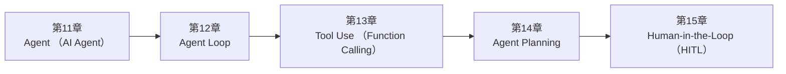

<!--
Chapter: 98
Node: SUMMARY-PART-03
Score: 100
Status: AUTO-GENERATED
Generated: summary
-->

# 第98章 【小结】第三部分：Agent 架构 (ch11-ch15)

> **速读指南**：本章是「第三部分：Agent 架构」的精华浓缩（共5个核心知识点）。
> 如果时间有限，只读本章即可掌握该部分所有核心概念。
> 重点看：**一、知识点精华一览**（速查表）和 **四、高频面试题精华**（备考必读）。

## 一、知识点精华一览

| 章节 | 概念 | 一句话掌握 |
|------|------|-----------|
| 第11章 | **Agent (AI Agent)** | Agent = LLM 大脑 + Tools 手脚 + Memory 记忆，能自主完成多步骤复杂任务的 AI 系统。 |
| 第12章 | **Agent Loop** | Agent Loop = ReAct 的工程实现，必须有 max_iterations + Checkpoint，否则生产不可用。 |
| 第13章 | **Tool Use (Function Calling)** | Tool Use = LLM 大脑下令，宿主程序执行，结果汇报——让 LLM 从'说话者'变成'行动者'。 |
| 第14章 | **Agent Planning** | Planning = 先画图纸再施工，让 Agent 处理10步以上复杂任务时不走弯路。 |
| 第15章 | **Human-in-the-Loop (HITL)** | HITL = 把人类判断力嵌入 Agent 关键节点，自动化效率和安全可控两者兼得。 |

## 二、核心原理速记

### 11. Agent (AI Agent)  `[L1-L2]`

**心智模型**：Agent = 能独立完成任务的实习工程师 - LLM（单次调用）= 你问我答的顾问：每次只回答一个问题 - Agent = 独立承担项目的实习生：理解目标后自主规划→执行→调整→汇报 三要素： LLM（大脑）+ Tools（手脚）+ Memory（记忆）= Agent

**考试要点**：
- Agent 三要素：LLM（大脑）+ Tools（手脚）+ Memory（记忆）
- Agent 区别于单次 LLM 调用的核心：自主性 + 工具调用 + 状态持久
- Agent 运行机制 = ReAct Loop（Thought→Action→Observation→循环）
- 必须设置 max_iterations + timeout，防止无限循环

**核心原则**：
- LLM 只负责决策，工具负责执行——不要让 LLM 直接操作系统
- 最小权限原则：Agent 只能访问完成任务所需的最小工具集和数据范围

### 12. Agent Loop  `[L1-L2]`

**心智模型**：Agent Loop = 工程师解决问题的工作流 1. 看看当前状态（State） 2. 想想下一步该做什么（Thought） 3. 执行一个操作（Action = 调用工具） 4. 看看结果（Observation） 5. 判断：完成了吗？→ 是：结束 / 否：回到第1步 安全版 Agent Loop（有限制）： 1-5 步同上，但额外有： - 步骤计数器（最多 N 次） - 超时计时器（最多 T 秒） - 错误计数器（连续失败 K 次自动停止）

**考试要点**：
- Agent Loop = ReAct 模式的工程化实现（Thought→Action→Observation→循环）
- 终止条件：FINISH / max_iterations / timeout / 连续失败阈值 / 外部中断
- AgentState 贯穿整个 Loop，只追加不修改，支持审计
- Checkpoint：每次迭代后持久化状态，支持断点续跑

**核心原则**：
- 有限循环：必须设置 max_iterations 和 timeout，无限循环是 Agent 最常见的故障模式
- 状态不可变追加：AgentState 只追加，不修改历史——便于调试和审计

### 13. Tool Use (Function Calling)  `[L1-L2]`

**心智模型**：Tool Use = 专业助理（LLM）+ 执行部门（工具） - LLM 是聪明的策略师：知道"现在要查数据库，参数是…" - 工具是实际执行的人：真正去查数据库，返回结果 - LLM 不能直接查数据库，就像 CEO 不亲自操作服务器—— 他们发出指令，执行人完成操作，汇报结果

**考试要点**：
- Tool Use = LLM 输出工具调用请求（JSON）→ 宿主程序执行 → 结果返回 LLM
- LLM 不直接执行工具，只描述'调用什么、传什么参数'
- 工具 description 决定 LLM 是否选择该工具；必须清晰准确
- 安全三要素：白名单 + 沙箱隔离 + 防 Tool Injection

### 14. Agent Planning  `[L2-L3]`

**心智模型**：Planning = 项目经理在开工前制定项目计划 - 纯 ReAct（无规划）= 施工队直接开始干，遇到问题再想 - Plan + Execute = 先出图纸（Plan），再按图施工（Execute） 类比： - 目标："开发一个用户管理系统" - Plan 阶段：拆解出10个子任务，确定顺序和依赖 - Execute 阶段：按照计划逐一完成，遇到偏差更新计划

**考试要点**：
- Planning = 先分解任务再执行，减少盲目试错
- Plan-and-Execute：Planner 生成计划 → Executor 执行 → Re-planner 动态调整
- 计划必须可更新（Re-plan）：遇到意外时调整，而不是硬按原计划

**核心原则**：
- 先规划再执行：复杂任务（超过5步）应该先生成计划，再逐步执行
- 计划可更新：执行过程中遇到意外，必须能更新计划（Re-plan），而不是硬按原计划

### 15. Human-in-the-Loop (HITL)  `[L2-L3]`

**心智模型**：HITL = 实习生汇报制度 - 实习生（Agent）自主处理日常事务，无需每步请示 - 但在两种情况下必须找主管（Human）确认： 1. 高风险操作："我准备删掉这批历史数据，可以吗？" 2. 不确定时："这里有两种方案，您倾向于哪种？" - 主管确认后，实习生继续执行 类比：自动驾驶的 L2/L3： - L2（HITL）：车辆自动驾驶，但遇到复杂路况（隧道、施工）提醒人类接管 - L4（无 HITL）：完全自动，不需要人类干预

**考试要点**：
- HITL = 在高风险操作节点暂停，等人工审批后继续
- 三种 HITL 模式：Pre-action Approval / Ambiguity Resolution / Milestone Review
- 超时 Fail-safe：人类不响应时，默认拒绝而不是默认批准
- 必须记录所有审批记录（谁/时间/操作）——合规要求

## 三、对比与选型速查

| 概念 | 解决的问题 | 最佳适用场景 | 不适合场景/反模式 |
|------|-----------|------------|-----------------|
| **Agent (AI Agent)** | 单次 LLM 调用只能处理"单个问题→单个答案"的场景 | 明确 Agent 的职责边界：一个 Agent 解决一类问题，不要做万能 Agent | 给 Agent 过多工具（后果：LLM 在选工具时困惑，工具选择准确率下降；每次调用 Token 成本增加） |
| **Agent Loop** | 单次 LLM 调用是无状态的：请求进来，响应出去，结束 | L1-L2 | 不设置 max_iterations（后果：Agent 陷入循环（如工具总是失败但一直重试），无限消耗资源） |
| **Tool Use (Function Calling)** | LLM 本身不能搜索互联网、查询数据库、执行代码——它只能生成文本 | L1-L2 | — |
| **Agent Planning** | 对于复杂任务（10步以上），纯粹的 ReAct（边想边做）容易： | L2-L3 | 计划写死，无法更新（后果：执行中遇到意外（工具失败、结果出乎意料）时无法调整，任务失败） |
| **Human-in-the-Loop (HITL)** | 全自动 Agent 的问题： | L2-L3 | 每一步都需要人工确认（后果：失去自动化价值，人工疲惫（确认疲劳），效率退化为全手动） |

**层级与难度**：

- `L1-L2` **Agent (AI Agent)**：Agent = LLM 大脑 + Tools 手脚 + Memory 记忆，能自主完成多步骤复杂任务
- `L1-L2` **Agent Loop**：Agent Loop = ReAct 的工程实现，必须有 max_iterations + Chec
- `L1-L2` **Tool Use (Function Calling)**：Tool Use = LLM 大脑下令，宿主程序执行，结果汇报——让 LLM 从'说话者'变成'行动
- `L2-L3` **Agent Planning**：Planning = 先画图纸再施工，让 Agent 处理10步以上复杂任务时不走弯路。
- `L2-L3` **Human-in-the-Loop (HITL)**：HITL = 把人类判断力嵌入 Agent 关键节点，自动化效率和安全可控两者兼得。

## 四、高频面试题精华

**Q: Agent 和普通 LLM 调用有什么本质区别？**

> **答题要点**：Agent = 能独立完成任务的实习工程师 - LLM（单次调用）= 你问我答的顾问：每次只回答一个问题 - Agent = 独立承担项目的实习生：理解目标后自主规划→执行→调整→汇报  三要素： LLM（大脑）+ Tools（手脚）+ Memory（记忆）= Agent
>
> **最佳实践**：明确 Agent 的职责边界：一个 Agent 解决一类问题，不要做万能 Agent

**Q: Agent 的四大核心组件是什么？各自负责什么？**

> **答题要点**：Agent = 能独立完成任务的实习工程师 - LLM（单次调用）= 你问我答的顾问：每次只回答一个问题 - Agent = 独立承担项目的实习生：理解目标后自主规划→执行→调整→汇报  三要素： LLM（大脑）+ Tools（手脚）+ Memory（记忆）= Agent
>
> **最佳实践**：明确 Agent 的职责边界：一个 Agent 解决一类问题，不要做万能 Agent

**Q: Agent Loop 的终止条件有哪些？为什么每个都必要？**

> **答题要点**：Agent Loop = 工程师解决问题的工作流 1. 看看当前状态（State） 2. 想想下一步该做什么（Thought） 3. 执行一个操作（Action = 调用工具） 4. 看看结果（Observation） 5. 判断：完成了吗？→ 是：结束 / 否：回到第1步  安全版 Agent Loop（有限制）： 1-5 步同上，但额外有： - 步骤计数器（最多 N 次） - 超时计时器（最多

**Q: AgentState 应该包含哪些字段？为什么要追加而不是覆盖历史？**

> **答题要点**：Agent Loop = 工程师解决问题的工作流 1. 看看当前状态（State） 2. 想想下一步该做什么（Thought） 3. 执行一个操作（Action = 调用工具） 4. 看看结果（Observation） 5. 判断：完成了吗？→ 是：结束 / 否：回到第1步  安全版 Agent Loop（有限制）： 1-5 步同上，但额外有： - 步骤计数器（最多 N 次） - 超时计时器（最多

**Q: Tool Use / Function Calling 的工作原理是什么？完整流程？**

> **答题要点**：Tool Use = 专业助理（LLM）+ 执行部门（工具） - LLM 是聪明的策略师：知道"现在要查数据库，参数是…" - 工具是实际执行的人：真正去查数据库，返回结果 - LLM 不能直接查数据库，就像 CEO 不亲自操作服务器——   他们发出指令，执行人完成操作，汇报结果

**Q: 工具的 description 为什么重要？写差了会有什么影响？**

> **答题要点**：Tool Use = 专业助理（LLM）+ 执行部门（工具） - LLM 是聪明的策略师：知道"现在要查数据库，参数是…" - 工具是实际执行的人：真正去查数据库，返回结果 - LLM 不能直接查数据库，就像 CEO 不亲自操作服务器——   他们发出指令，执行人完成操作，汇报结果

**Q: 为什么复杂任务需要 Planning？纯 ReAct 有什么局限？**

> **答题要点**：Planning = 项目经理在开工前制定项目计划 - 纯 ReAct（无规划）= 施工队直接开始干，遇到问题再想 - Plan + Execute = 先出图纸（Plan），再按图施工（Execute）  类比： - 目标："开发一个用户管理系统" - Plan 阶段：拆解出10个子任务，确定顺序和依赖 - Execute 阶段：按照计划逐一完成，遇到偏差更新计划

**Q: Plan-and-Execute 和 ReAct 的区别？各自适用什么场景？**

> **答题要点**：Planning = 项目经理在开工前制定项目计划 - 纯 ReAct（无规划）= 施工队直接开始干，遇到问题再想 - Plan + Execute = 先出图纸（Plan），再按图施工（Execute）  类比： - 目标："开发一个用户管理系统" - Plan 阶段：拆解出10个子任务，确定顺序和依赖 - Execute 阶段：按照计划逐一完成，遇到偏差更新计划

**Q: 为什么生产级 Agent 需要 Human-in-the-Loop？**

> **答题要点**：HITL = 实习生汇报制度 - 实习生（Agent）自主处理日常事务，无需每步请示 - 但在两种情况下必须找主管（Human）确认：   1. 高风险操作："我准备删掉这批历史数据，可以吗？"   2. 不确定时："这里有两种方案，您倾向于哪种？" - 主管确认后，实习生继续执行  类比：自动驾驶的 L2/L3： - L2（HITL）：车辆自动驾驶，但遇到复杂路况（隧道、施工）提醒人类接管 - 

**Q: 哪些操作必须设置 HITL？设计原则是什么？**

> **答题要点**：HITL = 实习生汇报制度 - 实习生（Agent）自主处理日常事务，无需每步请示 - 但在两种情况下必须找主管（Human）确认：   1. 高风险操作："我准备删掉这批历史数据，可以吗？"   2. 不确定时："这里有两种方案，您倾向于哪种？" - 主管确认后，实习生继续执行  类比：自动驾驶的 L2/L3： - L2（HITL）：车辆自动驾驶，但遇到复杂路况（隧道、施工）提醒人类接管 - 

## 六、知识关联图

## 七、本章自测清单

完成本部分学习后，你应该能够：

- [ ] **Agent (AI Agent)**：Agent = LLM 大脑 + Tools 手脚 + Memory 记忆，能自主完成多步骤复杂任务的 AI 系统。
- [ ] **Agent Loop**：Agent Loop = ReAct 的工程实现，必须有 max_iterations + Checkpoint，否则生
- [ ] **Tool Use (Function Calling)**：Tool Use = LLM 大脑下令，宿主程序执行，结果汇报——让 LLM 从'说话者'变成'行动者'。
- [ ] **Agent Planning**：Planning = 先画图纸再施工，让 Agent 处理10步以上复杂任务时不走弯路。
- [ ] **Human-in-the-Loop (HITL)**：HITL = 把人类判断力嵌入 Agent 关键节点，自动化效率和安全可控两者兼得。

> 如果某项还不确定，回到对应章节复习后再打勾。
