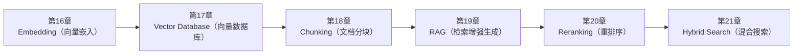

<!--
Chapter: 99
Node: SUMMARY-PART-04
Score: 100
Status: AUTO-GENERATED
Generated: summary
-->

# 第99章 【小结】第四部分：RAG 与知识检索 (ch16-ch21)

> **速读指南**：本章是「第四部分：RAG 与知识检索」的精华浓缩（共6个核心知识点）。
> 如果时间有限，只读本章即可掌握该部分所有核心概念。
> 重点看：**一、知识点精华一览**（速查表）和 **四、高频面试题精华**（备考必读）。

## 一、知识点精华一览

| 章节 | 概念 | 一句话掌握 |
|------|------|-----------|
| 第16章 | **Embedding（向量嵌入）** | Embedding = 给文字分配语义坐标，让计算机能计算'语义距离'——RAG 的数学基础。 |
| 第17章 | **Vector Database（向量数据库）** | 向量数据库 = 语义搜索引擎，毫秒内在百万向量中找最相似的 K 个——RAG 的核心存储组件。 |
| 第18章 | **Chunking（文档分块）** | Chunking = 把书拆成知识卡片，卡片大小决定检索精度——太大不专注，太小没上下文。 |
| 第19章 | **RAG（检索增强生成）** | RAG = 开卷考试模式：检索最相关的知识片段注入 Prompt，LLM 基于真实资料生成答案。 |
| 第20章 | **Reranking（重排序）** | Reranking = 先快速海选，再精准面试——两阶段检索让 RAG 兼顾速度和精度。 |
| 第21章 | **Hybrid Search（混合搜索）** | Hybrid Search = 语义搜索 + 关键词搜索两路并行，RRF 融合——覆盖两种检索范式，召回率显著提升。 |

## 二、核心原理速记

### 16. Embedding（向量嵌入）  `[L1-L2]`

**心智模型**：Embedding = 给每段文字分配一个"语义坐标" - 想象一个巨大的多维空间（1536维） - 每段文字都有一个坐标点 - 语义相近的文字，坐标点也相近 - "苹果手机"和"iPhone"的坐标点很近 - "苹果手机"和"量子力学"的坐标点很远 类比：颜色的 RGB 值 - 红色 = [255, 0, 0]，橙色 = [255, 128, 0] - RGB 距离近 = 颜色相似 - Embedding 向量距离近 = 语义相似 只不过 Embedding 是 1536 维，不是 3 维

**考试要点**：
- Embedding = 文本 → 固定维度浮点向量，语义相近的文本向量距离近
- 核心度量：余弦相似度（Cosine Similarity），范围 [-1,1]，越接近 1 越相似
- 同一系统必须用同一个 Embedding 模型，不同模型向量空间不兼容
- Embedding 结果可以缓存（同文本→同向量），避免重复 API 调用

### 17. Vector Database（向量数据库）  `[L1-L2]`

**心智模型**：向量数据库 = 语义搜索引擎 - 普通数据库 = 图书馆按书号找书（精确匹配） - 向量数据库 = 图书馆按"这本书的内容"找相关书（语义匹配） 入库：把每本书的"内容摘要"转成向量坐标，存入数据库 检索：用"我想找关于机器学习的书"的向量坐标，找最近的向量

**考试要点**：
- 向量数据库核心能力：毫秒级相似向量检索（ANN）
- HNSW：主流 ANN 算法，O(log N) 复杂度，精度损失极小
- 选型简则：开发用 Chroma，生产用 Qdrant，快速上线用 Pinecone
- 必须同时存向量 + 原始文本 + 元数据，元数据支持过滤条件

### 18. Chunking（文档分块）  `[L1-L2]`

**心智模型**：Chunking = 把一本书拆成知识卡片 - 整本书（1 个向量）：搜什么都搜到这本书，无法定位具体内容 - 每章（中等块）：能定位到章节级别 - 每段/每个概念（小块）：能精确定位到具体知识点 卡片太大：包含多个主题，向量"不专注"，检索精度低 卡片太小：缺乏上下文，LLM 无法理解，生成质量差 适当大小：检索精准，上下文完整

**考试要点**：
- Chunking = 将长文档切成小块，每块独立向量化+存储
- 核心参数：chunk_size（块大小）+ chunk_overlap（重叠，防止边界信息丢失）
- 通用起点：chunk_size=500 Token，overlap=10-20%
- Parent-Child：小块检索（精准）+ 大块生成（完整上下文）

### 19. RAG（检索增强生成）  `[L1-L2]`

**心智模型**：RAG = 开卷考试 - 不用 RAG 的 LLM = 闭卷考试：只能用记忆里的知识，可能记错 - 使用 RAG 的 LLM = 开卷考试：考试时可以翻参考书，答案更准确 但 RAG 的"翻书"很智能： - 不是翻整本书，而是精准定位到"最相关的几页" - LLM 读完相关页面，综合生成答案

**考试要点**：
- RAG = 检索（Retrieve）+ 增强（Augment）+ 生成（Generate）
- 解决三大问题：知识截止日期、无法访问私有数据、幻觉风险（只减少知识型幻觉）
- 两阶段：离线索引（Chunking→Embedding→存储）+ 在线处理（检索→注入→生成）
- 4 个核心指标：Context Recall / Context Precision / Faithfulness / Answer Relevancy

### 20. Reranking（重排序）  `[L2-L3]`

**心智模型**：两阶段检索 = 猎头招聘流程 Phase 1（粗检索）= 简历筛选：从 1000 份简历中快速筛出 50 份（速度快，可能有漏网之鱼） Phase 2（Reranking）= 面试官评估：HR 仔细评估这 50 份，精选出最合适的 5 份（精度高，但耗时） 向量检索适合"海量快速筛选"，Reranker 适合"精准深度评估" 两者结合 = 速度 + 精度

**考试要点**：
- Reranking = 两阶段检索：粗检索 Top-N（快）→ Reranker 精排 Top-K（准）
- Reranker = 交叉编码器，同时看 Query+Doc，精度高但速度慢
- 典型配置：粗检索 Top-50，Reranker 精选 Top-5 注入 Prompt
- 实验效果：Reranking 可提升 RAG 最终质量 10-30%

### 21. Hybrid Search（混合搜索）  `[L2-L3]`

**心智模型**：Hybrid Search = 图书馆双轨检索 - 向量检索 = 按"主题内容"找书（语义搜索） - BM25 检索 = 按"书名关键词"找书（精确匹配） - 融合 = 两份书单合并去重，同时出现在两份里的排名更靠前 或：Hybrid Search = 搜索引擎的工作方式 Google 从来不只用向量搜索，也不只用关键词——两者结合才有现在的效果

**考试要点**：
- Hybrid Search = 向量检索（语义）+ BM25（关键词）+ RRF 融合
- RRF：在两路检索中都排名靠前的文档，融合后分数最高
- alpha 参数：0=纯 BM25，1=纯向量，0.5=均衡
- 黄金组合：Hybrid Search（召回率↑）+ Reranker（精度↑）

## 三、对比与选型速查

| 概念 | 解决的问题 | 最佳适用场景 | 不适合场景/反模式 |
|------|-----------|------------|-----------------|
| **Embedding（向量嵌入）** | 传统关键词搜索（BM25）基于词汇精确匹配： | Query 和 Document 使用同一个 Embedding 模型，否则向量空间不兼容 | 用 LLM 生成 Embedding（让 ChatGPT 把文本转成向量）（后果：LLM 不是 Embedding 模型 |
| **Vector Database（向量数据库）** | 普通数据库（PostgreSQL/MySQL）不支持向量相似度检索： | 存入向量时，同时存储原始文本和元数据（source、chunk_id、date 等），检索后能直接获取上下文 | 用 numpy 数组在内存中做向量搜索（规模化后）（后果：超过 10 万向量后内存溢出，无法持久化，重启丢失） |
| **Chunking（文档分块）** | 为什么不把整个文档直接向量化？ | 从 chunk_size=500, overlap=50 开始，通过 Evaluation 调优 | chunk_size 设置过大（超过 2000 Token）（后果：向量包含多个主题，检索相似度下降；检索结果可能超出  |
| **RAG（检索增强生成）** | LLM 有三大知识局限： | RAG Prompt 必须明确指定：'基于以下资料回答，资料不足时说无法回答'，防止 LLM 用幻觉填补空白 | RAG 检索到无关内容也注入 Prompt（后果：噪音上下文误导 LLM，答案质量反而不如不用 RAG） |
| **Reranking（重排序）** | 向量检索（双编码器）的局限： | 粗检索 Top-N 要足够大（20-100），给 Reranker 足够的候选池 | 只用 Reranker 不用向量检索（用 Reranker 直接全库精排）（后果：Reranker 速度慢，无法扩展到大 |
| **Hybrid Search（混合搜索）** | 向量搜索的局限（没有 Hybrid Search 时）： | 以 alpha=0.5 为起点，根据业务场景和 Evaluation 结果调整 | 只用向量搜索，遇到关键词场景报告'找不到相关内容'（后果：用户搜索精确术语、错误代码时体验差，产品质量不符合预期） |

**层级与难度**：

- `L1-L2` **Embedding（向量嵌入）**：Embedding = 给文字分配语义坐标，让计算机能计算'语义距离'——RAG 的数学基础。
- `L1-L2` **Vector Database（向量数据库）**：向量数据库 = 语义搜索引擎，毫秒内在百万向量中找最相似的 K 个——RAG 的核心存储组件。
- `L1-L2` **Chunking（文档分块）**：Chunking = 把书拆成知识卡片，卡片大小决定检索精度——太大不专注，太小没上下文。
- `L1-L2` **RAG（检索增强生成）**：RAG = 开卷考试模式：检索最相关的知识片段注入 Prompt，LLM 基于真实资料生成答案。
- `L2-L3` **Reranking（重排序）**：Reranking = 先快速海选，再精准面试——两阶段检索让 RAG 兼顾速度和精度。
- `L2-L3` **Hybrid Search（混合搜索）**：Hybrid Search = 语义搜索 + 关键词搜索两路并行，RRF 融合——覆盖两种检索范式，

## 四、高频面试题精华

**Q: Embedding 是什么？它解决了什么问题（相比关键词搜索）？**

> **答题要点**：Embedding = 给每段文字分配一个"语义坐标" - 想象一个巨大的多维空间（1536维） - 每段文字都有一个坐标点 - 语义相近的文字，坐标点也相近 - "苹果手机"和"iPhone"的坐标点很近 - "苹果手机"和"量子力学"的坐标点很远  类比：颜色的 RGB 值 - 红色 = [255, 0, 0]，橙色 = [255, 128, 0] - RGB 距离近 = 颜色相似 - Emb
>
> **最佳实践**：Query 和 Document 使用同一个 Embedding 模型，否则向量空间不兼容

**Q: 余弦相似度是什么？如何用它判断两段文字的语义相似度？**

> **答题要点**：Embedding = 给每段文字分配一个"语义坐标" - 想象一个巨大的多维空间（1536维） - 每段文字都有一个坐标点 - 语义相近的文字，坐标点也相近 - "苹果手机"和"iPhone"的坐标点很近 - "苹果手机"和"量子力学"的坐标点很远  类比：颜色的 RGB 值 - 红色 = [255, 0, 0]，橙色 = [255, 128, 0] - RGB 距离近 = 颜色相似 - Emb
>
> **最佳实践**：Query 和 Document 使用同一个 Embedding 模型，否则向量空间不兼容

**Q: 向量数据库和普通数据库的核心区别是什么？**

> **答题要点**：向量数据库 = 语义搜索引擎 - 普通数据库 = 图书馆按书号找书（精确匹配） - 向量数据库 = 图书馆按"这本书的内容"找相关书（语义匹配）  入库：把每本书的"内容摘要"转成向量坐标，存入数据库 检索：用"我想找关于机器学习的书"的向量坐标，找最近的向量
>
> **最佳实践**：存入向量时，同时存储原始文本和元数据（source、chunk_id、date 等），检索后能直接获取上下文

**Q: ANN（近似最近邻）和暴力搜索（KNN）的区别？为什么 ANN 更实用？**

> **答题要点**：向量数据库 = 语义搜索引擎 - 普通数据库 = 图书馆按书号找书（精确匹配） - 向量数据库 = 图书馆按"这本书的内容"找相关书（语义匹配）  入库：把每本书的"内容摘要"转成向量坐标，存入数据库 检索：用"我想找关于机器学习的书"的向量坐标，找最近的向量
>
> **最佳实践**：存入向量时，同时存储原始文本和元数据（source、chunk_id、date 等），检索后能直接获取上下文

**Q: 为什么 RAG 需要 Chunking？不切分有什么问题？**

> **答题要点**：Chunking = 把一本书拆成知识卡片 - 整本书（1 个向量）：搜什么都搜到这本书，无法定位具体内容 - 每章（中等块）：能定位到章节级别 - 每段/每个概念（小块）：能精确定位到具体知识点  卡片太大：包含多个主题，向量"不专注"，检索精度低 卡片太小：缺乏上下文，LLM 无法理解，生成质量差 适当大小：检索精准，上下文完整
>
> **最佳实践**：从 chunk_size=500, overlap=50 开始，通过 Evaluation 调优

**Q: 常见的 Chunking 策略有哪些？各自适用什么场景？**

> **答题要点**：Chunking = 把一本书拆成知识卡片 - 整本书（1 个向量）：搜什么都搜到这本书，无法定位具体内容 - 每章（中等块）：能定位到章节级别 - 每段/每个概念（小块）：能精确定位到具体知识点  卡片太大：包含多个主题，向量"不专注"，检索精度低 卡片太小：缺乏上下文，LLM 无法理解，生成质量差 适当大小：检索精准，上下文完整
>
> **最佳实践**：从 chunk_size=500, overlap=50 开始，通过 Evaluation 调优

**Q: RAG 解决了 LLM 的哪些问题？**

> **答题要点**：RAG = 开卷考试 - 不用 RAG 的 LLM = 闭卷考试：只能用记忆里的知识，可能记错 - 使用 RAG 的 LLM = 开卷考试：考试时可以翻参考书，答案更准确  但 RAG 的"翻书"很智能： - 不是翻整本书，而是精准定位到"最相关的几页" - LLM 读完相关页面，综合生成答案
>
> **最佳实践**：RAG Prompt 必须明确指定：'基于以下资料回答，资料不足时说无法回答'，防止 LLM 用幻觉填补空白

**Q: RAG 的完整工作流程是什么？（离线索引 + 在线检索生成）？**

> **答题要点**：RAG = 开卷考试 - 不用 RAG 的 LLM = 闭卷考试：只能用记忆里的知识，可能记错 - 使用 RAG 的 LLM = 开卷考试：考试时可以翻参考书，答案更准确  但 RAG 的"翻书"很智能： - 不是翻整本书，而是精准定位到"最相关的几页" - LLM 读完相关页面，综合生成答案
>
> **最佳实践**：RAG Prompt 必须明确指定：'基于以下资料回答，资料不足时说无法回答'，防止 LLM 用幻觉填补空白

**Q: Reranking 解决了向量检索的什么问题？**

> **答题要点**：两阶段检索 = 猎头招聘流程 Phase 1（粗检索）= 简历筛选：从 1000 份简历中快速筛出 50 份（速度快，可能有漏网之鱼） Phase 2（Reranking）= 面试官评估：HR 仔细评估这 50 份，精选出最合适的 5 份（精度高，但耗时）  向量检索适合"海量快速筛选"，Reranker 适合"精准深度评估" 两者结合 = 速度 + 精度
>
> **最佳实践**：粗检索 Top-N 要足够大（20-100），给 Reranker 足够的候选池

**Q: 双编码器（向量检索）和交叉编码器（Reranker）的区别？**

> **答题要点**：两阶段检索 = 猎头招聘流程 Phase 1（粗检索）= 简历筛选：从 1000 份简历中快速筛出 50 份（速度快，可能有漏网之鱼） Phase 2（Reranking）= 面试官评估：HR 仔细评估这 50 份，精选出最合适的 5 份（精度高，但耗时）  向量检索适合"海量快速筛选"，Reranker 适合"精准深度评估" 两者结合 = 速度 + 精度
>
> **最佳实践**：粗检索 Top-N 要足够大（20-100），给 Reranker 足够的候选池

## 六、知识关联图

## 七、本章自测清单

完成本部分学习后，你应该能够：

- [ ] **Embedding（向量嵌入）**：Embedding = 给文字分配语义坐标，让计算机能计算'语义距离'——RAG 的数学基础。
- [ ] **Vector Database（向量数据库）**：向量数据库 = 语义搜索引擎，毫秒内在百万向量中找最相似的 K 个——RAG 的核心存储组件。
- [ ] **Chunking（文档分块）**：Chunking = 把书拆成知识卡片，卡片大小决定检索精度——太大不专注，太小没上下文。
- [ ] **RAG（检索增强生成）**：RAG = 开卷考试模式：检索最相关的知识片段注入 Prompt，LLM 基于真实资料生成答案。
- [ ] **Reranking（重排序）**：Reranking = 先快速海选，再精准面试——两阶段检索让 RAG 兼顾速度和精度。
- [ ] **Hybrid Search（混合搜索）**：Hybrid Search = 语义搜索 + 关键词搜索两路并行，RRF 融合——覆盖两种检索范式，召回率显著提升。

> 如果某项还不确定，回到对应章节复习后再打勾。
